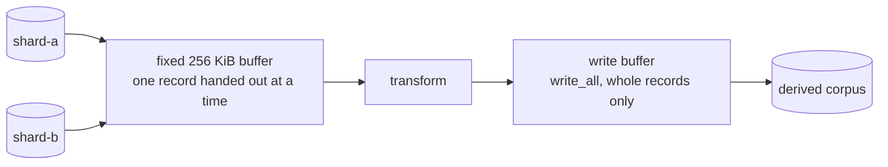
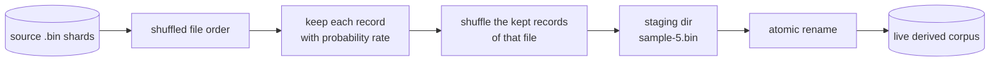
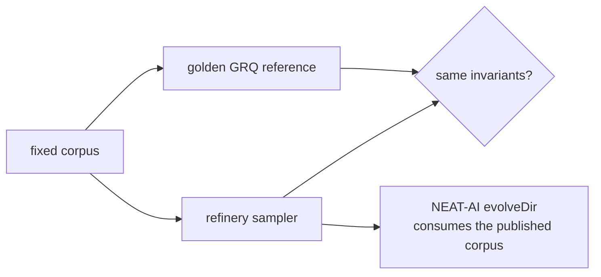
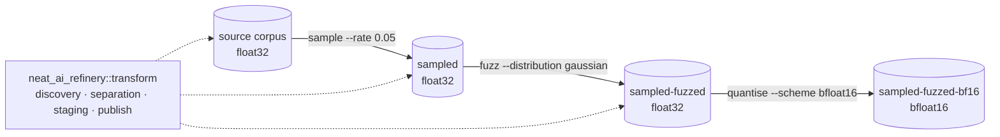
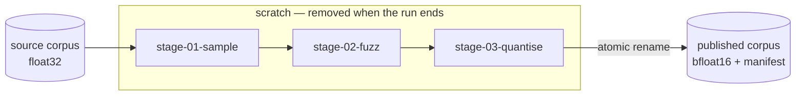
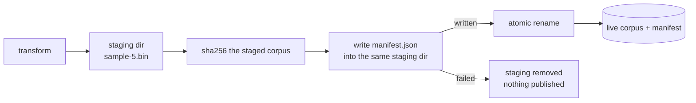
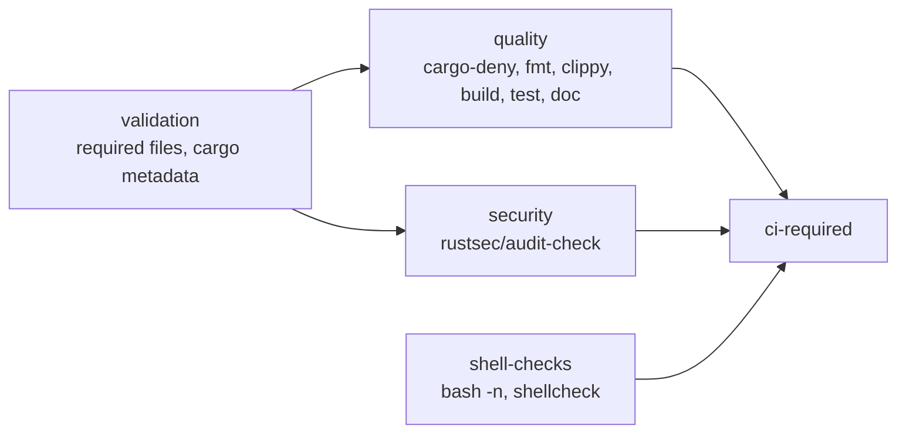

# NEAT-AI-Refinery

[](https://github.com/stSoftwareAU/NEAT-AI/blob/Develop/docs/brand/social-previews/neat-ai-refinery.png)

> **Raw training data goes in unchanged. Reproducible derived corpora come out.** 🏭

NEAT-AI-Refinery is a high-performance Rust tool for producing transformed
training corpora for [NEAT-AI](https://github.com/stSoftwareAU/NEAT-AI).

It owns the boundary:

```text
immutable source training corpus
        │
        ▼
sampling / shuffling / quantisation / fuzzing / validation
        │
        ▼
derived training corpus
```

The source corpus is never modified in place.

## Scope

Refinery is intentionally application-agnostic. It does not know about GRQ,
stocks, observation-version modules, or NEAT evolution policy.

It operates on fixed-width binary records and produces derived corpora from them.

Refinery owns:

- materialised sampling of a source corpus;
- deterministic/reproducible shuffling;
- quantisation and other representation transforms;
- fuzzing/noise injection;
- composing those transforms into pipelines with an explicit order;
- transformation manifests and provenance;
- strict validation of record boundaries and output artefacts;
- atomic publication of derived corpora.

Refinery does **not** own:

- creature evolution or generation policy — NEAT-AI;
- scorer-side multi-creature evaluation — NEAT-AI-scorer;
- application-specific orchestration or feature generation — downstream users.

The line between the two is the **artefact**: Refinery owns work that writes a
new corpus of records to disk, and a sub-sample taken while scoring is runtime
policy even though it is also called sampling. The decision rule, and the audit
that applied it to every open NEAT-AI and GRQ issue, are in
[`docs/corpus-transform-ownership.md`](docs/corpus-transform-ownership.md).

## Migration principle

The existing system is working, so migration is deliberately evolutionary:

1. reproduce the current GRQ sampling behaviour — done;
2. prove compatibility against fixed fixtures — done, `./parity/run.sh`;
3. integrate behind a fallback/feature switch — done, `GRQ_SAMPLER_IMPL`;
4. soak in production — done, `./soak/run.sh` and
   [`docs/production-soak.md`](docs/production-soak.md); **Refinery is now the
   GRQ default**, with the switch kept as the rollback;
5. remove obsolete code only after the new path is proven — the one step still
   outstanding, tracked by
   [#9](https://github.com/stSoftwareAU/NEAT-AI-Refinery/issues/9);
6. add new transforms afterwards — quantisation is done,
   [`docs/quantisation.md`](docs/quantisation.md), and so is fuzzing,
   [`docs/fuzzing.md`](docs/fuzzing.md);
7. compose them in a stated order — done,
   [`docs/pipelines.md`](docs/pipelines.md).

No migration issue should combine behavioural changes with the first sampler port.

## Record shape

Refinery receives the record shape explicitly. A caller such as GRQ may derive
the values from the current fittest creature JSON and pass them in.

For example:

```text
neat_ai_refinery \
  --source /path/to/trainData-binary \
  --output /path/to/trainData-binary-sampler \
  --inputs 2511 \
  --outputs 1 \
  sample --rate 0.05
```

The important contract is simply:

```text
bytes_per_record = (inputs + outputs) * 4
```

for the current Float32 corpus format.

The downstream orchestration layer may use `jq` (or equivalent) to derive
`inputs` and `outputs` from a creature export. Refinery itself should not
parse GRQ version state.

## Corpus contract

The contract lives in the `neat_ai_refinery::corpus` module, so a caller works
with checked types rather than raw byte arithmetic:

| Type | Owns |
| --- | --- |
| `RecordShape` | `inputs`, `outputs`, `record_values`, `bytes_per_record` |
| `ValueEncoding` | how a value is stored — `Float32` (four bytes) or `BFloat16` (two) |
| `SourceCorpus` | a read-only source, validated on open |
| `DerivedDestination` | an output path checked against the sources |
| `RecordReader` | streaming, bounded-memory reads across one or more files |
| `RecordWriter` | buffered whole-record writes to a derived destination |
| `CorpusError` | every way the contract can be breached |

```rust
use neat_ai_refinery::corpus::{RecordShape, SourceCorpus};

let shape = RecordShape::new(2511, 1)?;          // bytes_per_record == 10_048
let corpus = SourceCorpus::open("trainData-binary", shape)?;
let first = corpus.read_record(0)?;               // inputs first, then outputs
```

### Streaming primitives

`RecordReader` and `RecordWriter` are the I/O foundation the transforms are
built on. They carry no sampling policy — a transform decides which records to
keep; the primitives only move whole records.

```rust
use neat_ai_refinery::corpus::{
    discover_sources, DerivedDestination, RecordReader, RecordShape, RecordWriter,
};

let shape = RecordShape::new(2511, 1)?;
let sources = discover_sources("trainData-binary")?;
let destination = DerivedDestination::new("trainData-binary-sampler", &sources)?;

let mut reader = RecordReader::open(&sources, shape)?;
let mut writer = RecordWriter::create(&destination, shape)?;
while let Some(record) = reader.next_record() {
    writer.write_record(record?)?;      // a transform filters or edits here
}
let records = writer.finish()?;
```



The reader's working set is one buffer, whatever the corpus size: records that
straddle a refill are compacted to the front rather than growing the buffer.
Files are consumed in the order given, and each is validated as it is read —
a file ending mid-record raises `PartialRecord` naming the path, its byte
length, the record width and the trailing bytes, and one holding no records at
all raises `EmptySource`. An error ends the stream rather than skipping past a
corpus that could not be interpreted.

The writer accepts records of exactly `bytes_per_record` bytes — anything else
is a `RecordLengthMismatch` — buffers them, and writes with `write_all`, so a
short write is retried instead of truncating the output. `finish` flushes the
tail and reports the record count; a writer dropped with records still buffered
flushes them and panics if that flush fails, so buffered records are never lost
in silence.

### Immutable source

**Refinery never writes to a source corpus.** Sources are opened with
`File::open`, which requests read access only; no code path in the crate opens
a source for writing, truncates it, appends to it, renames it or removes it.
Derived corpora are written elsewhere, and `DerivedDestination` rejects an
output path that resolves to one of the sources — after canonicalisation, so a
relative path, a `..` segment or a symlink cannot smuggle a write back onto a
source.


### Fatal conditions

Malformed input fails loud rather than being processed approximately:

- a partial trailing record — the size is not a whole multiple of
  `bytes_per_record`;
- an empty source, which holds no records at all;
- a record shape with zero inputs or zero outputs;
- a record width whose `inputs + outputs` or `× 4` arithmetic overflows;
- a record index past the end of the corpus;
- a source directory containing no corpus files.

### Input discovery and ordering

`discover_sources` expands a source path into the files to read, in read order:

1. a regular file is used as-is and yields exactly that one path;
2. a directory is scanned **non-recursively** — nested directories are skipped,
   never descended into;
3. entries whose name begins with `.` are skipped;
4. remaining entries must resolve to regular files (a symlink to one counts);
5. the result is sorted by file name, **byte-wise** — not by locale, case or
   embedded number, so `Shard-1` precedes `shard-10`, which precedes `shard-2`.

Ordering is fixed by these rules alone, so the same source path yields the same
list on every machine and a derived corpus stays reproducible.

## Materialised sampling

`sample` is the first transform, a port of GRQ's `src/train/Sampler.ts`. It
keeps each source record independently with probability `--rate` and publishes
the result as a fresh derived corpus:

```bash
neat_ai_refinery \
  --source trainData-binary \
  --output trainData-binary-sampler \
  --inputs 2511 --outputs 1 \
  [--metadata grq_observation_version=42] \
  sample --rate 0.05 [--seed 20260831]
```



- **Rate range** — `0 < rate <= 1`, the range the Deno sampler enforces.
  Anything else, `NaN` included, is rejected before a file is opened.
- **Output name** — `sample-<percent>.bin`, the rate rounded to a whole
  percentage, so `--rate 0.05` publishes `sample-5.bin`.
- **Atomic publish** — the corpus is built in a staging directory beside the
  output and swapped in with `rename(2)`. A reader resolving the path sees the
  previous corpus or the new one, never an empty or half-built directory.
- **Failure** — a malformed record, a missing corpus file or a failed write
  aborts the run with a non-zero exit; the staging directory is removed and the
  previously published corpus is left exactly as it was.
- **Seed** — omit `--seed` and the run seeds from the operating system, as
  production does. The seed used is always reported, so any run can be
  replayed. A given seed reproduces a sample byte for byte.
- **Immutability** — a source and output directory that overlap are refused,
  either way round, because publishing replaces the whole output directory.
- **Provenance** — a `manifest.json` recording how the corpus was made is
  published inside the same directory, in the same atomic swap.

The ported behaviour, the deliberate omissions, and where the Rust port is
stricter than the Deno one are documented in
[`docs/sampling-semantics.md`](docs/sampling-semantics.md).

### Running it in production

**Refinery is the producer of GRQ's sampled corpus.** GRQ selects the sampler
with `GRQ_SAMPLER_IMPL`: unset — the default — runs this one, and `typescript`
is the rollback to GRQ's own sampler, kept until that sampler is removed. A
Refinery failure fails the run rather than being served quietly from the old
path, both implementations report the same timing and record-count line so a
fleet run can compare them, and rolling back is one environment variable.

The caller's half of the contract — what GRQ passes in, the manifest fields it
reads the counts back from, and where the switch lives — is in
[`docs/grq-integration.md`](docs/grq-integration.md).

### Soaking it

The cut-over was gated on measured evidence, captured by a harness rather than
by hand:

```bash
./soak/run.sh                    # production shape, 8 × 20 000 records, rate 0.05
```

A soak runs the release binary repeatedly, re-verifies every published corpus
against its own manifest, digests the source corpus before and after to prove
it was never written to, forces a run to fail and checks the live corpus
survived it byte for byte, and measures both implementations the same way:

| Sampler | Elapsed | Records/s | Peak RSS |
| --- | --- | --- | --- |
| Refinery | 214 ms | 747 664 | 13 020 KiB |
| Deno `Sampler.ts` | 642 ms | 249 221 | 168 476 KiB |

The reports are committed under [`docs/evidence/`](docs/evidence), one per
host, and `.github/workflows/soak.yml` runs the same soak on macOS and Linux
for every pull request. What is asserted, what is deliberately not, and how to
roll the cut-over back are in
[`docs/production-soak.md`](docs/production-soak.md).

### Proving it against GRQ

The port is held to GRQ's sampler by a golden parity harness — Refinery and
the extracted `Sampler.ts` reference run over the same fixture corpora, and
both must satisfy the same invariants:

```bash
./parity/run.sh
```



Whole fixed-width records only, every record traced back to the source, the
requested share kept, the order randomised, the same published file name, the
source untouched, the live corpus replaced whole — and NEAT-AI's `evolveDir`
opening a Refinery-published corpus unchanged. Byte-for-byte equality is not
the target: GRQ draws from `Math.random()` with no seam to seed it.

The harness, the invariant-to-test map and the GRQ commit the reference was
extracted from are documented in
[`docs/parity-harness.md`](docs/parity-harness.md). It needs Deno; a plain
`cargo test` skips those tests with a notice when Deno is absent, and
`.github/workflows/parity.yml` is the gate that enforces them.

### Measuring it

```bash
./bench/run.sh                     # every transform, plus the Deno sampler for comparison
cargo run --release --example sample_throughput -- [shards] [records-per-shard] [rate]
```

The benchmark harness builds one synthetic corpus at the production shape and
measures each transform through the release binary, reporting wall-clock, input
GiB/s, records/s, peak RSS and published size. At 160 000 records of 10 048
bytes, rate 0.05:

| Case | Wall-clock | Input GiB/s | Records/s | Peak RSS | Output |
| --- | --- | --- | --- | --- | --- |
| `sample` | 304 ms | 4.93 | 526 316 | 13 292 KiB | 76.8 MiB |
| `quantise` | 1 581 ms | 0.95 | 101 202 | 2 980 KiB | 766.6 MiB |
| `pipeline` | 370 ms | 4.05 | 432 432 | 13 352 KiB | 38.7 MiB |
| Deno `Sampler.ts` | 576 ms | 2.60 | 277 778 | 170 876 KiB | 77.6 MiB |

A run can be held to a committed baseline (`--baseline`, same corpus and host)
or to the Deno sampler measured beside it (`--min-speedup`); both fail the run
rather than warn. `.github/workflows/benchmark.yml` enforces the second on
macOS and Linux for every pull request and publishes the numbers to the job
summary. The method, the gates and what the numbers are *not* are in
[`docs/benchmarks.md`](docs/benchmarks.md).

`sample_throughput` remains the one-line sampler probe for a quick local
number. Behavioural parity comes before optimisation: both report numbers
rather than asserting on them, and the gates above compare a run with another
run rather than with a wish.

## Quantisation

`quantise` is the second transform, and a **representation** one: it re-encodes
every value in a narrower format and leaves the records themselves — how many,
and in what order — exactly as it found them.

```bash
neat_ai_refinery \
  --source trainData-binary \
  --output trainData-binary-bf16 \
  --inputs 2511 --outputs 1 \
  quantise --scheme bfloat16
```

- **Scheme** — `bfloat16`, the conservative starting point: an `f32` keeps its
  sign and its whole exponent and loses sixteen mantissa bits, **rounded to
  nearest with ties to even** rather than truncated, so the error is symmetric
  instead of a systematic pull towards zero. There is no default; the scheme
  decides the error the corpus carries, so it is always stated.
- **Error** — relative error is bounded by `2⁻⁸` ≈ `3.91e-3` at *every*
  magnitude, because the exponent survives whole. Decoding is exact, so all
  error is introduced once, at write time.
- **Storage** — two bytes a value instead of four: exactly 50% smaller for the
  same record count.
- **Deterministic** — quantisation takes no seed and needs none. The same
  source always produces the same bytes.
- **Output name** — `quantise-<scheme>.bin`, published atomically with its
  manifest, as `sample` is.

Measured on Linux aarch64, 8 shards × 20 000 records at the production shape:

| Measure | Result |
| --- | --- |
| Storage | 1 533.2 MiB → 766.6 MiB, 50.0% smaller |
| Throughput | 86 236 records/s, 826 MiB/s read |
| Max relative error | `3.891e-3`, against a `3.906e-3` bound |
| Mean relative error | `1.408e-3` |

```bash
cargo run --release --example quantise_throughput -- [shards] [records-per-shard]
```

Refinery makes **no claim** that a quantised corpus trains a better model. It
reports what quantisation costs and what it saves; whether that trade is worth
taking is a downstream experimental question.

The mapping, the error bounds, the special-value behaviour and the benchmark
method are in [`docs/quantisation.md`](docs/quantisation.md).

## Fuzzing

`fuzz` is the third transform, and a **value** one: it perturbs values with
seeded noise and leaves the records themselves — how many, in what order and how
wide — exactly as it found them.

```bash
neat_ai_refinery \
  --source trainData-binary \
  --output trainData-binary-fuzzed \
  --inputs 2511 --outputs 1 \
  fuzz --distribution gaussian --scale 0.01 --mode relative \
       [--targets inputs] [--clamp-min -1 --clamp-max 1] [--seed 20260831]
```

- **Explicit policy** — `--distribution` (`gaussian` or `uniform`), `--scale`
  and `--mode` (`absolute`, `x + noise`; or `relative`, `x × (1 + noise)`) have
  no defaults. A scale means nothing without the distribution and mode to read
  it against, so all three are always stated and always recorded.
- **Outputs are safe by default** — `--targets` defaults to `inputs`. Perturbing
  an expected output changes what the corpus *teaches* rather than adding noise
  to it, so reaching one takes an explicit `--targets outputs` or
  `--targets all`.
- **Bounds** — `--clamp-min` and `--clamp-max` hold every perturbed value in
  range; either side may be given alone, and by default neither is.
- **Non-finite values are defined, not incidental** — a `NaN` or infinity
  already in the source is written back unchanged and counted as preserved,
  because noise is not defined on it; a perturbation whose *result* leaves the
  finite range fails the run naming the record and value, because a bound that
  clamped it would publish a plausible number in place of a fault.
- **Seed** — omit `--seed` and the run seeds from the operating system. The seed
  used is always reported and always recorded, so any run can be replayed; a
  given seed and policy reproduce a corpus byte for byte.
- **Output name** — `fuzz-<distribution>.bin`, published atomically with its
  manifest, as `sample` and `quantise` are.

Refinery makes **no claim** that a fuzzed corpus trains a better model, or that
noise augmentation improves fitness. It supplies the transform; whether the
perturbation helps is a downstream experimental question.

The distributions, the modes, the bounds and non-finite policy, and the manifest
it all lands in are in [`docs/fuzzing.md`](docs/fuzzing.md).

### Composing transforms

Every transform reads a directory of `.bin` files and publishes a directory of
`.bin` files with a manifest beside it, so transforms compose by being run one
after another — no shared state, and no knowledge of GRQ or of each other:

```bash
neat_ai_refinery --source trainData-binary --output sampled \
  --inputs 2511 --outputs 1 sample --rate 0.05
neat_ai_refinery --source sampled --output sampled-fuzzed \
  --inputs 2511 --outputs 1 fuzz --distribution gaussian --scale 0.01 \
  --mode relative --seed 20260831
neat_ai_refinery --source sampled-fuzzed --output sampled-fuzzed-bf16 \
  --inputs 2511 --outputs 1 quantise --scheme bfloat16
```



The shared half — source discovery, destination separation, staging and atomic
publication — lives in `neat_ai_refinery::transform`, and is all any of the
three transforms uses. Discovery ignores `manifest.json`, so it is never
mistaken for records; and when a source carries a manifest, its declared
encoding and record width are checked against what the run was told to read, so
quantising an already quantised corpus — or fuzzing one as if it were `float32`
— fails loud instead of reinterpreting its bytes.

### Ordered pipelines

The `pipeline` subcommand runs that chain in one invocation, from a
configuration file that states the order:

```bash
neat_ai_refinery --source trainData-binary --output trainData-binary-refined \
  --inputs 2511 --outputs 1 pipeline --config pipeline.json
```

```json
{
  "version": 1,
  "seed": 20260831,
  "stages": [
    { "transform": "sample", "rate": 0.05 },
    { "transform": "fuzz", "distribution": "gaussian", "scale": 0.01, "mode": "relative" },
    { "transform": "quantise", "scheme": "bfloat16" }
  ]
}
```



- **The order is explicit, because transforms do not commute.** Fuzzing then
  quantising perturbs `float32` values and rounds the result; quantising then
  fuzzing rounds first and perturbs the rounded values. A pipeline runs exactly
  the list it was given and records that list in the manifest.
- **Nothing is baked in.** Each stage is the ordinary standalone transform run
  over the previous stage's output, so a one-stage pipeline is byte-for-byte
  the standalone run and every transform stays independently testable.
- **One seed replays the whole run.** Each stage that draws randomness gets its
  own seed derived from the pipeline seed and its position, so no two stages
  share a sequence and moving a stage changes what it draws. A stage may pin
  its own `seed` instead.
- **Only the final corpus is published.** Intermediate corpora are scratch and
  are removed when the run ends; a stage that fails publishes nothing, leaves
  no scratch, and names the stage that failed.
- **The manifest records the ordered transforms** under `pipeline`, each with
  the parameters and seed it ran under.

The configuration schema, the seed derivation and the manifest it lands in are
in [`docs/pipelines.md`](docs/pipelines.md).

## Transformation manifest

Every derived corpus is published with its provenance beside it:

```text
trainData-binary-sampler/
├── manifest.json      ← how this corpus was made
└── sample-5.bin       ← the corpus
```

```json
{
  "manifest_version": 1,
  "tool": { "name": "neat-ai-refinery", "version": "0.1.0" },
  "created_at": "2026-08-31T05:51:23Z",
  "created_at_unix": 1788155483,
  "transform": { "name": "sample", "parameters": { "rate": 0.05 }, "seed": 20260831 },
  "record_shape": {
    "inputs": 2511, "outputs": 1, "record_values": 2512,
    "bytes_per_record": 10048, "encoding": "float32"
  },
  "source": {
    "path": "/data/trainData-binary",
    "identity_strategy": "path+bytes",
    "file_count": 2,
    "record_count": 80,
    "files": [{ "name": "shard-a.bin", "bytes": 602880 }]
  },
  "output": {
    "file": "sample-5.bin",
    "record_count": 4,
    "bytes": 40192,
    "checksum": { "algorithm": "sha256", "value": "57d5a3b3…" }
  },
  "metadata": { "grq_observation_version": "42" }
}
```

- **Reproducible** — the transform, its parameters and the seed actually used
  are all recorded, so the same source replays to the same bytes. The output
  checksum is how you prove it did.
- **`record_shape` describes the published corpus** — what a reader of this
  directory must decode with. A representation transform such as `quantise`
  adds a `source_record_shape` beside it recording the layout it read; its
  absence, as in the `sample` manifest above, means both corpora share one
  layout.
- **A pipeline adds `pipeline`** — the ordered transform records, first to
  last, each with the parameters and seed its stage ran under. Its absence, as
  above, means the corpus came from the single transform in `transform`.
- **Never separated from its corpus** — the manifest is written into the
  staging directory *before* the publishing rename, so the atomic swap brings
  corpus and provenance across together. A manifest that cannot be written
  aborts the run: nothing is published, and the previously published corpus is
  left exactly as it was.
- **Source identity is `path+bytes`** — the canonical source path plus each
  file's name and byte length. Hashing a multi-gigabyte source on every run
  would cost more than it proves, so the strategy is named in the manifest
  rather than left for a reader to assume.
- **Nothing application-specific is invented** — Refinery records what it did.
  An application fact such as a GRQ observation version is passed in with
  `--metadata KEY=VALUE` (repeatable) and stored verbatim, uninterpreted.
  Keys are `[A-Za-z0-9_.-]`, at most 64 bytes and unique; values are at most
  1024 bytes and hold no control characters, so a manifest stays readable and
  machine-parsable.



A consumer reads the corpus exactly as before: NEAT-AI scans the published
directory for `.bin` files, so the manifest sits beside them unread — the
parity harness proves `evolveDir` still consumes a Refinery corpus unchanged.

## Design goals

- Rust-first and highly performant.
- Streaming/bounded-memory processing where practical.
- Deterministic operation when a seed is supplied.
- Fail loud on malformed or partial records.
- Preserve source data unchanged.
- Derived artefacts carry enough metadata to reproduce how they were made.
- Behavioural parity before optimisation.
- Benchmarks reported as throughput, peak RSS and output size rather than
  subjective "faster" claims.

## Development

Typical local checks:

```bash
cargo fmt --all -- --check
cargo clippy --workspace --all-targets --all-features -- -D warnings
cargo test --workspace
```

Before raising a PR, run the full local gate — it mirrors CI:

```bash
./quality.sh
```

`quality.sh` needs `shellcheck` and `cargo-deny`; `markdownlint-cli2` and
`actionlint` are used when installed and skipped with a notice otherwise
(CI always runs them).

The parity harness is separate because it needs Deno:

```bash
./parity/run.sh
```

So is the production soak, which needs Deno and the release binary:

```bash
./soak/run.sh
```

So is the benchmark, which needs the same two:

```bash
./bench/run.sh
```

## Continuous integration

PRs into `Develop` (and `milestone/**`) run the `CI` workflow, whose
`ci-required` job is the single aggregated merge gate:



Standalone gates run on PRs against every base branch, so work that bypasses
the full CI graph is still covered:

| Workflow | Gate |
| --- | --- |
| `cargo-quality.yml` | `cargo fmt` and `cargo clippy` |
| `cargo-audit.yml` | RustSec advisories (also weekly on cron) |
| `dependency-review.yml` | new dependencies: vulnerabilities and licences |
| `gitleaks.yml` | secret scanning over the PR commit range |
| `semgrep.yml` | SAST scanning |
| `sbom.yml` | CycloneDX SBOM artefact |
| `actionlint.yml` | workflow YAML lint |
| `markdown-lint.yml` | `markdownlint-cli2` |
| `parity.yml` | sampler parity against GRQ and `evolveDir` consumption |
| `soak.yml` | the production soak on macOS and Linux |
| `benchmark.yml` | throughput, peak RSS and output size on macOS and Linux |
| `cargo-upgrade.yml` | weekly dependency-refresh PR |

Every third-party `uses:` reference is pinned to a 40-character commit SHA with
a trailing `# <version>` comment, and container images are pinned by `sha256:`
digest. `refinery/tests/workflow_pins.rs` enforces that on every `cargo test`
run, so an unpinned action fails the build rather than a review.

Refinery has no NEAT-AI-core path dependency, so — unlike the sibling
projects — no workflow checks out a sibling repository.

## Licence

Apache-2.0.
