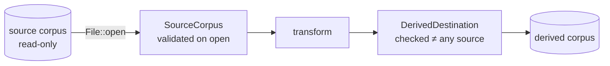
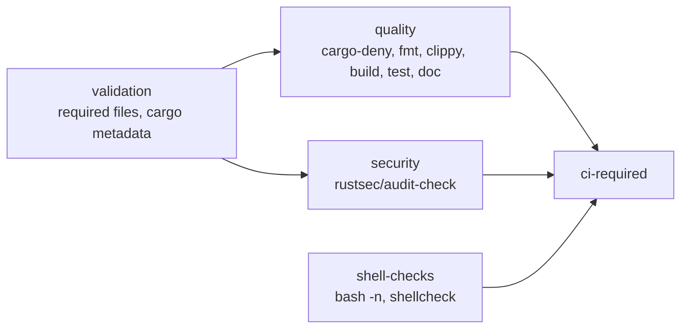

# NEAT-AI-Refinery

> **Raw training data goes in unchanged. Reproducible derived corpora come out.** 🏭

NEAT-AI-Refinery is a high-performance Rust tool for producing transformed
training corpora for [NEAT-AI](https://github.com/stSoftwareAU/NEAT-AI).

It owns the boundary:

```text
immutable source training corpus
        │
        ▼
sampling / shuffling / quantisation / fuzzing / validation
        │
        ▼
derived training corpus
```

The source corpus is never modified in place.

## Scope

Refinery is intentionally application-agnostic. It does not know about GRQ,
stocks, observation-version modules, or NEAT evolution policy.

It operates on fixed-width binary records and produces derived corpora from them.

Refinery owns:

- materialised sampling of a source corpus;
- deterministic/reproducible shuffling;
- quantisation and other representation transforms;
- fuzzing/noise injection;
- transformation manifests and provenance;
- strict validation of record boundaries and output artefacts;
- atomic publication of derived corpora.

Refinery does **not** own:

- creature evolution or generation policy — NEAT-AI;
- scorer-side multi-creature evaluation — NEAT-AI-scorer;
- application-specific orchestration or feature generation — downstream users.

## Migration principle

The existing system is working, so migration is deliberately evolutionary:

1. reproduce the current GRQ sampling behaviour;
2. prove compatibility against fixed fixtures;
3. integrate behind a fallback/feature switch;
4. soak in production;
5. remove obsolete code only after the new path is proven;
6. add new transforms such as quantisation and fuzzing afterwards.

No migration issue should combine behavioural changes with the first sampler port.

## Record shape

Refinery should receive the record shape explicitly. A caller such as GRQ may
derive the values from the current fittest creature JSON and pass them in.

For example:

```text
neat_ai_refinery \
  --source /path/to/trainData-binary \
  --output /path/to/trainData-binary-sampler \
  --inputs 2511 \
  --outputs 1 \
  sample --rate 0.05
```

The important contract is simply:

```text
bytes_per_record = (inputs + outputs) * 4
```

for the current Float32 corpus format.

The downstream orchestration layer may use `jq` (or equivalent) to derive
`inputs` and `outputs` from a creature export. Refinery itself should not
parse GRQ version state.

## Corpus contract

The contract lives in the `neat_ai_refinery::corpus` module, so a caller works
with checked types rather than raw byte arithmetic:

| Type | Owns |
| --- | --- |
| `RecordShape` | `inputs`, `outputs`, `record_values`, `bytes_per_record` |
| `ValueEncoding` | how a value is stored — currently `Float32`, four bytes |
| `SourceCorpus` | a read-only source, validated on open |
| `DerivedDestination` | an output path checked against the sources |
| `CorpusError` | every way the contract can be breached |

```rust
use neat_ai_refinery::corpus::{RecordShape, SourceCorpus};

let shape = RecordShape::new(2511, 1)?;          // bytes_per_record == 10_048
let corpus = SourceCorpus::open("trainData-binary", shape)?;
let first = corpus.read_record(0)?;               // inputs first, then outputs
```

### Immutable source

**Refinery never writes to a source corpus.** Sources are opened with
`File::open`, which requests read access only; no code path in the crate opens
a source for writing, truncates it, appends to it, renames it or removes it.
Derived corpora are written elsewhere, and `DerivedDestination` rejects an
output path that resolves to one of the sources — after canonicalisation, so a
relative path, a `..` segment or a symlink cannot smuggle a write back onto a
source.



### Fatal conditions

Malformed input fails loud rather than being processed approximately:

- a partial trailing record — the size is not a whole multiple of
  `bytes_per_record`;
- an empty source, which holds no records at all;
- a record shape with zero inputs or zero outputs;
- a record width whose `inputs + outputs` or `× 4` arithmetic overflows;
- a record index past the end of the corpus;
- a source directory containing no corpus files.

### Input discovery and ordering

`discover_sources` expands a source path into the files to read, in read order:

1. a regular file is used as-is and yields exactly that one path;
2. a directory is scanned **non-recursively** — nested directories are skipped,
   never descended into;
3. entries whose name begins with `.` are skipped;
4. remaining entries must resolve to regular files (a symlink to one counts);
5. the result is sorted by file name, **byte-wise** — not by locale, case or
   embedded number, so `Shard-1` precedes `shard-10`, which precedes `shard-2`.

Ordering is fixed by these rules alone, so the same source path yields the same
list on every machine and a derived corpus stays reproducible.

## Design goals

- Rust-first and highly performant.
- Streaming/bounded-memory processing where practical.
- Deterministic operation when a seed is supplied.
- Fail loud on malformed or partial records.
- Preserve source data unchanged.
- Derived artefacts carry enough metadata to reproduce how they were made.
- Behavioural parity before optimisation.
- Benchmarks reported as throughput, peak RSS and output size rather than
  subjective "faster" claims.

## Development

Typical local checks:

```bash
cargo fmt --all -- --check
cargo clippy --workspace --all-targets --all-features -- -D warnings
cargo test --workspace
```

Before raising a PR, run the full local gate — it mirrors CI:

```bash
./quality.sh
```

`quality.sh` needs `shellcheck` and `cargo-deny`; `markdownlint-cli2` and
`actionlint` are used when installed and skipped with a notice otherwise
(CI always runs them).

## Continuous integration

PRs into `Develop` (and `milestone/**`) run the `CI` workflow, whose
`ci-required` job is the single aggregated merge gate:



Standalone gates run on PRs against every base branch, so work that bypasses
the full CI graph is still covered:

| Workflow | Gate |
| --- | --- |
| `cargo-quality.yml` | `cargo fmt` and `cargo clippy` |
| `cargo-audit.yml` | RustSec advisories (also weekly on cron) |
| `dependency-review.yml` | new dependencies: vulnerabilities and licences |
| `gitleaks.yml` | secret scanning over the PR commit range |
| `semgrep.yml` | SAST scanning |
| `sbom.yml` | CycloneDX SBOM artefact |
| `actionlint.yml` | workflow YAML lint |
| `markdown-lint.yml` | `markdownlint-cli2` |
| `cargo-upgrade.yml` | weekly dependency-refresh PR |

Every third-party `uses:` reference is pinned to a 40-character commit SHA with
a trailing `# <version>` comment, and container images are pinned by `sha256:`
digest. `refinery/tests/workflow_pins.rs` enforces that on every `cargo test`
run, so an unpinned action fails the build rather than a review.

Refinery has no NEAT-AI-core path dependency, so — unlike the sibling
projects — no workflow checks out a sibling repository.

## Licence

Apache-2.0.
