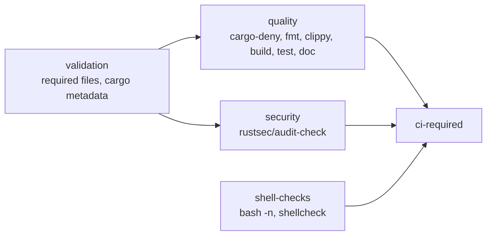

# Bootstrap CI and security posture

## Summary

NEAT-AI-Refinery had no `.github/` directory and no local quality gate. This PR
brings it up to the sibling NEAT-AI Rust baseline, using NEAT-AI-Ockham as the
template while dropping everything Ockham-specific: no NEAT-AI-core sibling
checkout, no `setup-neat-core` composite action, no `neat-core.expected-version`
gate, and no optimiser-specific assumptions. Closes #1.

Added:

- `.github/workflows/ci.yml` — `validation` → `quality` / `security`, plus
  `shell-checks`, aggregated by a `ci-required` gate. Fires on PRs into
  `Develop` and `milestone/**`.
- `.github/workflows/security.yml` — reusable RustSec `audit-check`, with the
  dependency-review step retained behind `include-dependency-review` (the sole
  caller passes `false`; the standalone workflow is the universal gate).
- Standalone gates on every base branch: `cargo-quality.yml`, `cargo-audit.yml`
  (plus weekly cron), `dependency-review.yml`, `gitleaks.yml` (checksum-verified
  pinned binary, PR diff range), `semgrep.yml` (digest-pinned container),
  `sbom.yml` (CycloneDX artefact), `actionlint.yml`, `markdown-lint.yml`.
- `cargo-upgrade.yml` — the fleet's weekly dependency-refresh PR. Dependabot is
  deliberately not added: the siblings use this convention, so one reviewed PR
  carries the whole refresh and CI judges it.
- Repository baseline: `deny.toml`, `rust-toolchain.toml` (1.98.0),
  `Cargo.lock`, `LICENSE` (Apache-2.0, matching README), `.github/CODEOWNERS`,
  an `[allowlist]` block in `.gitleaks.toml`, and `quality.sh` mirroring CI.
- `refinery/tests/workflow_pins.rs` — the pinning policy as executable tests.

Deliberately **not** copied from Ockham: the `version-increment` job and
`scripts/auto-version.sh` (Refinery has no release pipeline yet), the
`.cargo/config.toml` `target-cpu=native` tuning (not CI/security), and the
codespell spell-check job (not in the issue's scope list, and `pip` is
unavailable on the worker so the local half of the gate could not be verified).

## Evidence

Backend/CI change with no web interface, so there is nothing to screenshot.
Verification is the local gate and the tests below.

`./quality.sh` — full run, all checks passed:

```text
Pre-deployment Quality Check (NEAT-AI-Refinery)
shellcheck: all scripts passed
Running markdownlint-cli2...   Summary: 0 issues in 0 files
Running actionlint...
Running licence and dependency audit (cargo-deny)...
Checking formatting... / Running linter... / Running tests...
test result: ok. 13 passed; 0 failed
Building documentation...
All quality checks passed!
```

The pinning gate was proved to bite, not merely to pass: dropping a scratch
workflow with `uses: actions/checkout@v5` and `image: alpine:3` into
`.github/workflows/` turned it red with the exact offending lines, and removing
the file returned it to green.

```text
.github/workflows/zz-scratch.yml:8 image: alpine:3 — container image is not pinned by @sha256: digest
.github/workflows/zz-scratch.yml:10 - uses: actions/checkout@v5 — `v5` is a mutable tag, not a 40-character commit SHA
test result: FAILED. 11 passed; 2 failed
```

CI job graph on PRs into `Develop`:



## Acceptance Criteria

- **met** — PRs into `Develop` run the Rust quality gates — evidence:
  `.github/workflows/ci.yml` (`branches: [Develop, "milestone/**"]`; `quality`
  runs cargo-deny, fmt, clippy, build, test, doc; `ci-required` aggregates).
- **met** — Secret scanning and dependency review are active — evidence:
  `.github/workflows/gitleaks.yml` (checksum-pinned scanner over the PR commit
  range) and `.github/workflows/dependency-review.yml`.
- **met** — Security/SBOM workflows do not assume NEAT-AI-core is a dependency —
  evidence: `.github/workflows/security.yml` and `.github/workflows/sbom.yml`
  contain no sibling checkout or `setup-neat-core` step; `Cargo.lock` shows the
  workspace resolving with no dependencies.
- **met** — All action versions are pinned consistently with the sibling
  projects — evidence: every `uses:` carries the same SHA pins as Ockham, and
  `refinery/tests/workflow_pins.rs::every_workflow_action_is_sha_pinned` /
  `::every_container_image_is_digest_pinned` enforce it on every `cargo test`.
- **met** — The repository builds with no feature implementation beyond the
  bootstrap binary — evidence: `./quality.sh` passes; `refinery/src/main.rs` is
  unchanged.
- **unrequested** — `LICENSE` added — reason: the `validation` job checks for
  the licence file the README already claims (Apache-2.0), which would
  otherwise fail on the first PR.
- **unrequested** — `Cargo.lock` committed — reason: `cargo audit`, dependency
  review and the SBOM all read the lockfile, so it must be in the tree.
- **unrequested** — `.markdownlint-cli2.yaml` now ignores `target/**` — reason:
  `cargo doc` emits third-party licence markdown there, which failed the local
  markdown gate after a doc build.
- **unrequested** — README "Continuous integration" section and CONTRIBUTING
  "Workflow changes" section — reason: the code change owes a docs change; the
  new gates and the pinning rule need a documented home.

## Test Plan

Added `refinery/tests/workflow_pins.rs` (13 tests):

- `repository_ships_workflows` — fails loud if `.github/workflows` is missing or
  empty, so a deleted CI directory cannot pass silently.
- `every_workflow_action_is_sha_pinned`,
  `every_container_image_is_digest_pinned`,
  `composite_actions_are_sha_pinned_too` — scan the real workflow files.
- Unit coverage of the checker: SHA pin with version comment passes; tag pin,
  SHA pin without a version comment, and a reference with no `@revision` are
  each reported; local `./…` actions and reusable workflows are exempt; comments
  and blank lines are ignored; a 40-character non-hex revision and a truncated
  SHA are both rejected; digest-pinned versus tag-pinned images; empty input.

Also run: `./quality.sh` (shellcheck, markdownlint-cli2, actionlint, cargo-deny,
fmt, clippy, tests, rustdoc) — all green.
