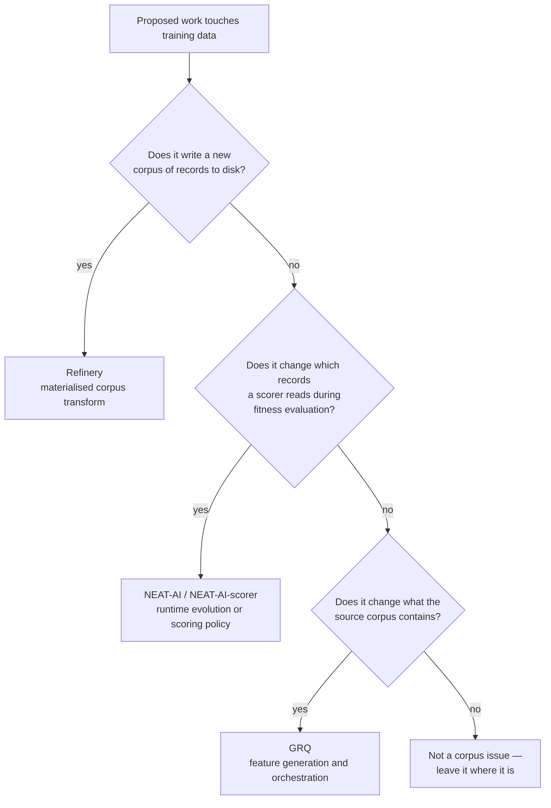

# Audit NEAT-AI and GRQ open issues for corpus-transform ownership

## Summary

Audited every open issue in `stSoftwareAU/NEAT-AI`, `stSoftwareAU/NEAT-AI-scorer`,
`stSoftwareAU/GRQ` and `stSoftwareAU/GRQ-sampler` against the corpus-transform
ownership rule, and committed the rule and the verdicts as
`docs/corpus-transform-ownership.md`. Closes #10.

**The audit result: no open issue in those repositories is Refinery-owned.**
Every sampling-adjacent issue is either runtime fitness policy (NEAT-AI,
NEAT-AI-scorer) or source feature generation (GRQ), so nothing moved, nothing
was recreated here, and nothing was closed or superseded there.

Two ambiguous issues would build a mechanism Refinery already owns, and the
document records why:

- **GRQ#4536** wants to stamp the sample rate beside `dataSha`. Refinery's
  published `manifest.json` already records it authoritatively
  (`refinery/src/sample/run.rs:117`), so the fix is to read the manifest rather
  than start a second provenance record.
- **GRQ#4459** needs a pass over the `.bin` corpus for `Var(y)`. The statistic
  stays GRQ's, but `neat_ai_refinery::corpus` already owns the fixed-width
  record contract (`refinery/src/corpus.rs:17-23`) and should be reused rather
  than reimplemented.

## Evidence

Backend/documentation change with no web interface — there is nothing to
screenshot. The deliverable is the audit itself; the verifiable artefacts are
the search commands recorded in the document (reproducible with `gh`) and the
`file:line` citations backing the two duplicate-mechanism findings.

Ownership decision rule, as committed in the document:



Verification run:

```text
$ markdownlint-cli2
Linting: 18 files
Summary: 0 issues in 0 files

$ ./quality.sh < /dev/null
All quality checks passed!
```

## Acceptance Criteria

- **met** — Search open NEAT-AI + GRQ issues for sampling/quantisation/fuzzing/data
  transforms — evidence: `docs/corpus-transform-ownership.md` §"How the sweep was
  run" records the exact `gh issue list` and `gh search issues` commands, and
  §"Verdicts" carries a row for every candidate returned (15 NEAT-AI, 2
  NEAT-AI-scorer, 7 GRQ entries; `GRQ-sampler` has no open issues).
- **met** — Cross-link or recreate true Refinery-owned issues here — evidence:
  `docs/corpus-transform-ownership.md` §"Result" and §"Duplicate mechanisms to
  avoid". No source issue was Refinery-owned, so there was nothing to recreate;
  the two issues with a genuine Refinery overlap (GRQ#4536, GRQ#4459) are
  cross-linked to `refinery/src/sample/run.rs:117` and `refinery/src/corpus.rs`
  respectively.
- **met** — Close/supersede old issues only where ownership genuinely moved —
  evidence: `docs/corpus-transform-ownership.md` §"Verdicts" — ownership moved
  for none, so nothing was closed or superseded. The "only where" condition is
  satisfied by taking no action.
- **partial** — Add a short ownership note to ambiguous source issues — evidence:
  the five notes are drafted and committed in
  `docs/corpus-transform-ownership.md` §"Ownership notes for the source issues" —
  reason: posting them requires writing to NEAT-AI and GRQ, and the run's write
  guard refuses cross-repo issue comments
  (`[SECURITY] [WRITE_REPO_BLOCKED] Refused issue-comment to stSoftwareAU/NEAT-AI`);
  the posting is tracked by #31.
- **unrequested** — README gained a five-line pointer to the new document —
  reason: an ownership rule nobody can find is re-litigated; the README's Scope
  section is where a reader already looks for the boundary.

## Test Plan

This is a documentation and audit change with no Rust surface, so no unit test
applies — the repository's gate for `docs/` is markdownlint, and the audit's
correctness rests on citations that were checked against the code:

- `markdownlint-cli2` — 18 files, 0 issues (the new document and the README
  edit).
- `./quality.sh < /dev/null` — full gate: bash syntax, shellcheck, markdownlint,
  actionlint, `cargo deny`, `cargo fmt --check`, `cargo clippy -D warnings`,
  `cargo test --workspace`, `cargo doc`.
- Citations verified against the tree before writing: `rate` is recorded in the
  manifest transform parameters at `refinery/src/sample/run.rs:117-123`, and
  `RecordShape` / `SourceCorpus` / `RecordReader` are exported from
  `refinery/src/corpus.rs:17-23`.
