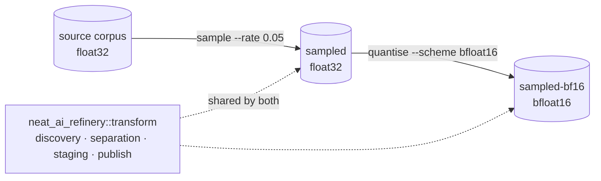

# Add quantisation as a composable derived-corpus transform

## Summary

Adds `quantise`, Refinery's second transform, with an initial conservative
`bfloat16` scheme: an `f32` keeps its sign and its whole exponent and loses
sixteen mantissa bits, **rounded to nearest with ties to even** rather than
truncated. Storage halves; relative error is bounded by `2⁻⁸` ≈ `3.91e-3` at
every magnitude; the source corpus is never touched. Closes #11.

Quantisation is a **representation** transform, not a selection one — every
record survives, in the order it was read, and a run takes no seed because it
is deterministic without one.

To make it compose with sampling rather than duplicate it, the machinery both
transforms share — source discovery, destination separation, staging and atomic
publication — moved out of `sample` into a new `neat_ai_refinery::transform`
module. Neither transform knows the other exists, and neither knows anything
about GRQ: composition is two ordinary CLI runs over each other's output
directory.

```bash
neat_ai_refinery --source trainData-binary --output sampled \
  --inputs 2511 --outputs 1 sample --rate 0.05
neat_ai_refinery --source sampled --output sampled-bf16 \
  --inputs 2511 --outputs 1 quantise --scheme bfloat16
```

## Evidence

This is a backend/CLI change with no web interface to screenshot. The evidence
is the test suite, the benchmark run and the mutation check below.

### Architecture



### Benchmarks

`cargo run --release --example quantise_throughput` on Linux aarch64 (7 cores),
8 shards × 20 000 records at the production shape (2511 inputs, 1 output):

```text
corpus: 8 shards × 20000 records = 1533 MiB, built in 1.66s
quantised 160000 records as bfloat16 in 1.855s — 86236 records/s, 826.4 MiB/s read
storage: 1533.2 MiB → 766.6 MiB, 50.0% smaller
reconstruction error over 401920000 values: max relative 3.891e-3, mean relative 1.408e-3, max absolute 1.600e1
scheme bound: 3.906e-3 — held
```

| Measure | Result |
| --- | --- |
| Storage reduction | 1 533.2 MiB → 766.6 MiB, **50.0%** |
| Read throughput | 86 236 records/s, **826 MiB/s** |
| Max relative error | `3.891e-3`, against the proven `3.906e-3` bound |
| Mean relative error | `1.408e-3` |
| Max absolute error | `1.600e1`, at values of order `10³` |

The measured maximum sits just under the proven bound, so the benchmark fixture
reaches the worst case rather than flattering the scheme. Storage reduction is
exactly 50% by construction — two bytes a value instead of four — so it is
reported, not tuned for.

**No claim is made that a quantised corpus improves model quality.** The
transform reports what it costs and what it saves; whether that trade is worth
taking is a downstream experimental question, as the issue asks.

### The tests catch a broken codec

Replacing round-to-nearest-even with plain truncation (the obvious wrong
implementation, which biases every magnitude towards zero) fails both the
bit-level and the corpus-level guards:

```text
test corpus::bfloat16::tests::rounds_to_the_nearest_representable_value ... FAILED
test corpus::bfloat16::tests::holds_the_relative_error_bound_across_the_exponent_range ... FAILED
test holds_the_documented_relative_error_bound_across_the_corpus ... FAILED
```

Restored, all 16 quantise integration tests and 61 unit tests pass, and
`./quality.sh` is green end to end.

### Round-trip and error bounds

Documented in [`docs/quantisation.md`](../../quantisation.md) — the bit-level
mapping, the proof of the `2⁻⁸` bound, and the special-value table (zeros keep
their sign, infinities survive, a `NaN` whose payload lives only in the
discarded bits stays a `NaN` rather than truncating to an infinity, `f32`
subnormals round to a signed zero, and only values within half an interval of
`f32::MAX` round up to `+∞`). Decoding is exact, so all error is introduced
once, at write time.

## Acceptance Criteria

- **met** — Source corpus remains unchanged — evidence:
  `refinery/tests/quantise_transform.rs::leaves_the_source_corpus_byte_for_byte_unchanged`
  and `::refuses_an_output_directory_that_overlaps_the_source`
- **met** — Quantisation parameters are explicit and included in the manifest —
  evidence: `refinery/tests/quantise_transform.rs::records_the_scheme_and_both_layouts_in_the_manifest`
  asserts `scheme`, `source_encoding`, `target_encoding`, `rounding` and
  `max_relative_error`, plus the new `source_record_shape`
- **met** — Initial conservative scheme with a documented mapping and error
  characteristics — evidence: `refinery/src/corpus/bfloat16.rs` and
  `docs/quantisation.md`
- **met** — Measure storage reduction, read throughput and reconstruction error
  — evidence: `refinery/examples/quantise_throughput.rs`, numbers above
- **met** — Do not assume a quantised corpus improves model quality — evidence:
  stated as a non-claim in `docs/quantisation.md`, `README.md` and the
  `quantise` module docs; nothing in the code or the benchmark asserts quality
- **met** — Deterministic tests — evidence:
  `refinery/tests/quantise_transform.rs::is_deterministic_without_a_seed`; the
  transform takes no seed at all
- **met** — Round-trip/error bounds documented — evidence:
  `docs/quantisation.md`, asserted by
  `refinery/src/corpus/bfloat16.rs::holds_the_relative_error_bound_across_the_exponent_range`
  and `::round_trips_a_value_the_scheme_represents_exactly`
- **met** — Benchmark results included — evidence: the run above, reproducible
  with `cargo run --release --example quantise_throughput`
- **met** — Can compose with sampling without GRQ-specific logic — evidence:
  `refinery/tests/quantise_transform.rs::composes_with_sampling_over_the_published_corpus`
  runs `sample` then `quantise` over its output; the shared half lives in
  `neat_ai_refinery::transform` and mentions neither GRQ nor either transform
- **unrequested** — `sample`'s staging, publication and source-discovery
  helpers moved to a new `transform` module, and `refinery/tests/sample_publish.rs`
  was renamed to `transform_publish.rs` with its assertions unchanged — reason:
  the acceptance criterion "compose with sampling without GRQ-specific logic"
  cannot be met by duplicating that machinery into `quantise`; `SampleError`
  keeps every variant and gains `From<TransformError>`, so its public surface
  and messages are unchanged.
- **unrequested** — `Cli::request` now returns a `TransformRequest` enum and a
  `CliError` instead of a bare `SampleRequest`/`SampleError` — reason: a second
  subcommand cannot be added to an irrefutable `let Command::Sample(..)`. Every
  existing assertion in `refinery/tests/cli_surface.rs` is preserved, only
  re-matched through the new enum; no test was removed or weakened.

## Test Plan

Added:

- `refinery/tests/quantise_transform.rs` — 16 integration tests over real
  corpora on disk: publication and record order, 50% storage reduction, the
  relative error bound across a whole corpus, determinism without a seed,
  exact round-trip of representable values, the manifest's parameters and both
  layouts, composition with `sample`, refusal of a double pass, refusal of a
  contradicted record width, a broken source manifest, a raw corpus with no
  manifest, source immutability, an overlapping destination, an empty source, a
  partial trailing record, and whole-directory replacement.
- `refinery/src/corpus/bfloat16.rs` — 10 unit tests on the mapping itself:
  round-to-nearest, ties-to-even, the error bound swept across every finite
  exponent, signed zeros, infinities, `NaN` payload preservation, saturation at
  the top of the range, subnormals, and determinism.
- `refinery/src/corpus/shape.rs` — bfloat16 width, encoding names, and
  encode/decode/transcode round trips.
- `refinery/src/quantise/plan.rs` — scheme naming, parsing, refusal of an
  unknown scheme, the recorded parameters, and the narrower target shape.
- `refinery/src/quantise/run.rs` — storage-reduction reporting, including the
  empty-source case that must not divide by zero.
- `refinery/src/manifest/model.rs` — `source_record_shape` is written when a
  transform changes the layout and omitted when it does not.
- `refinery/tests/cli_surface.rs` — the documented `quantise` invocation,
  refusal of an unknown scheme, `--scheme` being required rather than
  defaulting, and metadata carried into a quantise request.

Modified:

- `refinery/tests/cli_surface.rs` — existing sample assertions re-matched
  through `TransformRequest`/`CliError`; none removed.
- `refinery/tests/transform_publish.rs` — renamed from `sample_publish.rs`,
  imports moved to `neat_ai_refinery::transform`; assertions unchanged.

`./quality.sh` passes: `cargo-deny`, `cargo fmt`, `clippy -D warnings`, the
full test suite (159 tests across 14 binaries plus 6 doc-tests), and
`cargo doc` with `-D warnings`.
