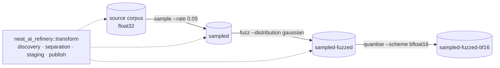

# Add seeded fuzz/noise augmentation as a composable transform

## Summary

Adds `fuzz`, Refinery's third transform and its first **value** transform: it
perturbs corpus values with seeded noise and changes nothing else — record
count, order, width and encoding all survive untouched. The whole perturbation
policy is validated once, applied to every targeted value, and recorded in the
manifest beside the published corpus, so a derived corpus can be replayed from
its own provenance. Closes #12.

The design follows the two transforms already in the repository rather than
inventing a shape for this one: source discovery, destination separation,
staging and atomic publication all come from `neat_ai_refinery::transform`, and
the published directory is a `.bin` corpus with a `manifest.json` beside it —
which is exactly what `sample` and `quantise` produce and consume.

```bash
neat_ai_refinery \
  --source trainData-binary --output trainData-binary-fuzzed \
  --inputs 2511 --outputs 1 \
  fuzz --distribution gaussian --scale 0.01 --mode relative \
       [--targets inputs] [--clamp-min -1 --clamp-max 1] [--seed 20260831]
```

Four decisions are worth a reviewer's attention:

- **`--distribution`, `--scale` and `--mode` have no defaults.** A scale means
  nothing without the distribution and the mode to read it against, so all
  three are always stated and always recorded — the stance `quantise --scheme`
  already takes.
- **`--targets` defaults to `inputs`.** Perturbing an expected output does not
  add noise to a corpus, it changes what the corpus *teaches*; reaching one is
  an explicit `--targets outputs` or `--targets all`.
- **Non-finite handling is defined, not incidental.** A `NaN` or infinity
  already in the source is written back unchanged and *counted* as preserved
  (noise is not defined on it); a perturbation whose *result* leaves the finite
  range fails the run naming the record and value, because clamping an infinity
  to the ceiling would publish a plausible number in place of a fault.
- **One draw per targeted value, whatever the value is.** The noise sequence
  depends on the policy and the record shape alone, never on the data, so
  reproducibility does not vary with what a corpus happens to hold.

Refinery makes **no claim** that a fuzzed corpus trains a better model or that
noise augmentation improves fitness. The README, `docs/fuzzing.md` and the
module documentation all say so explicitly; Refinery only supplies the
transform.

## Evidence

This is a backend/CLI change with no web interface to screenshot, so the
evidence is the test suite and the binary's own output. Run end to end against a
200-record corpus with the release binary:

```text
$ sha256sum src/shard-a.bin
1ef3d401cae82659a329092052a566b87861ee5676323a38ecdbb1fd74fc9850  src/shard-a.bin

$ neat_ai_refinery --source src --output fuzzed --inputs 3 --outputs 1 \
    --metadata run.label=demo \
    fuzz --distribution gaussian --scale 0.02 --mode absolute \
         --clamp-min -1 --clamp-max 1 --seed 20260831
🏭 fuzzed/fuzz-gaussian.bin — 200 records, 600 values perturbed (2 clamped, 0 non-finite preserved) from 1 file(s), seed 20260831
📄 fuzzed/manifest.json — sha256 e5c9932fe62308e2d1fc50a30cc96b209e402a446f93caba65cee6d0df05512a

$ neat_ai_refinery ... --output again ...   # identical seed and policy
🏭 again/fuzz-gaussian.bin — 200 records, 600 values perturbed (2 clamped, 0 non-finite preserved) from 1 file(s), seed 20260831
📄 again/manifest.json — sha256 e5c9932fe62308e2d1fc50a30cc96b209e402a446f93caba65cee6d0df05512a

$ sha256sum src/shard-a.bin                 # the source after both runs
1ef3d401cae82659a329092052a566b87861ee5676323a38ecdbb1fd74fc9850  src/shard-a.bin

expected outputs identical: True
input values moved:         600 of 600
```

Same seed, same checksum; source byte-for-byte unchanged; every input moved and
no expected output did. The published policy:

```json
{
  "name": "fuzz",
  "parameters": {
    "clamp_max": 1.0, "clamp_min": -1.0,
    "distribution": "gaussian", "mode": "absolute", "scale": 0.02,
    "targets": "inputs",
    "non_finite_result": "fail", "non_finite_source": "preserve"
  },
  "seed": 20260831
}
```

Failing loud rather than publishing something plausible:

```text
$ neat_ai_refinery ... fuzz --distribution uniform --scale 1e300 --mode absolute --clamp-max 1
neat_ai_refinery: record 0 value 0: -0.7312715 was perturbed to -inf, which the corpus cannot store — the scale does not suit this corpus
exit=1                                       # and no output directory was created

$ neat_ai_refinery ... fuzz --distribution cauchy --scale 0.1 --mode absolute
neat_ai_refinery: unknown noise distribution "cauchy" — Refinery offers: gaussian, uniform
exit=1
```

Where the transform sits:



`./quality.sh` passes in full — cargo-deny, `cargo fmt --check`, clippy with
`-D warnings`, 155 tests and `cargo doc` with `-D warnings`.

## Acceptance Criteria

- **met** — Same seed/config produces identical derived corpus — evidence:
  `refinery/tests/fuzz_transform.rs::the_same_seed_and_policy_produce_an_identical_derived_corpus`
  (bytes and checksum), plus
  `::seeds_from_the_operating_system_and_reports_the_seed_it_used` (a reported
  OS seed replays the run) and
  `refinery/src/fuzz/noise.rs::the_same_seed_replays_the_same_sequence`. The two
  identical checksums in the Evidence section are the same property from the
  binary.
- **met** — Source unchanged — evidence:
  `refinery/tests/fuzz_transform.rs::leaves_the_source_corpus_byte_for_byte_unchanged`,
  and `::composes_with_sampling_over_the_published_corpus`, which fuzzes a
  published corpus and asserts it survives. Sources are opened read-only and
  `resolved_source` refuses an output that overlaps one
  (`::refuses_an_output_directory_that_overlaps_the_source`).
- **met** — Tests prove outputs are untouched by default — evidence:
  `refinery/tests/fuzz_transform.rs::leaves_expected_outputs_untouched_by_default`
  asserts every published output against its source bit for bit, and
  `::perturbs_outputs_only_when_explicitly_requested` proves `--targets
  outputs`/`all` are the only way to reach one.
  `refinery/tests/cli_surface.rs::targets_inputs_unless_the_caller_asks_for_more`
  pins the default at the CLI.
- **met** — Seeded/reproducible — evidence: `refinery/src/fuzz/noise.rs`, a
  seeded generator drawn from once per targeted value in record order; the seed
  used is always recorded (`FuzzOutcome::seed`, `transform.seed`).
- **met** — Explicit distributions/parameters — evidence:
  `refinery/src/cli.rs::FuzzArgs` — `--distribution`, `--scale` and `--mode` are
  required, and `refinery/tests/cli_surface.rs::requires_the_distribution_the_scale_and_the_mode`
  asserts none of them is defaulted.
- **met** — Manifest records the exact perturbation policy — evidence:
  `refinery/src/fuzz/plan.rs::FuzzPolicy::parameters` and
  `refinery/tests/fuzz_transform.rs::records_the_exact_perturbation_policy_in_the_manifest`.
  Both bounds always appear, `null` when absent
  (`::records_absent_bounds_explicitly_rather_than_omitting_them`), so an
  unbounded policy is legible as a decision.
- **met** — Bounds/non-finite handling defined and tested — evidence:
  `::clamps_every_published_value_into_the_configured_bounds`,
  `::honours_a_one_sided_bound`,
  `::preserves_a_non_finite_source_value_rather_than_perturbing_it` and
  `::fails_loud_when_a_perturbation_leaves_the_finite_range`, with the policy
  itself documented in `docs/fuzzing.md`.
- **met** — No claim that fuzzing improves fitness — evidence:
  `refinery/src/fuzz.rs` module documentation, `docs/fuzzing.md` and the README
  section all state that Refinery only supplies the transform.
- **unrequested** — `ValueEncoding::decode_into` added in
  `refinery/src/corpus/shape.rs` — reason: fuzzing edits values rather than
  re-encoding them, and this keeps its working set at one record instead of
  allocating a `Vec<f32>` per record; `decode` now delegates to it.
- **unrequested** — `transform::source_manifest` / `source_manifest_path` added
  in `refinery/src/transform/scan.rs`, with `quantise::check_source_declaration`
  switched to them — reason: `fuzz` needs the same source-manifest check, and
  duplicating it in a second transform rather than sharing it would have been
  the worse change.
- **unrequested** — `allow_negative_numbers` on `--scale`, `--clamp-min` and
  `--clamp-max` — reason: without it clap reads `--clamp-min -1` as an unknown
  flag, so the documented invocation would not parse and a negative scale would
  be rejected with the wrong message.

## Test Plan

New — `refinery/tests/fuzz_transform.rs`, 25 integration tests driving the
public API against real corpora on disk:

- publication, ordering and layout: `publishes_every_record_in_order_under_the_distribution_name`,
  `replaces_a_previously_published_corpus_whole`;
- targets: `leaves_expected_outputs_untouched_by_default`,
  `perturbs_outputs_only_when_explicitly_requested`;
- reproducibility: `the_same_seed_and_policy_produce_an_identical_derived_corpus`,
  `a_different_seed_produces_a_different_corpus`,
  `a_policy_change_alone_produces_a_different_corpus`,
  `seeds_from_the_operating_system_and_reports_the_seed_it_used`;
- provenance: `records_the_exact_perturbation_policy_in_the_manifest`,
  `records_absent_bounds_explicitly_rather_than_omitting_them`;
- bounds and non-finite values: `clamps_every_published_value_into_the_configured_bounds`,
  `honours_a_one_sided_bound`, `keeps_uniform_absolute_noise_inside_the_scale`,
  `preserves_a_non_finite_source_value_rather_than_perturbing_it`,
  `fails_loud_when_a_perturbation_leaves_the_finite_range`;
- policy validation: `rejects_a_scale_that_is_not_a_positive_finite_number`,
  `rejects_bounds_that_cross_or_are_not_finite`;
- immutability and composition: `leaves_the_source_corpus_byte_for_byte_unchanged`,
  `composes_with_sampling_over_the_published_corpus`,
  `refuses_a_source_whose_manifest_declares_another_encoding`,
  `refuses_a_record_shape_the_source_manifest_contradicts`,
  `fails_loud_on_a_source_manifest_it_cannot_read`,
  `refuses_an_output_directory_that_overlaps_the_source`,
  `refuses_a_source_directory_holding_no_corpus_files`,
  `fails_loud_on_a_partial_trailing_record`.

New unit tests: `refinery/src/fuzz/plan.rs` (11 — parsing, target splits, both
modes, clamping, preservation, overflow, recorded parameters, validation),
`refinery/src/fuzz/noise.rs` (4 — the Gaussian stream is standard normal, the
uniform one stays in `[-1, 1)`, pairs are not lost, a seed replays), and
`refinery/src/fuzz/error.rs` (2 — messages name the alternatives and locate a
non-finite result).

Extended: `refinery/tests/cli_surface.rs` (+8 — the documented invocation, the
`inputs` default, bounds and seed, unknown distribution/mode/targets, an
unusable scale, crossed bounds, the three required flags, metadata) and
`refinery/src/corpus/shape.rs` (+1 — `decode_into` reuses a buffer without
keeping the previous record).

Whole suite: 155 tests, all passing under `./quality.sh`.

## Documentation

- `docs/fuzzing.md` — new: the policy, both distributions, both modes, the
  target split, bounds, the non-finite table, reproducibility (with a Mermaid
  flow), the manifest, and composing with `sample` and `quantise`.
- `README.md` — a **Fuzzing** section, the migration principle updated (fuzzing
  is no longer "not done"), and the composing-transforms example and diagram
  extended to all three transforms.
- Module documentation on `refinery/src/fuzz.rs` and its submodules; `cli.rs`
  and `lib.rs` updated to name the new transform.
