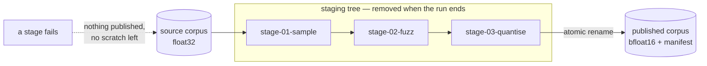

# Compose transform pipelines with explicit ordering

## Summary

Refinery's transforms already composed by being run one after another. This
adds the composition as a first-class, recorded thing: a `pipeline` module and
CLI subcommand that applies several standard transforms **in a stated order**
and publishes one derived corpus, from a serialisable configuration file.

The order is configuration rather than a detail because transforms do not
generally commute — fuzzing then quantising perturbs `float32` values and
rounds the result; quantising then fuzzing rounds first and perturbs the
rounded values. A pipeline runs exactly the list it was given and records that
list in the manifest.

Nothing is baked into GRQ, and nothing is baked into the orchestrator: each
stage is the ordinary standalone `sample`, `fuzz` or `quantise` run over the
previous stage's output, so a one-stage pipeline is byte-for-byte the
standalone run and every transform stays independently testable.

Closes #13.

### What was added

- **`neat_ai_refinery::pipeline`** — `PipelineConfig` (the stable JSON form),
  `PipelineRequest`/`PlannedStage` (validation before any file is opened), and
  `run_pipeline` (the run itself), with `PipelineError`/`StageError` carrying
  each transform's own explanation under the stage that produced it.
- **`manifest.pipeline`** — an optional, ordered `Vec<TransformRecord>`. Its
  absence still means a single-transform corpus, so existing manifests and the
  pinned consumer contract are unchanged.
- **`pipeline --config FILE`** on the CLI, and a run report naming the stages in
  the order they ran.
- **`docs/pipelines.md`**, plus a README section under *Composing transforms*.

### How ordering, seeds and publication work



A run has **one** seed. Each stage that draws randomness gets its own seed
derived from the pipeline seed and its **position** via the SplitMix64
finaliser, so no two stages share a draw sequence and moving a stage changes
what it draws. A stage may pin its own seed instead. Only the final corpus is
published; the intermediate corpora live inside the staging tree and are
removed whether the run succeeds or fails.

## Evidence

This is a backend/CLI change with no web interface to screenshot. The evidence
is the test suite and the command output below.

The `pipeline` subcommand run end to end over a 400-record, two-shard corpus:

```text
$ neat_ai_refinery --source trainData-binary --output refined \
    --inputs 3 --outputs 1 --metadata grq_observation_version=42 \
    pipeline --config pipeline.json
🏭 refined/quantise-bfloat16.bin — 400 → 203 records through sample → fuzz → quantise, seed 20260831
   1. sample — 400 → 203 records, seed 283084283387929719
   2. fuzz — 203 → 203 records, seed 7589195149613138759
   3. quantise — 203 → 203 records
📄 refined/manifest.json — sha256 d2f11f72d041fd36c71cc96b357e6ef87559cc121336a03dbb3019084cf28e4f
```

Re-running the identical source, configuration and seed into a second output
published the same bytes (`cmp` reported no difference, and the checksum above
matched), and the published directory held exactly the corpus and its manifest
— no scratch survived.

The manifest that run published, abridged:

```json
{
  "transform": {
    "name": "pipeline",
    "parameters": { "config_version": 1, "stage_count": 3 },
    "seed": 20260831
  },
  "pipeline": [
    { "name": "sample", "parameters": { "rate": 0.5 }, "seed": 283084283387929719 },
    { "name": "fuzz", "parameters": { "distribution": "gaussian", "mode": "relative", "scale": 0.01, "targets": "inputs" }, "seed": 7589195149613138759 },
    { "name": "quantise", "parameters": { "scheme": "bfloat16" }, "seed": null }
  ],
  "record_shape": { "encoding": "bfloat16", "bytes_per_record": 8 },
  "source_record_shape": { "encoding": "float32", "bytes_per_record": 16 },
  "source": { "path": "…/trainData-binary", "file_count": 2, "record_count": 400 },
  "output": { "file": "quantise-bfloat16.bin", "record_count": 203 }
}
```

`./quality.sh` passes in full: shellcheck, markdownlint, actionlint,
`cargo deny`, `cargo fmt --check`, clippy with `-D warnings`, 272 tests across
the workspace, and `cargo doc` with `RUSTDOCFLAGS="-D warnings"`.

## Acceptance Criteria

- **met** — Pipeline configuration has a stable serialisable form — evidence:
  `refinery/src/pipeline/config.rs` (`PipelineConfig`, version-gated, unknown
  keys refused);
  `refinery/tests/pipeline_compose.rs::round_trips_the_configuration_through_a_stable_json_form`,
  `::loads_a_configuration_an_operator_wrote_by_hand`,
  `::refuses_a_configuration_version_it_does_not_know`,
  `::refuses_a_stage_key_it_does_not_know_rather_than_ignoring_it`
- **met** — Manifest records ordered transforms — evidence: `manifest.pipeline`
  in `refinery/src/manifest/model.rs`;
  `refinery/tests/pipeline_compose.rs::records_the_ordered_transforms_in_the_manifest`,
  `::applies_the_stages_in_the_order_they_are_configured`
- **met** — Same source/config/seed reproduces the same output — evidence:
  `refinery/tests/pipeline_compose.rs::replays_the_same_bytes_for_the_same_source_config_and_seed`,
  `::draws_and_reports_a_seed_when_the_configuration_omits_one`;
  `refinery/src/pipeline/plan.rs` unit tests over the stage-seed derivation
- **met** — Individual transforms remain independently testable — evidence: no
  transform was modified; every stage calls the public `sample`/`fuzz`/
  `quantise` entry point unchanged
  (`refinery/src/pipeline/run.rs::run_stage`), and
  `refinery/tests/pipeline_compose.rs::is_equivalent_to_running_the_transforms_one_after_another`
  asserts a one-stage pipeline is byte-for-byte the standalone run
- **unrequested** — no `shuffle` stage — reason: the issue's example names one,
  but no `shuffle` transform exists in the crate; adding one is a separate
  transform, not pipeline composition, so the pipeline covers the three
  transforms that do exist and takes a new one without changing its shape

## Test Plan

New — `refinery/tests/pipeline_compose.rs` (12 tests):

- `round_trips_the_configuration_through_a_stable_json_form`
- `loads_a_configuration_an_operator_wrote_by_hand`
- `records_the_ordered_transforms_in_the_manifest`
- `replays_the_same_bytes_for_the_same_source_config_and_seed`
- `draws_and_reports_a_seed_when_the_configuration_omits_one`
- `applies_the_stages_in_the_order_they_are_configured` — the non-commuting
  check: the same stages in the opposite order publish different bytes
- `is_equivalent_to_running_the_transforms_one_after_another`
- `refuses_a_pipeline_with_no_stages`
- `refuses_a_configuration_version_it_does_not_know`
- `refuses_a_stage_key_it_does_not_know_rather_than_ignoring_it`
- `refuses_an_unusable_stage_before_a_single_file_is_read`
- `publishes_nothing_and_leaves_no_scratch_when_a_stage_fails`

Added — `refinery/tests/cli_surface.rs` (4 tests) covering the `pipeline`
subcommand: the documented invocation, an unreadable configuration, a stage the
run cannot perform, and the missing `--config` flag.

Added — unit tests in `refinery/src/pipeline/config.rs` (7),
`refinery/src/pipeline/plan.rs` (6, including the stage-seed derivation),
`refinery/src/pipeline/run.rs` (1) and `refinery/src/manifest/model.rs` (2, for
the new `pipeline` field being omitted when absent).

No existing test was modified or removed.

## Security self-check

- **Input validation** — the configuration is version-gated, refuses unknown
  keys rather than ignoring them, and every stage parameter is validated by the
  transform that owns it before any file is opened.
- **Secrets** — none staged; the only new files are source, tests and docs.
- **Injection surface** — no new shell, SQL or HTTP calls. Stage scratch
  directories are named from the stage's position and the transform's own
  `&'static str` name, never from configuration text.
- **Filesystem safety** — the immutable-source rule is unchanged: the output is
  checked against the source before anything is created, each stage reuses the
  existing `DerivedDestination`/`StagedCorpus` machinery, and scratch lives
  inside the staging tree that is removed on both success and failure.
- **Error handling** — every failure is fatal and named: no stage error is
  swallowed, and a failed run publishes nothing.
