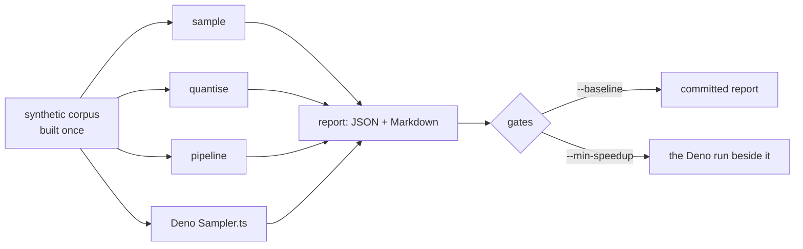

# Benchmark Refinery throughput, peak RSS and output size

## Summary

Adds a benchmark harness that establishes objective performance evidence for
the Rust implementation: each transform measured through the release binary
over one synthetic corpus, reporting wall-clock, input GiB/s, records/s, peak
RSS and published output size, with the Deno `Sampler.ts` GRQ shipped measured
beside it over the same corpus. Closes #14.

No optimisation was attempted and no transform code changed — this issue asks
for measurement, so the committed numbers are the baseline future runs are held
to, not a before/after.

What landed:

- `neat_ai_refinery::bench` — the harness: cases, measured runs, the report,
  and the baseline comparison.
- `refinery/examples/benchmark.rs` and `bench/run.sh` — the reproducible
  command.
- `.github/workflows/benchmark.yml` — the same benchmark on `ubuntu-latest` and
  `macos-latest` for every pull request, publishing the numbers to the job
  summary and failing on a regression.
- `docs/benchmarks.md` and `docs/evidence/bench-linux-aarch64.{json,md}`.
- `corpus::write_synthetic_corpus` — the fixture builder the soak already had,
  lifted so both harnesses read the same corpus.

Two regression gates, both fail the run rather than warn:

| Gate | Holds a run against | Where |
| --- | --- | --- |
| `--baseline FILE` (`--tolerance`, default 0.25) | a committed report over the same corpus | manual, per host |
| `--min-speedup F` | the Deno sampler measured in the same run | CI, every PR |

The CI gate is a *ratio*, not an absolute time: a hosted runner's speed varies
job to job, so an absolute threshold would either flake or catch nothing. Both
samplers run on the same runner seconds apart, so their ratio is comparable
between runs. CI measures 383 MiB and gates at 1.25× against ~1.9× measured.

## Evidence

Backend/CLI change — no web interface to screenshot. The evidence is the
committed report, produced by the harness itself.

`./bench/run.sh` on `linux`/`aarch64`, 6 CPUs — production shape, 8 × 20 000
records (1.5 GiB), rate 0.05, 3 repeats
([`docs/evidence/bench-linux-aarch64.md`](../../evidence/bench-linux-aarch64.md)):

| case | transform | wall-clock ms | input GiB/s | records/s | peak RSS KiB | output MiB | output/input |
| --- | --- | --- | --- | --- | --- | --- | --- |
| sample | `sample --rate 0.05` | 304 | 4.93 | 526316 | 13292 | 76.8 | 0.050 |
| quantise | `quantise --scheme bfloat16` | 1581 | 0.95 | 101202 | 2980 | 766.6 | 0.500 |
| pipeline | `pipeline sample → quantise` | 370 | 4.05 | 432432 | 13352 | 38.7 | 0.025 |
| typescript | `Sampler.ts --rate 0.05` | 576 | 2.60 | 277778 | 170876 | 77.6 | 0.051 |

Refinery samples 1.9× the records a second the Deno sampler does, at 0.08× its
peak RSS, keeping the same share of the corpus.

Both gates were exercised on this host, not just written:

```text
$ ./bench/run.sh --baseline docs/evidence/bench-linux-aarch64.json
| sample   | 1.16× | 1.00× | 1.00× | ok |
| quantise | 0.93× | 1.00× | 1.00× | ok |
| pipeline | 1.05× | 1.01× | 1.01× | ok |
No regression against docs/evidence/bench-linux-aarch64.json.

$ ./bench/run.sh --shards 2 --records 2000 --inputs 100 --min-speedup 1.2
benchmark: performance regression: Refinery sampled at 0.79× the Deno sampler,
below the 1.20× gate
```

The second is a real property, and it is documented: over a 1.5 MiB corpus of
404-byte records, process start-up dominates and the ratio collapses. That is
why the CI corpus is 383 MiB.



`./quality.sh` passes: 126 unit tests, 12 new integration tests, and the
existing parity and soak suites unchanged.

## Acceptance Criteria

- **met** — Reproducible benchmark command/script — evidence: `bench/run.sh`,
  `refinery/examples/benchmark.rs`, documented in `docs/benchmarks.md`; a
  re-run against the committed baseline is shown above.
- **partial** — Results reported for at least one macOS and one Linux host when
  available — evidence: `docs/evidence/bench-linux-aarch64.md`;
  `.github/workflows/benchmark.yml` runs `macos-latest` on every PR and
  uploads its report — reason: the container this change was made in is
  Linux-only, so no macOS report could be committed; inventing one would be
  worse than naming the gap.
- **met** — Performance regressions are visible in CI or a repeatable manual
  benchmark — evidence: `.github/workflows/benchmark.yml` (job summary plus the
  `--min-speedup` gate) and
  `refinery/tests/benchmark_evidence.rs::a_baseline_comparison_fails_loud_on_a_throughput_regression`.
- **met** — Do not trade away parity/correctness merely to win the benchmark —
  evidence: no transform code changed; the harness itself fails a case that did
  not read the whole corpus or whose published bytes disagree with its manifest
  (`refinery/src/bench/run.rs::measure_case`), and the parity and soak suites
  still pass.
- **unrequested** — `corpus::write_synthetic_corpus`, with `soak/run.rs` moved
  onto it — reason: the benchmark needs the identical fixture the soak builds;
  copying 25 lines would have let the two harnesses drift and stopped their
  numbers being comparable.

## Test Plan

New — `refinery/tests/benchmark_evidence.rs` (12 tests):

- `measures_every_case_in_the_standard_suite` — every case is timed, reads the
  whole corpus, publishes bytes, and reports throughput and peak memory.
- `reports_the_output_size_each_transform_actually_published` — sampling keeps
  a share; `bfloat16` halves the corpus exactly.
- `renders_as_committable_evidence` — JSON round-trips, Markdown names the
  metrics.
- `refuses_a_configuration_that_would_measure_nothing`,
  `fails_loud_when_the_binary_under_measurement_cannot_run`.
- Baseline gate: clean run, throughput regression, a case that stopped being
  measured, an incomparable corpus, an unusable tolerance.
- Speedup gate: refuses to pass with no reference measured; against a live
  Deno run, fails above the measured speedup and passes below it (skips with a
  notice when `deno` is absent, as the soak suite does).

New unit tests — `bench/case.rs` (3), `bench/error.rs` (3), `bench/report.rs`
(6), `bench/baseline.rs` (7), `bench/run.rs` (5), `corpus/synthetic.rs` (4).

Unchanged and still passing: `parity_harness.rs`, `soak_evidence.rs`,
`workflow_pins.rs` (which pins the new workflow's actions).
