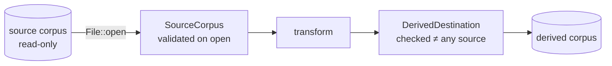

# Define the fixed-width corpus and immutable-source contract

## Summary

Refinery had no library crate — only a stub binary — so the corpus contract
existed as prose in `README.md` and nothing enforced it. This PR adds the
`neat_ai_refinery` library with a `corpus` module that makes the record layout
and the immutable-source rule executable. Closes #2.

Added:

- `RecordShape` / `ValueEncoding` — `inputs`, `outputs`, `record_values` and
  `bytes_per_record`, computed with `checked_add`/`checked_mul` so a zero side
  or an overflowing width is rejected at construction rather than producing a
  nonsensical stride.
- `SourceCorpus` — opens a source with `File::open` (read access only) and
  validates the whole-file invariant up front: an empty source and a partial
  trailing record are both fatal. `read_record` decodes native-endian `f32`
  values through `&File`, so no mutable handle to a source ever exists.
- `discover_sources` — the documented discovery and ordering rules:
  non-recursive directory scan, dot-files skipped, regular files only, sorted
  byte-wise by file name.
- `DerivedDestination` — canonicalises the output path and every source, then
  rejects a destination that resolves to a source, so a relative path, a `..`
  segment or a symlinked directory cannot smuggle a write back onto a source.
- `CorpusError` — one fatal variant per breach, hand-written `Display`/`Error`
  (no new dependencies, so `cargo-deny` and the audit surface are unchanged).
- `README.md` — a "Corpus contract" section with the type table, the
  immutable-source rule, the fatal conditions and the discovery ordering.

The crate carries `#![forbid(unsafe_code)]` and `#![deny(missing_docs)]`.
`refinery/src/main.rs` is untouched; wiring a CLI to these types belongs to the
sampler-port issue, not here.

## Evidence

Library/CLI change with no web interface, so there is nothing to screenshot.
Verification is the tests below plus the full local gate (`./quality.sh`),
which passed end to end: shellcheck, markdownlint-cli2, actionlint,
`cargo deny check`, `cargo fmt --check`, `cargo clippy -D warnings`,
`cargo test --workspace` (35 tests) and `cargo doc` with
`RUSTDOCFLAGS="-D warnings"`.

Data flow the contract enforces:

## Acceptance Criteria

- **met** — Public Rust types represent the record layout — evidence:
  `refinery/src/corpus/shape.rs` (`RecordShape`, `ValueEncoding`),
  `refinery/src/corpus/source.rs` (`SourceCorpus`).
- **met** — Unit tests cover valid, zero/invalid, overflow and partial-record
  cases — evidence: `refinery/src/corpus/shape.rs::tests::rejects_zero_inputs`,
  `::rejects_zero_outputs`, `::rejects_a_value_count_that_overflows`,
  `::rejects_a_byte_width_that_overflows`,
  `::computes_the_width_of_a_realistic_shape`, and
  `refinery/tests/corpus_contract.rs::rejects_a_partial_trailing_record`,
  `::reads_back_every_record_of_a_well_formed_corpus`,
  `::rejects_an_empty_source`.
- **met** — README/API docs state the immutable-source rule — evidence: the
  "Corpus contract → Immutable source" section of `README.md` and the
  crate-level documentation in `refinery/src/lib.rs`.
- **met** — No source mutation code path exists — evidence: sources are only
  ever reached through `File::open` in `refinery/src/corpus/source.rs`;
  `refinery/src/` contains no `OpenOptions`, `fs::write`, `File::create`,
  `remove_*`, `rename`, `set_len` or `set_permissions` call, and `refinery/tests/corpus_contract.rs::opening_and_reading_leaves_the_source_bytes_untouched`
  asserts the bytes and modification time are unchanged after a full read.
- **unrequested** — `discover_sources` and `DerivedDestination` are new API
  surface rather than documentation alone — reason: the issue lists "input
  discovery and ordering rules are documented" and "derived outputs are written
  somewhere separate from source" as required behaviour, and both rules are
  only enforceable (and testable) as code.

## Test Plan

Unit tests — `refinery/src/corpus/shape.rs`:

- `computes_the_width_of_a_realistic_shape` — 2511 inputs + 1 output → 2512
  values, 10 048 bytes per record.
- `accepts_the_smallest_possible_record` — 1 + 1 → 8 bytes.
- `rejects_zero_inputs`, `rejects_zero_outputs` — `InvalidRecordShape`.
- `rejects_a_value_count_that_overflows` — `usize::MAX + 1` value count.
- `rejects_a_byte_width_that_overflows` — width fits, `× 4` does not.
- `float32_occupies_four_bytes` — the encoding constant and its default.

Unit tests — `refinery/src/corpus/source.rs`:

- `decodes_native_endian_values`, `decodes_an_empty_slice_to_no_values`.

Integration tests — `refinery/tests/corpus_contract.rs`:

- `reads_back_every_record_of_a_well_formed_corpus` — byte length, record
  count and both records' values.
- `rejects_a_partial_trailing_record` — 20 bytes at a 12-byte stride reports
  8 trailing bytes.
- `rejects_an_empty_source`, `rejects_a_record_index_past_the_end`.
- `opening_and_reading_leaves_the_source_bytes_untouched` — the immutability
  assertion.
- `opens_a_read_only_source` — a `0o444` source opens and reads (Unix only).
- `discovers_a_single_file_as_itself`,
  `discovers_directory_entries_in_byte_wise_name_order` (`Shard-1`,
  `shard-10`, `shard-2`, with a dot-file and a nested directory skipped),
  `rejects_a_directory_with_no_sources`, `reports_a_missing_source_path`.
- `rejects_a_derived_destination_that_is_a_source`,
  `accepts_a_derived_destination_separate_from_the_sources`.

Doc test — the `RecordShape` example in `refinery/src/lib.rs`.
