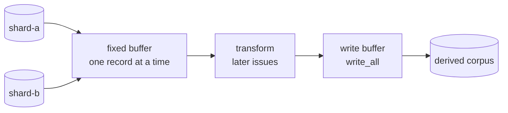

# Implement streaming binary corpus reader/writer primitives

## Summary

The corpus contract could describe and index a source, but every read went
through `SourceCorpus::read_record`, which seeks per record and holds one file
at a time — no way to stream a multi-file corpus, and no way to write a derived
one at all. This PR adds the I/O foundation the later transforms sit on, with
no sampling policy attached. Closes #3.

Added:

- `RecordReader` — streams whole records from one or more corpus files in the
  order given, through a single fixed-size buffer (256 KiB by default, at least
  one record however wide the shape). `next_record` hands out a borrowed slice
  of that buffer, so a record costs no allocation and the working set stays the
  same whatever the corpus size; a record straddling a refill is compacted to
  the front of the buffer rather than growing it.
- Strict per-file validation as each file is consumed: a file ending mid-record
  raises `PartialRecord` naming the path, its byte length, the record width and
  the trailing bytes; a file holding no records raises `EmptySource` naming the
  path. An error ends the stream — the reader yields `None` afterwards instead
  of reading on past a corpus it could not interpret.
- `RecordWriter` — buffered whole-record writes into a checked
  `DerivedDestination`, so the writer structurally cannot target a source. A
  record of the wrong width is rejected with `RecordLengthMismatch` before it
  reaches the buffer; flushes use `write_all`, so a short write is retried
  rather than truncating the output. `finish` flushes the tail and reports the
  record count, and a writer dropped with records still buffered flushes them
  and panics if that flush fails — buffered records are never lost in silence.
- `CorpusError::EmptySourceList` and `CorpusError::RecordLengthMismatch`, both
  naming the offending path and record geometry in `Display`.
- `README.md` — a "Streaming primitives" section with the usage example, the
  buffering diagram and the failure behaviour; the contract table gains the two
  new types.

The primitives take only paths and a `RecordShape`: no GRQ-specific import, no
sampler policy, nothing that knows what a record means.



## Evidence

Backend/library change with no web interface to screenshot. The evidence is the
test suite — `./quality.sh` passes end to end (cargo-deny, `cargo fmt`,
clippy with `-D warnings`, `cargo test --workspace --all-features`, and
`cargo doc` with `RUSTDOCFLAGS="-D warnings"`):

```text
running 14 tests   (tests/record_stream.rs)
test result: ok. 14 passed; 0 failed; 0 ignored
...
All quality checks passed!
```

Fixtures: `refinery/tests/fixtures/` holds four small committed binaries for
the 2×1 shape (twelve bytes per record) — `shard-a.bin` (two records),
`shard-b.bin` (one record), `truncated.bin` (one record plus eight trailing
bytes) and `empty.bin` (zero bytes). They are written little-endian and the
tests decode them explicitly with `f32::from_le_bytes`, so the assertions do
not depend on the host byte order. Larger cases use generated temporary
fixtures.

## Acceptance Criteria

- **met** — no sampler policy in this issue — evidence: `refinery/src/corpus/reader.rs`
  and `refinery/src/corpus/writer.rs` expose record movement only; neither takes
  a rate, a seed or a predicate.
- **met** — `cargo test --workspace` passes — evidence: 55 tests across the lib
  unit tests, `refinery/tests/record_stream.rs`, `refinery/tests/corpus_contract.rs`,
  `refinery/tests/workflow_pins.rs` and the doc-tests; `./quality.sh` runs the
  same suite with `--all-features`.
- **met** — the primitives are usable by later transforms without GRQ-specific
  imports — evidence: `refinery/tests/record_stream.rs::round_trips_a_corpus_through_the_writer`
  drives a reader into a writer using only `RecordShape`, paths and a
  `DerivedDestination`.

## Test Plan

Added `refinery/tests/record_stream.rs` (14 tests):

- `streams_every_record_of_a_committed_fixture` — committed fixture, record for
  record.
- `streams_multiple_files_in_the_order_given` — two files, one continuous
  stream.
- `streams_a_record_that_lands_exactly_on_the_buffer_boundary` — one-record
  buffer, so every record ends exactly where the buffer does; asserts the
  buffer never grows.
- `streams_records_that_straddle_buffer_refills` — 250 records through a
  three-record buffer, each record checked byte for byte.
- `rejects_a_truncated_final_record` — asserts the reported path, byte length,
  record width and trailing bytes.
- `stops_the_stream_at_a_truncated_file_rather_than_reading_on` — the stream
  ends at the fault instead of continuing into the next file.
- `rejects_an_empty_file_in_the_stream` — an empty file is reported, not
  silently skipped.
- `rejects_an_empty_source_list`, `reports_a_source_that_cannot_be_opened`.
- `round_trips_a_corpus_through_the_writer` — two sources in, one derived
  corpus out, byte-identical to the concatenated sources and readable as a
  `SourceCorpus`.
- `writes_values_the_way_the_corpus_stores_them`,
  `rejects_a_record_of_the_wrong_width`,
  `buffers_writes_until_the_buffer_is_full` — ten records through a four-record
  buffer, so the tail only lands on `finish`.
- `leaves_the_source_files_unchanged_after_streaming` — source bytes and
  modification times identical after a full stream.

Added four unit tests in `refinery/src/corpus/reader.rs` covering buffer
sizing: whole-record default capacity, a shape wider than the default buffer,
a zero capacity raised to one record, and the empty source list.
