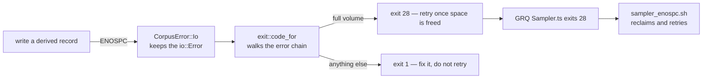

# Exit 28 when the target volume is full

## Summary

Every failed run exited 1, so nothing told "the disk is full" apart from any
other failure and GRQ's sampler retry gate — which fires on exit **28** — had
no signal to gate on: a full volume burned all three attempts again, the
behaviour GRQ #4234 fixed. Refinery now reports POSIX `ENOSPC` (28) when a
transform fails because the target volume filled up, and 1 for everything else.
Closes #38.

- `refinery/src/exit.rs` classifies a failure by reading the error chain —
  `io::ErrorKind::StorageFull`, or a raw `ENOSPC` on a platform that does not
  map it — through both `Error::source()` and an `io::Error`'s own payload, so
  a full volume is recognised however deeply the write is wrapped. `main.rs`
  exits with `ExitCode::from(code_for(&error))`.
- `refinery/src/corpus/writer.rs`: a flush failure already reported to the
  caller is no longer raised a second time as a panic on drop. Without this the
  fix does not reach the process at all — an out-of-space run **panicked and
  exited 101** (evidence below), never 1 and never 28. A later successful flush
  re-arms the guard, so records buffered afterwards are still never lost in
  silence.
- The consumer half is a companion PR in stSoftwareAU/GRQ (branch
  `issue-38-propagate-refinery-enospc-exit-code`): `runRefinerySampler` throws a
  `RefinerySamplerFailure` carrying the child's exit code, and `samplerExitCode`
  reports it unchanged, so `Sampler.ts` exits 28 and
  `worker/shared/sampler_enospc.sh` fires again.



## Evidence

Backend/CLI change — no web interface to screenshot. The exit code was driven
end to end against a real full volume: a 1 MiB tmpfs in a user namespace, with
a 2.4 MB source corpus, using the binary built from this branch and from
`origin/Develop`.

Before (`origin/Develop`) — the panic on drop replaced the exit code entirely:

```text
thread 'main' panicked at refinery/src/corpus/writer.rs:215:27:
derived corpus …/sample-100.bin lost buffered records on drop: …: No space left on device (os error 28)
exit=101
```

After (this branch):

```text
neat_ai_refinery: …/.derived.staging-…/sample-100.bin: No space left on device (os error 28)
exit=28
```

`./quality.sh` passes: fmt, clippy (`-D warnings`), `cargo deny`, 131 unit +
all integration tests, doc tests and `cargo doc`.

## Reproduction

- **symptom** — a run whose target volume filled up was indistinguishable from
  any other failure, so GRQ's retry gate (`exit 28`) never fired and a full disk
  burned all three sampler attempts
- **status** — `verified` — `refinery/tests/exit_codes.rs` failed against the
  unfixed code (both `/dev/full` tests panicked in `RecordWriter::drop`) and
  passes after the fix, and the real binary on a real full tmpfs went from
  `exit=101` to `exit=28` as quoted above
- **regression test** —
  `refinery/tests/exit_codes.rs::a_full_volume_exits_with_the_enospc_code`

## Acceptance Criteria

<!-- vibe-spec-review inputs="diff+issue-body" -->

- **met** — Refinery exits 28 when a transform fails because the target volume
  is full, from `ErrorKind::StorageFull` plus the raw `os error 28` — evidence:
  `refinery/src/exit.rs:47`, `refinery/src/main.rs:26`,
  `refinery/tests/exit_codes.rs::a_full_volume_exits_with_the_enospc_code` —
  reviewer: met
- **met** — GRQ propagates the code: `runRefinerySampler` carries the child exit
  code on the thrown error and `Sampler.ts` exits with it — evidence: GRQ
  `src/train/RefinerySampler.ts` (`RefinerySamplerFailure`),
  `src/train/SamplerDiskFailure.ts` (`samplerExitCode`), `src/train/Sampler.ts`
  — reviewer: met
- **partial** — tests: a Rust test that the mapped error yields exit 28, and a
  GRQ test that a stub binary exiting 28 makes `Sampler.ts` exit 28 — evidence:
  `refinery/tests/exit_codes.rs` (real kernel `ENOSPC` via `/dev/full`),
  GRQ `test/train/RefinerySampler_test.ts::"runRefinerySampler - a full volume
  carries Refinery's ENOSPC exit code"` — reviewer: partial — reason: no
  automated test spawns `Sampler.ts` or asserts the real binary's process exit
  is 28; both stop at the classifier. The process-level path was verified by
  hand instead (the tmpfs run quoted above); automating it needs a mountable
  small filesystem, which a unit test cannot assume.
- **unrequested** — `refinery/src/corpus/writer.rs` no longer panics on drop
  after a reported flush failure — reason: required for the mapped code to
  survive; without it a full volume exits 101, as the before/after evidence
  shows.
- **unrequested** — GRQ reports a signalled or out-of-band child code as 1
  rather than carrying it — reason: carrying `status.code` verbatim would make
  an OOM-killed sampler exit 137, a number `worker/shared/exit_codes.sh` gives a
  different fleet-wide meaning.

## Standards Review

<!-- vibe-standards-review inputs="diff+CODING-STANDARDS.md" -->

There is no `CODING-STANDARDS.md` in this repository; the reviewer judged
against `CONTRIBUTING.md`, the README, the crate lints
(`#![forbid(unsafe_code)]`, `#![deny(missing_docs)]`), GRQ's `AGENTS.md`, and
the fleet-wide standards (Australian English, fail loud, tests that call real
code).

- **violation** — a signalled child's code was carried into `Deno.exit`, so an
  OOM kill made the sampler stage exit 137, a reserved fleet-wide meaning —
  evidence: GRQ `src/train/SamplerDiskFailure.ts` `carriedExitCode` — reason:
  fixed here; only a code the child chose itself (`1..127`, no signal) is
  carried.
- **violation** — `RefinerySamplerFailure` discarded `status.signal`, so a kill
  was reported as a bare number — evidence: GRQ
  `src/train/RefinerySampler.ts` — reason: fixed here; the signal is carried and
  named in the message.
- **violation** — the writer's reported-failure latch was never cleared, so one
  reported flush failure disabled the "records never vanish" guard for the
  writer's whole life — evidence: `refinery/src/corpus/writer.rs:217` — reason:
  fixed here; a successful flush re-arms it.
- **violation** — the `/dev/full` tests returned green on a host without the
  device, having asserted nothing — evidence:
  `refinery/tests/exit_codes.rs:34` — reason: fixed here; a missing device on
  Linux now fails the test, and only a platform without it at all skips.
- **violation** — the README exit-code table read as exhaustive while a refused
  command line exits 2 and a panic 101 — evidence: `README.md:210` — reason:
  fixed here; both are stated, with 28 named as the only retryable code.
- **violation** — `assert_eq!(STORAGE_FULL, 28)` mirrors a constant against
  itself, and nothing asserts the real binary exits 28 — evidence:
  `refinery/tests/exit_codes.rs:113` — reason: stands. The number is a
  cross-repo wire value GRQ cannot see this constant for, so pinning it catches
  a silent unhooking; the binary's own 28 is covered by the manual tmpfs run
  recorded above rather than by a test that would need to mount a filesystem.
- **clean** — the error chain reaches every `io::Error`-bearing variant
  (`cli.rs` → `sample/error.rs` → `corpus/error.rs`, and the pipeline/transform
  paths); Australian English throughout; every new public item documented under
  `#![deny(missing_docs)]`; no import cycle and the GRQ unit/integration split
  respected; CHANGELOG entry under `[Unreleased] / Fixed`; the three places
  recording the old "known gap" all updated; no hidden or secret paths staged.

## Test Plan

- `refinery/tests/exit_codes.rs` (new): a real kernel `ENOSPC` through
  `RecordWriter` maps to 28; the same failure does not panic when the writer is
  dropped; a full volume wrapped in a pipeline stage still maps to 28; an
  invalid rate and a permission failure stay 1; the wire values 28/1 are pinned;
  the real binary exits 1 for an ordinary failure.
- `refinery/src/exit.rs` unit tests: the mapped kind, the raw `ENOSPC` number,
  an `io::Error` wrapping an out-of-space one, another filesystem failure, and a
  failure carrying no filesystem error.
- GRQ `test/unit/train/SamplerDiskFailure.ts`: `samplerExitCode` carries the
  child's code, refuses a code the child did not choose (0, −1, 137, 143, 130,
  256, 28.5, NaN) and a signalled death, and keeps the message test for a
  failure raised inside GRQ.
- GRQ `test/train/RefinerySampler_test.ts`: a stub binary exiting 28 rejects
  with a `RefinerySamplerFailure` whose code is 28 and whose
  `samplerExitCode` is 28; a stub exiting 1 still reports 1.
