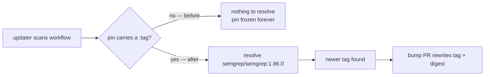

# Pin the Semgrep container by version tag as well as digest

## Summary

`.github/workflows/semgrep.yml` pinned the Semgrep SAST container by digest
alone, so nothing could bump it: Renovate's `github-actions` manager and
Dependabot's `docker` ecosystem both resolve a **tag** and then rewrite the
digest beside it. With no tag the pin was frozen on the 2026-05-18 manifest
indefinitely, running an ever-staler scanner engine with nothing flagging the
drift.

Re-pinned as `semgrep/semgrep:1.86.0@sha256:a9ea2d…`, and extended the existing
supply-chain gate (`refinery/tests/workflow_pins.rs`) so a tagless digest pin
fails `cargo test` rather than a review. Closes #42.

## Evidence

Backend/CI-config change — no web interface to screenshot.

**The image is byte-for-byte unchanged.** The `1.86.0` tag resolves to exactly
the digest that was already pinned, confirmed against the Docker Hub registry:

```console
$ curl -sI -H "Authorization: Bearer $TOKEN" \
    https://registry-1.docker.io/v2/semgrep/semgrep/manifests/1.86.0 | grep -i digest
docker-content-digest: sha256:a9ea2d5621c29d815d90c2a3b2f9571da8972ef4ff855c9e4902681730240e35
```

The digest is still what GitHub Actions resolves the container by; the tag is
only what an updater reads.



Full gate run after the final edit: `./quality.sh < /dev/null` — bash syntax,
shellcheck, markdownlint, actionlint, `cargo deny`, `cargo fmt --check`,
`cargo clippy -D warnings`, the workspace test suite and `cargo doc` all passed
("All quality checks passed!").

## Test Plan

`refinery/tests/workflow_pins.rs` — 16 tests, all passing:

- Added `digest_pin_without_a_version_tag_is_reported` — a digest pin with no
  `:<version>` tag is now a violation. Observed failing before the
  `has_version_tag` check existed, passing after.
- Added `registry_port_is_not_mistaken_for_a_version_tag` —
  `ghcr.io:443/owner/image@sha256:…` is still reported (a port is not a tag),
  while `ghcr.io:443/owner/image:2.1.0@sha256:…` passes.
- Added `empty_version_tag_is_reported` — `image:@sha256:…` is a violation.
- `every_container_image_is_digest_pinned` (existing, unchanged) now exercises
  the new rule against the real workflow tree, so a future tagless pin in any
  workflow fails the build.

**Modified test, documented as required:** the fixture in
`digest_pinned_image_passes_and_tag_pinned_image_is_reported` was
`semgrep/semgrep@sha256:…` (tagless), which the tightened policy now rejects.
Its fixture gained `:1.86.0`; the test's assertions are unchanged and it still
covers "digest pin passes, `:latest` tag is reported". No test was removed or
disabled.

## Documentation

`README.md` (Continuous integration) and `CONTRIBUTING.md` (Workflow changes)
both stated the pinning policy as digest-only; both now state the
tag-plus-digest rule and why the tag is required. The header comment in
`semgrep.yml` was updated in the same way.
