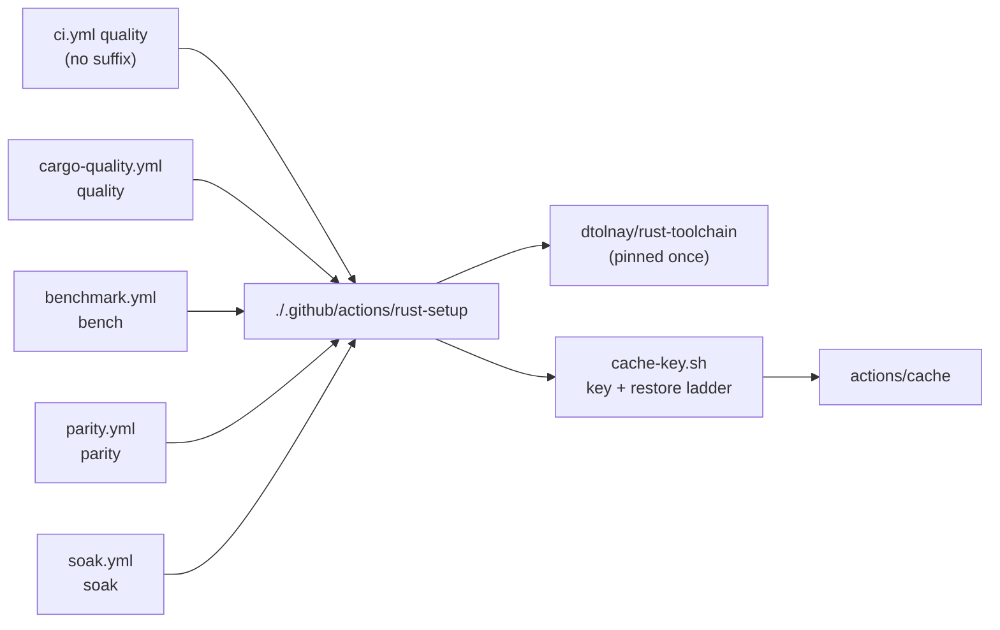

# Extract the shared Rust setup into a composite action

## Summary

"Install the pinned Rust toolchain, restore the Cargo cache" was copy-pasted
across five workflows, so a change to the toolchain pin or the cache-key
strategy had to be applied five times by hand — and an edit that reached only
four of them silently reintroduced the drift. The block now lives once, in the
composite action `.github/actions/rust-setup`, which takes the cache-key suffix
and the rustup components as inputs. Closes #43.

Every existing cache key is preserved byte-for-byte, so no workflow starts from
a cold cache: `benchmark.yml` still writes `<os>-cargo-bench-<hash>`,
`cargo-quality.yml` `<os>-cargo-quality-<hash>`, `parity.yml` and `soak.yml`
their own, and the `ci.yml` `quality` job keeps the unsuffixed
`<os>-cargo-<hash>` cache the others fall back to.

**Deviation from the issue's suggested fix — `actions/checkout` stays in each
caller.** The issue asked for the checkout to move into the action too. It
cannot: the runner reads a local action (`uses: ./…`) from the workspace, so the
repository must already be checked out before `uses: ./.github/actions/rust-setup`
resolves at all. A `workflow_call` reusable workflow — the issue's alternative —
does not help either, because it runs as a separate job on a fresh runner and so
cannot set up the job that follows. The checkout policy the centralisation was
meant to protect is therefore gated directly instead: `persist-credentials:
false` on every checkout in a workflow that calls the action is now a test.

## Evidence

Backend/CI-only change — no web interface to screenshot. The evidence is the
test run and the linters:

- `cargo test --workspace --all-features` — 15 new tests in
  `refinery/tests/rust_setup_action.rs` pass; the pre-existing
  `refinery/tests/workflow_pins.rs` (16 tests, including
  `composite_actions_are_sha_pinned_too`) still passes over the new action.
- `./quality.sh` — full gate green, including `actionlint` (which validates the
  five call sites against the new `action.yml` inputs) and `shellcheck -x -s
  bash` over `.github/actions/rust-setup/cache-key.sh`.



The key ladder is what preserves the cache hits: a suffixed workflow tries its
own cache first and falls back to the shared one, and an empty suffix *is* that
shared cache.

```text
$ .github/actions/rust-setup/cache-key.sh Linux bench deadbeef
key=Linux-cargo-bench-deadbeef
restore-keys<<RUST_SETUP_RESTORE_KEYS
Linux-cargo-bench-
Linux-cargo-
RUST_SETUP_RESTORE_KEYS
```

## Test Plan

New file `refinery/tests/rust_setup_action.rs` (15 tests). The cache-key script
is executed for real via `std::process::Command`, so its behaviour is covered by
`cargo test` on both runners rather than only by a live CI run.

Drift gates over the workflow tree:

- `no_workflow_inlines_a_cargo_cache` — the Cargo cache belongs to the composite
  action alone; inlining one anywhere fails the build.
- `every_rust_workflow_uses_the_composite_action` — each of the five must call
  it.
- `each_workflow_keeps_its_original_cache_key_suffix` — regression guard on the
  cache keys the refactor had to preserve.
- `no_rust_workflow_checkout_persists_the_token` — the checkout policy the
  action cannot own.
- `the_composite_action_ships_the_shared_setup_block` — the action still carries
  the toolchain, the cache and both Cargo paths.

Behaviour of `cache-key.sh`:

- `a_suffixed_key_falls_back_to_the_shared_cache`,
  `an_empty_suffix_yields_the_shared_key`, `a_dotted_suffix_is_accepted` — the
  happy paths and the full expected output.
- `a_missing_argument_fails_loudly` — a missing OS, suffix or hash exits
  non-zero with a message naming the argument, rather than emitting a
  half-formed key.
- `a_suffix_that_could_forge_the_output_is_rejected` — the suffix reaches
  `$GITHUB_OUTPUT`, so a newline, a space, a slash or a substitution attempt is
  refused.

Parser edge cases: `cargo_cache_paths_ignores_comments_and_prose`,
`invocation_inputs_reads_the_with_block`,
`invocation_inputs_handles_a_step_without_a_with_block`,
`invocation_inputs_ignores_other_actions_and_empty_input`,
`invocation_inputs_matches_an_action_whatever_its_pin`.

## Security Self-Check

- **Input validation** — `cache-key.sh` requires all three arguments and
  restricts each to `[A-Za-z0-9._-]`, so nothing written to `$GITHUB_OUTPUT` can
  open a new key or close the heredoc.
- **Secrets** — no hidden or credential files staged; `persist-credentials:
  false` is preserved on all five checkouts and is now enforced by a test.
- **Supply chain** — the action reuses the existing SHA pins unchanged
  (`actions/cache` v5, `dtolnay/rust-toolchain` frozen 2026-05-18), and
  `workflow_pins.rs::composite_actions_are_sha_pinned_too` already polices
  `.github/actions/`.
- **Error handling** — the script runs under `set -euo pipefail` and exits `2`
  with a message on stderr rather than emitting a partial key.

## Documentation

- `README.md` — the composite action, its suffix ladder and the checkout
  constraint, with a Mermaid diagram, in the "Continuous integration" section.
- `CONTRIBUTING.md` — where to change the toolchain pin and cache strategy now.
