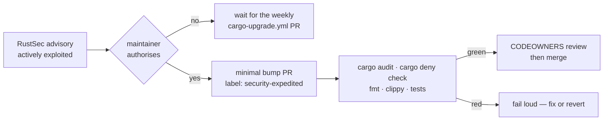

# Document the emergency dependency-bump fast lane

## Summary

The repository had no written fast lane for a dependency advisory that is being
actively exploited: `cargo-upgrade.yml` raises one refresh PR a week, and
`SECURITY.md`/`CONTRIBUTING.md` described only the normal cadence, so an on-call
maintainer had to improvise the bypass under time pressure. Adds
`docs/incident-response.md` — when the fast lane applies, who authorises it,
which gates stay mandatory, how the expedited PR is raised and what happens
after it lands — linked from `SECURITY.md` and `CONTRIBUTING.md`.
Documentation-only: no workflow changes. Closes #49.

The runbook separates the two things that get conflated in an incident: skipping
the *cadence* is authorised, skipping a *security gate* never is. `cargo audit`,
`cargo deny check` and the rest of `./quality.sh` stay mandatory, and merging
over a red or pending gate — or silencing `cargo audit` via `deny.toml` to get
green — is called out explicitly as forbidden.



## Evidence

Documentation change with no web interface to screenshot. The evidence is the
new test suite, which gates the runbook's content rather than its existence:

```text
$ cargo test --test incident_response
test the_security_policy_links_to_the_runbook ... ok
test the_runbook_covers_every_required_step ... ok
test the_runbook_refuses_to_drop_the_security_gates ... ok
test the_runbook_links_resolve_to_committed_files ... ok
test the_runbook_names_only_workflows_that_exist ... ok
test result: ok. 5 passed; 0 failed
```

All five were observed failing before the runbook existed (TDD): four on the
missing file, the fifth on `SECURITY.md` carrying no link to it.

The full gate passes: `./quality.sh` → `All quality checks passed!` (22s),
including `markdownlint-cli2` over the three changed Markdown files.

## Test Plan

- Added `refinery/tests/incident_response.rs`:
  - `the_security_policy_links_to_the_runbook` — `SECURITY.md` carries a
    Markdown link to `docs/incident-response.md`, and the file exists.
  - `the_runbook_covers_every_required_step` — the five required headings are
    present **and in order**, so a section cannot be dropped or reshuffled.
  - `the_runbook_refuses_to_drop_the_security_gates` — the parsed body of the
    "Gates that still must pass" section names `cargo audit` and
    `cargo deny check`. This is the one that stops the doc from rotting into a
    licence to skip checks.
  - `the_runbook_links_resolve_to_committed_files` — every relative link
    resolves against `docs/` (`../CONTRIBUTING.md`, `../.github/CODEOWNERS`),
    fenced code excluded.
  - `the_runbook_names_only_workflows_that_exist` — every `*.yml` the runbook
    names is a real file in `.github/workflows`, so a renamed workflow fails the
    build instead of misdirecting an on-call maintainer.
- No existing tests were modified or removed.
