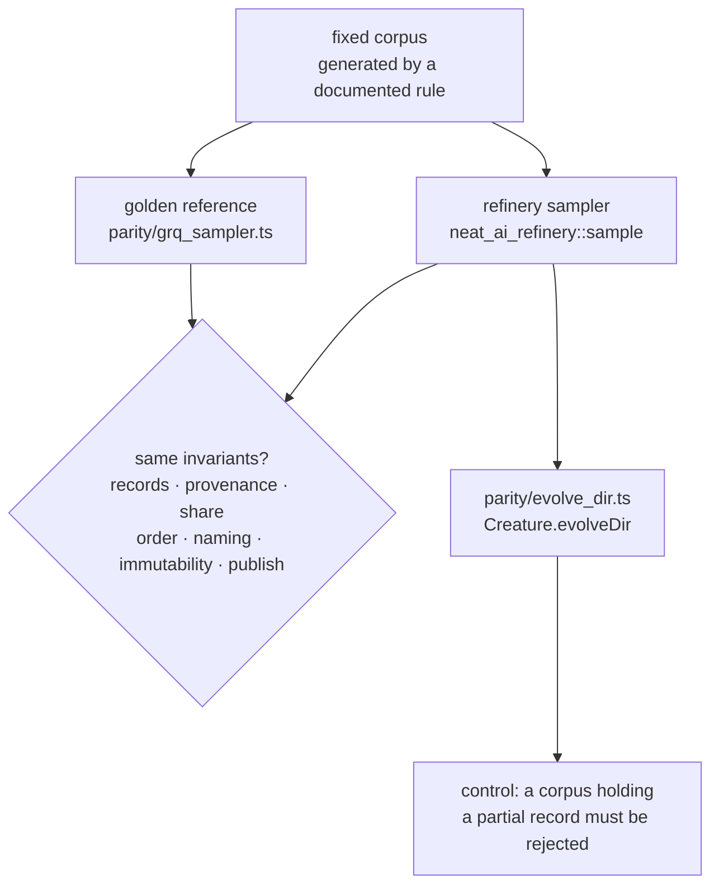

# Build a golden parity harness against GRQ `src/train/Sampler.ts`

## Summary

The sampler was ported in #4 with nothing holding it to GRQ's behaviour. This
PR adds the compatibility gate that does: a golden parity harness that runs
Refinery's sampler and GRQ's `Sampler.ts` over the same fixture corpora and
asserts the same invariants of both, plus an end-to-end check that NEAT-AI's
`Creature.evolveDir` consumes a Refinery-published corpus unchanged. Closes #5.

Added:

- `refinery/tests/parity_harness.rs` — eight tests. Six run **both**
  implementations over one fixture corpus and hold each output to the same
  invariant; two exercise `evolveDir` against a published corpus and its
  control.
- `parity/grq_sampler.ts` — the golden reference: GRQ's sampling algorithm
  extracted so it can run without GRQ's creature and version state. The read
  loop, `Math.random() < rate`, both Fisher-Yates shuffles, the
  `sample-<percent>.bin` naming, the short-write loop and `publishSamplerDir`
  are verbatim; only the environment seams (`NetworkUtil`/`VersionManager`,
  logging, ENOSPC reclamation, the staging root) are replaced. Pinned to GRQ
  commit `3ae5a5987bd0c1bc115dd83c50854a574d806b51`.
- `parity/evolve_dir.ts` — evolves a small creature over a corpus directory
  with `Creature.evolveDir` and reports whether it was consumed.
- `parity/run.sh`, `parity/deno.json`, `parity/deno.lock` — the one-command
  driver, the pinned NEAT-AI dependency and its integrity hashes.
- `.github/workflows/parity.yml` — the enforcing gate: installs Deno and sets
  `REFINERY_PARITY_REQUIRED=1`, so the harness cannot pass by not running.
- `docs/parity-harness.md` — what the harness proves, the invariant-to-test
  map, the reference's provenance and the cut-over rule.

Byte-for-byte parity is deliberately not the target: GRQ's sampler draws from
`Math.random()` and exposes no seam to seed it, so identical bytes are
unobtainable without changing GRQ first. What is compared is the contract a
caller depends on.

## Evidence

Backend and CLI only — no web interface to screenshot. The evidence is the
harness itself and the runs below.



`./parity/run.sh`:

```text
running 8 tests
test both_samplers_keep_close_to_the_requested_share ... ok
test both_samplers_name_the_published_file_the_same_way ... ok
test both_samplers_publish_whole_records_that_came_from_the_source ... ok
test both_samplers_randomise_the_output_order_without_losing_a_record ... ok
test both_samplers_replace_a_live_corpus_whole_and_leave_no_scratch ... ok
test evolve_dir_consumes_a_refinery_published_corpus ... ok
test evolve_dir_rejects_a_corpus_refinery_would_never_publish ... ok
test neither_sampler_changes_the_source_corpus ... ok

test result: ok. 8 passed; 0 failed
Parity harness passed!
```

The harness was checked for sensitivity rather than assumed: changing the
reference sampler's selection to `Math.random() < rate / 2` fails it —

```text
grq reference (deno): kept 500 of 20000 records at rate 0.05 — outside [846, 1154]
```

— and the mutation was reverted. The `evolveDir` control is the same idea from
the consumer side: NEAT-AI rejects a corpus holding a partial record
(`{"consumed":false,"rejected":"Population cannot be empty"}`), so consuming a
Refinery corpus says something about the records inside it.

Both halves of the skip policy were exercised. Without `deno` on `PATH`:

```text
SKIPPED evolve_dir_consumes_a_refinery_published_corpus: `deno` is not on PATH …
test result: ok. 8 passed; 0 failed
```

and with `REFINERY_PARITY_REQUIRED=1` set, as `parity.yml` does:

```text
panicked: evolve_dir_consumes_a_refinery_published_corpus: REFINERY_PARITY_REQUIRED
is set but `deno` is not on PATH — the parity harness cannot run
test result: FAILED
```

`./quality.sh` passes: shellcheck, markdownlint-cli2, actionlint, cargo-deny,
fmt, clippy, 93 tests and the doc build.

## Acceptance Criteria

- **met** — A documented compatibility test exists — evidence:
  `refinery/tests/parity_harness.rs` (six two-implementation invariant tests),
  documented in `docs/parity-harness.md` with an invariant-to-test table, and
  gated by `.github/workflows/parity.yml`.
- **met** — An end-to-end test proves `evolveDir` can open/use a
  Refinery-produced corpus — evidence:
  `refinery/tests/parity_harness.rs::evolve_dir_consumes_a_refinery_published_corpus`
  drives `parity/evolve_dir.ts`, which calls `Creature.evolveDir` on the
  published directory unchanged and requires a finite scored error;
  `::evolve_dir_rejects_a_corpus_refinery_would_never_publish` is its control.
- **met** — Any intentional difference from the old sampler is separately
  documented and approved rather than hidden in the port — evidence:
  `docs/sampling-semantics.md` (unchanged list of stricter conditions and
  deliberate omissions) plus the "Intentional differences" section of
  `docs/parity-harness.md`, which adds the two differences inherent to the
  comparison (seeding, instrumentation). No new behavioural difference is
  introduced by this PR — it adds tests, documentation and a workflow only.
- **met** — This issue gates GRQ cut-over — evidence:
  `.github/workflows/parity.yml` runs on PRs against any base branch with
  `REFINERY_PARITY_REQUIRED=1`, and the "Cut-over" section of
  `docs/parity-harness.md` states the rule: re-extract the reference and re-run
  the harness when GRQ's `Sampler.ts` moves.

## Test Plan

Added `refinery/tests/parity_harness.rs`:

- `both_samplers_publish_whole_records_that_came_from_the_source` — whole
  fixed-width records only, and every record traced back to the source multiset.
- `both_samplers_keep_close_to_the_requested_share` — 20 000 records at rate
  0.05 land inside five standard deviations of `Binomial(20 000, 0.05)`.
- `both_samplers_randomise_the_output_order_without_losing_a_record` — at rate
  1 the sample is a permutation of the source, not a copy.
- `both_samplers_name_the_published_file_the_same_way` — identical
  `sample-<percent>.bin` names at rates 1, 0.5, 0.125, 0.05 and 0.004.
- `neither_sampler_changes_the_source_corpus` — the source is byte-identical
  after both runs.
- `both_samplers_replace_a_live_corpus_whole_and_leave_no_scratch` — a stale
  corpus is replaced whole, with no staging or `.deleting-*` leftovers.
- `evolve_dir_consumes_a_refinery_published_corpus` — NEAT-AI scores creatures
  against a Refinery-published corpus.
- `evolve_dir_rejects_a_corpus_refinery_would_never_publish` — the control.

No existing test was modified or removed.
