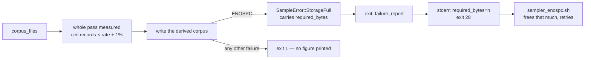

# `required_bytes=<n>` on exit 28

## Summary

Exit `28` told GRQ's sampler gate that a run was worth retrying but not whether
there was now room for it, so `grq_sampler_required_kb` reported
`required unknown` and refused every retry. A `sample` run that fills the
target volume now reports what a whole fresh attempt costs, on its own stderr
line beside the failure. Closes #51.

- `refinery/src/sample/run.rs` measures a whole pass before a byte is written:
  `ceil(source records × rate)` whole records — records are fixed width, so a
  partial one is never written — plus 1 % in integer maths for the manifest and
  for a sample landing above its mean. `whole_pass_bytes` exposes the same
  figure to a caller that wants it before the run.
- The figure is attached only to an out-of-space failure, as
  `SampleError::StorageFull { required_bytes, source }`, and never below what
  the failed attempt had already written (tracked as records are accepted). The
  wrapped failure stays the error's `source()`, so `code_for` still reads the
  `ENOSPC` off the chain and the exit code is unchanged.
- `refinery/src/exit.rs::failure_report` builds the stderr report `main.rs`
  prints: the failure, then `neat_ai_refinery: required_bytes=<n>` for exit 28
  alone. `required_bytes` finds the figure however deeply a pipeline stage has
  wrapped it. An unknown requirement prints nothing — the caller refuses the
  retry rather than freeing a guessed amount.



## Evidence

Backend/CLI change — no web interface to screenshot. A real kernel `ENOSPC` was
driven through the built binary by publishing a 12 000-byte corpus onto an 8 KiB
`tmpfs` inside a private mount namespace (paths shortened):

```text
neat_ai_refinery: /data/.derived.staging-…/sample-100.bin: No space left on device (os error 28) — a whole fresh attempt needs 12120 bytes of free space
neat_ai_refinery: required_bytes=12120
exit=28
```

GRQ's own reader finds it unchanged:

```console
$ … | grep -o 'required_bytes=[0-9][0-9]*'
required_bytes=12120
```

`./quality.sh < /dev/null` passes in full: fmt, clippy (`-D warnings`),
cargo-deny, shellcheck, markdownlint, 142 unit tests plus every integration
suite and doc test, and the docs build.

## Reproduction

- **symptom** — a sampler run that filled the volume exited 28 with only
  `neat_ai_refinery: {error}` on stderr, so GRQ logged
  `❌ sampler ENOSPC: … required unknown — nothing reported what another pass
  costs … not retrying`
- **status** — `verified` — with the reporting reverted to its previous shape,
  `the_binary_reports_the_requirement_when_a_real_volume_fills_up` failed on a
  real ENOSPC run (`the run reports exactly one figure on stderr: …`, 0 figures
  found) and `a_full_volume_reports_what_a_whole_fresh_attempt_needs` failed
  with it; both pass after the fix
- **regression test** —
  `refinery/tests/exit_codes.rs::the_binary_reports_the_requirement_when_a_real_volume_fills_up`

## Acceptance Criteria

<!-- vibe-spec-review inputs="diff+issue-body" -->

- **partial** — a real ENOSPC gives exactly one `required_bytes=<n>` line with
  `n` in `[ceil(source × rate), ceil(source × rate × 1.02)]` and exit 28 —
  evidence: `refinery/tests/exit_codes.rs::the_binary_reports_the_requirement_when_a_real_volume_fills_up`
  (real kernel ENOSPC, real binary, exit 28, one figure in bounds) and
  `::a_full_volume_reports_what_a_whole_fresh_attempt_needs` (the `/dev/full`
  harness the issue named) — reviewer: partial — reason: the reviewer is right
  that the `/dev/full` harness cannot reach the binary — a staging directory is
  never `/dev/full`, so the process-level assertion needs a genuinely full
  filesystem, which is a tmpfs in a private mount namespace. That test skips out
  loud on a host that refuses the namespace, so end-to-end coverage is
  best-effort; the `/dev/full` half, which does not skip, covers the report and
  the code with a real kernel ENOSPC and the production estimator.
- **met** — an exit-1 failure (`NoCorpusFiles`) prints no `required_bytes=` —
  evidence: `refinery/tests/exit_codes.rs::an_ordinary_failure_reports_no_requirement`
  (runs the binary, asserts exit 1 and no token) — reviewer: met
- **met** — two-file fixture: rate 1.0 is the sum of the file sizes (+1 %), rate
  0.05 is `ceil(0.05 × sum)` (+1 %) — evidence:
  `refinery/src/sample/run.rs::tests::a_whole_pass_at_full_rate_is_the_source_plus_headroom`
  and `::a_whole_pass_at_a_sampling_rate_is_that_share_plus_headroom` —
  reviewer: met
- **met** — `./quality.sh < /dev/null` green — evidence: run after the final
  edit, "All quality checks passed!" — reviewer: met
- **unrequested** — the estimate rounds to whole records rather than to bytes —
  reviewer: unrequested — reason: the reviewer flagged this as wrongly
  implemented, since at a rate that does not land on a record boundary the
  figure can exceed the criterion's `× 1.02` ceiling. Kept deliberately: a
  partial record is never written, so byte rounding reports a size no corpus can
  occupy and under-states a pass that keeps one record — the direction that
  makes a retry fail again. The deviation is bounded by one record width and now
  pinned by
  `run.rs::tests::the_estimate_stays_within_a_record_of_the_share_at_every_rate`.
- **unrequested** — the exit-28 message line now ends "— a whole fresh attempt
  needs `<n>` bytes of free space" — reviewer: unrequested — reason: the
  machine-readable token is a line of its own as asked; this says the same thing
  to the operator reading the log, and carries no `required_bytes=` token so
  GRQ's grep still finds exactly one figure.
- **unrequested** — `exit::failure_report` (public) rather than the formatting
  living in `main.rs` — reviewer: unrequested — reason: `main.rs` is not
  reachable from a test, and the report is the contract GRQ reads; putting it in
  the library is what lets the `/dev/full` test assert on it without a
  subprocess.
- **unrequested** — `sample::whole_pass_bytes` (public) — reviewer: unrequested
  — reason: the same figure a failed run reports, obtainable before the run; it
  is what lets the `/dev/full` test use the production estimator over a real
  corpus instead of a number of its own.
- **unrequested** — tests beyond the stated criteria (pipeline-stage wrapping,
  empty source, trailing partial record, sub-record rate, unscannable source,
  requirement not replaced once set) — reviewer: unrequested — reason: the edges
  of a figure a caller acts on; each is a few lines and runs in microseconds.

## Standards Review

<!-- vibe-standards-review inputs="diff+CODING-STANDARDS.md" -->

- **violation** — a third doc surface still said the ENOSPC diagnostic was
  outstanding — evidence: `docs/sampling-semantics.md:113` — reason: fixed here;
  the "Deliberately not ported" bullet now points at the exit code (#38) and
  this line.
- **violation** — the full-volume harness folded any fault (failed spawn,
  signalled child) into a silent skip — evidence:
  `refinery/tests/exit_codes.rs:344` — reason: fixed here; only a missing
  `unshare` or a refused namespace skips, and both say so — every other fault
  now panics.
- **violation** — the docs claimed 1 % headroom covered "a sample above its
  mean", which Binomial selection does not support — evidence: `README.md:243`,
  `docs/grq-integration.md:160` — reason: fixed here; both now call the figure
  an estimate and say a mid-range rate can land above it.
- **violation** — post-test cleanup discarded a fallible result — evidence:
  `refinery/src/sample/run.rs:299` — reason: fixed here; `remove_dir_all` now
  carries `.expect`, matching the convention in `corpus/synthetic.rs:95`.
- **violation** — the PR summary was absent from the commit — evidence:
  `docs/archive/pr-summaries/pr-summary-51.md` — reason: fixed here; this file
  is committed with the change.
- **violation** — `sample::whole_pass_bytes` is public with no production caller
  — evidence: `refinery/src/sample/run.rs:85` — reason: stands. It is the figure
  the run reports, and the integration test can only reach the production
  estimator through the public API; the production path uses the private
  `pass_bytes` and pays no second scan.
- **clean** — Australian English throughout; no hidden or secret paths staged;
  every test calls real code (real kernel ENOSPC, the real binary) rather than
  grepping source; fail-loud error handling — the estimate propagates with `?`,
  an unknown requirement returns `None` rather than a guess; test speed (whole
  workspace 7.9 s, this suite 0.02 s, no sleeps or wall-clock thresholds); docs
  updated alongside the code; `# Errors` sections, a doctest, `#[must_use]`,
  saturating arithmetic, no `unwrap` outside tests, no `unsafe`; commit carries
  the issue reference and the run-id trailer.

## Test Plan

- `refinery/tests/exit_codes.rs`
  - `the_binary_reports_the_requirement_when_a_real_volume_fills_up` — runs the
    built binary onto a tmpfs too small for the sample; asserts exit 28 and
    exactly one figure within `[ceil(source × rate), ceil(source × rate × 1.02)]`.
    Skips out loud on a host that grants no unprivileged mount namespace.
  - `a_full_volume_reports_what_a_whole_fresh_attempt_needs` — the kernel
    `ENOSPC` from the existing `/dev/full` harness, the estimate from a real
    two-file corpus: one figure, in bounds, code still 28.
  - `an_ordinary_failure_reports_no_requirement` — the binary on a source with
    no `.bin` files: exit 1, the failure reported in full, no figure.
  - `a_requirement_survives_the_wrapping_a_pipeline_stage_adds`.
- `refinery/src/sample/run.rs` — the estimate over a two-file fixture at rate
  1.0 (sum + 1 %) and 0.05 (`ceil(0.05 × sum)` + 1 %), the general bound at
  seven rates and five corpus sizes (`the_estimate_stays_within_a_record_of_the_share_at_every_rate`),
  a trailing partial record buying no space, an empty source, a sub-record rate
  still reserving a whole record, and an unscannable source reported rather than
  guessed.
- `refinery/src/exit.rs` — the token's shape and single occurrence, silence for
  an unknown requirement, silence for exit 1, the figure found through a
  `CliError` wrap, and a requirement never replaced once set.
