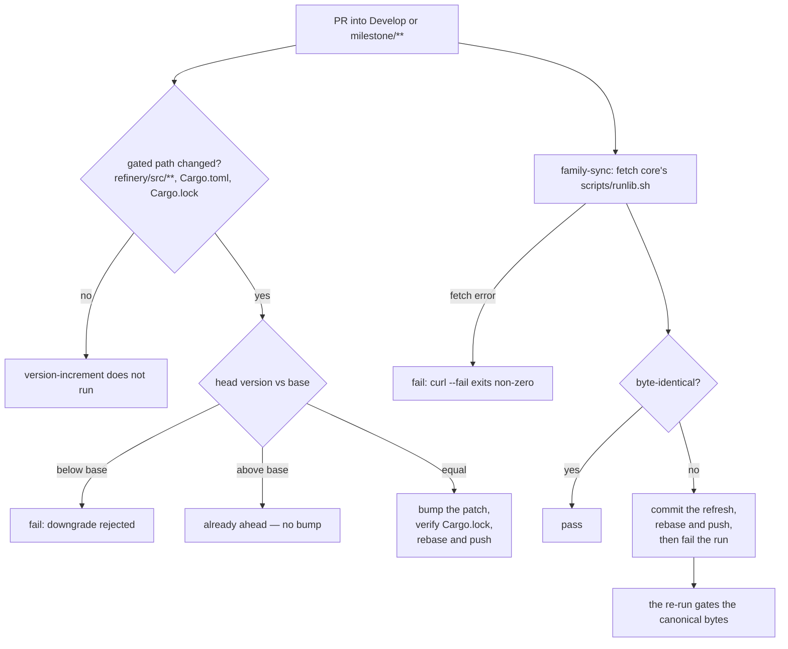

# Version-increment gate and the canonical `runlib.sh` with a family-sync job

## Summary

Refinery joins the NEAT-AI family's two shared gates. `scripts/auto-version.sh`
(taken verbatim from NEAT-AI-Ockham) is driven by a new paths-filtered
`version-increment.yml`: a PR that changes `refinery/src/**`,
`refinery/Cargo.toml` or `Cargo.lock` at an unchanged version gets a patch bump
pushed onto its branch, and a version below the base branch fails the job.
`scripts/runlib.sh` is now the canonical copy from NEAT-AI-core `Develop`, and a
`family-sync` job in `ci.yml` refetches it on every PR, commits the refresh when
the two differ, and fails on a fetch error. Both jobs rebase before they push,
because they share the PR branch.

Closes #53.

## Evidence

Backend/CLI change only — there is no web surface to screenshot. The evidence is
the workflows exercised locally against the repository's real files.

**The bump gate, run against the real `refinery/Cargo.toml` and `Cargo.lock`
with the base version read from `origin/Develop`:**

```text
base version on Develop: 0.1.0
--- unchanged version -> patch bump ---
auto-version.sh: bumped neat-ai-refinery 0.1.0 -> 0.1.1
0.1.1
lockfile: version = "0.1.1"
--- version below the base -> fails ---
auto-version.sh: version downgraded: 9.9.9 -> 0.1.0 (… must never go backwards
vs the base branch — the machines rebuild off this version)
exit=1 (downgrade rejected)
```

**The family-sync fetch, drift and failure paths, run against the live
canonical URL:**

```text
drift detected (as CI would)
refresh restores byte-identity
curl --fail on a missing path exited 22
```

**Byte-identity, verified rather than asserted:**

```text
$ cmp <(curl -fsSL https://raw.githubusercontent.com/stSoftwareAU/NEAT-AI-core/Develop/scripts/runlib.sh) scripts/runlib.sh
# identical — no output
$ diff -u /tmp/ockham/scripts/auto-version.sh scripts/auto-version.sh
# identical — no output
```

**Test and gate output:** `./scripts/test-runlib.sh` 24/24,
`./scripts/test-auto-version.sh` 26/26, `cargo test --workspace --all-features`
green (including the 17 new `family_gates` tests), and `./quality.sh` reports
`All quality checks passed!`.

The two jobs and how they interact with the PR branch:



## Acceptance Criteria

<!-- vibe-spec-review inputs="diff+issue-body" -->

- **met** — A PR changing `refinery/src/**` at an unchanged version receives a
  patch-bump commit; a version below Develop fails CI — evidence:
  `.github/workflows/version-increment.yml:26-31` (paths filter), `:83` (the
  bump call), `:88-99` (the lockfile check), `:100-133` (commit, rebase, push), `scripts/auto-version.sh:106-109`
  (downgrade → `die`, exit 1), and
  `scripts/test-auto-version.sh::a downgrade fails loud and changes nothing` —
  reviewer: met
- **met** — `scripts/runlib.sh` is byte-identical to core's; a stale copy on a
  PR is refreshed by CI — evidence: `cmp` against a live fetch of
  `NEAT-AI-core@Develop:scripts/runlib.sh` returns identical; refresh logic at
  `.github/workflows/ci.yml:214-296`, with `--fail` at `:223` making a fetch
  error fatal — reviewer: met
- **partial** — `./scripts/runlib.sh` installs `~/.cargo/bin/neat_ai_refinery`
  and `.neat-ai-refinery.version`, removes `target/`; a second run prints
  `[neat-ai-refinery] already installed v<x>` and runs no cargo command —
  evidence: `scripts/test-runlib.sh` asserts the install path, the stamp name,
  the `target/` removal with the bytes freed, the already-installed line, and
  that `cargo build` is never invoked on the second run — reviewer: partial —
  reason: everything holds except the literal "runs no cargo command". Refinery's
  manifest declares an explicit `[[bin]]` table (`refinery/Cargo.toml:12`) —
  that is what names the binary `neat_ai_refinery` rather than
  `neat-ai-refinery` — and the canonical script's no-cargo fast path
  deliberately declines any manifest whose target shape it cannot read
  unambiguously (`scripts/runlib.sh:251-254`), so the second run costs one
  `cargo metadata` call before reporting. Nothing is compiled. Removing the
  `[[bin]]` table would satisfy the literal wording but rename the built
  artefact to `target/release/neat-ai-refinery`, breaking
  `refinery/examples/benchmark.rs:235` and `production_soak.rs:200` — a
  behaviour change this issue does not ask for. Every Rust sibling (Ockham,
  Lamarck) carries the same `[[bin]]` table, so this is the family-wide shape,
  not a Refinery defect. The test asserts exactly one `metadata` call and zero
  builds, and a second fixture without the `[[bin]]` table asserts the zero-cargo
  path still works, so the divergence is pinned rather than papered over.
- **met** — Tests and quality checks pass — evidence: `./quality.sh` run after
  the final edit reports `All quality checks passed!` (bash syntax, shellcheck,
  both script contract tests, markdownlint, actionlint, cargo-deny, fmt, clippy,
  `cargo test --workspace --all-features`, rustdoc) — reviewer: missing —
  reason: the reviewer saw only the diff and could not run the gate; it was run
  here and passed.
- **unrequested** — `refinery/tests/family_gates.rs` (17 tests over the two
  workflows) — reviewer: unrequested — reason: the issue's Failure Detection
  section makes the gate's *configuration* the contract, and configuration is
  where it fails silently; a dropped `paths:` entry or a `curl` that lost
  `--fail` is invisible until a fleet host installs the wrong artefact. Workflow
  YAML assertions are this repo's established convention
  (`refinery/tests/workflow_pins.rs`, `rust_setup_action.rs`).
- **unrequested** — `scripts/test-auto-version.sh` plus its wiring into
  `quality.sh:40` and the `shell-checks` job — reviewer: unrequested — reason:
  TDD is mandatory on this route, and the issue asks only that `shell-checks`
  *lint* the copied script; a copied script with no contract test is linted but
  never exercised. The tests were written red-first, before `auto-version.sh`
  existed.
- **unrequested** — README provenance/family-sync prose, the mermaid node, the
  workflow-table row, and the new CONTRIBUTING section — reviewer: unrequested —
  reason: the issue asks only for the README install-path note (which already
  existed). A change owes a docs change: the stamp name changed from
  `.neat_ai_refinery.version` to `.neat-ai-refinery.version`, so the existing
  README paragraph was factually wrong until updated.
- **unrequested** — the `0.0.0` bootstrap branch when the base branch carries no
  `refinery/Cargo.toml` (`version-increment.yml:78-81`) — reviewer: unrequested
  — reason: copied from Ockham's equivalent step; it keeps the job from dying on
  a branch predating the manifest. Inert today.

## Standards Review

<!-- vibe-standards-review inputs="diff+CODING-STANDARDS.md" -->

The repository has no `CODING-STANDARDS.md`; the reviewer was pointed at
`CONTRIBUTING.md`, `README.md`, `quality.sh`, `deny.toml`, the existing
workflow/test conventions and the fleet rules.

- **violation** — `family-sync` auto-overwrote a drifted `scripts/runlib.sh` and
  still exited 0, so a green `ci-required` reported bytes that had never been
  through `shell-checks` or `test-runlib.sh` — evidence:
  `.github/workflows/ci.yml:239-243` (as reviewed) — reason: fixed here. Drift
  now fails the run (`ci.yml:285-296`); the refresh is still pushed, and the
  re-run is what gates the canonical bytes. Covered by
  `family_gates.rs::family_sync_fails_the_run_when_the_copy_had_drifted`.
- **violation** — the same-repo guard skipped the whole `family-sync` job,
  including the read-only comparison, so a fork PR could ship an edited
  `scripts/runlib.sh` and `ci-required` scored the skip as OK — evidence:
  `.github/workflows/ci.yml:200` (as reviewed) — reason: fixed here. The guard
  moved to the push step; the fetch and comparison now run for every PR.
- **violation** — likewise in `version-increment.yml`, the job-level guard meant
  the downgrade check never ran on a fork PR — evidence:
  `.github/workflows/version-increment.yml:45` (as reviewed) — reason: fixed
  here. Both are covered by
  `family_gates.rs::only_the_push_is_guarded_to_this_repository`.
- **violation** — `${{ secrets.ACTIONS_PUSH || secrets.GITHUB_TOKEN }}` is a
  silent fallback that flips whether the auto-pushed commit re-triggers CI, with
  nothing in the log saying which branch was taken — evidence:
  `.github/workflows/ci.yml:249`, `version-increment.yml:84` (as reviewed) —
  reason: fixed here. Both push steps now print which token they used and what
  that implies for the re-run.
- **violation** — the base64 of `x-access-token:<secret>` was never
  `::add-mask::`-ed (the runner masks the secret, not its encoding), and
  `base64 -w0` is GNU-only while this repo runs macOS jobs — evidence:
  `.github/workflows/ci.yml:256`, `version-increment.yml:96` (as reviewed) —
  reason: both fixed here; the credential is masked and encoded with
  `base64 | tr -d '\n'`. Covered by
  `family_gates.rs::the_push_credential_is_masked_and_encoded_portably`.
- **violation** — `Cargo.lock` was rewritten by awk and never validated before
  being committed — evidence: `.github/workflows/version-increment.yml:79` (as
  reviewed) — reason: fixed here. The bump step now confirms the lockfile and
  the manifest record the same version and exits 1 otherwise
  (`version-increment.yml:85-99`); the check was exercised locally against the
  real lockfile and against a deliberately corrupted one.
- **violation** — `scripts/auto-version.sh`'s header credits NEAT-AI-Discovery
  and Ockham's Issue #45, which is stale provenance in this repository —
  evidence: `scripts/auto-version.sh:6,9` — reason: stands. The issue requires
  the file "copied unchanged from NEAT-AI-Ockham", and editing the header would
  break that byte-identity. `CONTRIBUTING.md:41-44` now warns the reader that the
  header cites Ockham's own issue numbers.
- **violation** — `CONTRIBUTING.md` called `auto-version.sh` "copied unchanged"
  while nothing enforces that, unlike `runlib.sh` — evidence:
  `CONTRIBUTING.md:43` (as reviewed) — reason: fixed here by correcting the
  wording: it is a point-in-time copy with no sync job, and
  `scripts/test-auto-version.sh` is what holds its behaviour.
- **violation** — `auto-version.sh`'s `manifest_field` is not section-aware
  (it returns the first matching key anywhere in the file) and `require_semver`
  accepts zero-padded components, after which `$((patch + 1))` aborts with a raw
  bash error instead of a `die()` — evidence: `scripts/auto-version.sh:32-41`,
  `:42-46`, `:115-121` — reason: stands. The file is copied verbatim from
  NEAT-AI-Ockham by this issue's explicit instruction, and Ockham is a sibling
  rather than a declared dependency of this repo, so the fix belongs upstream in
  Ockham. Both are latent: `[package]` is the first table in
  `refinery/Cargo.toml`, and the padded-version path still fails loudly.
- **clean** — Australian English throughout the added lines (`artefact`,
  `behaviour`, `honours`, `licence`); both checkouts SHA-pinned with trailing
  version comments and `workflow_pins.rs` green; least-privilege `permissions:`
  (workflow-level `contents: read`, job-level `contents: write`);
  `persist-credentials: false` on every checkout; `set -euo pipefail` first in
  every multi-line `run:`; no `${{ github.* }}` interpolated into a `run:` body;
  `milestone/**` in the branch filter; `curl --fail` plus an empty-body guard;
  bash-3.2-safe constructs in the copied scripts; tests assert observable
  outcomes against a logging `cargo` shim; the local gate mirrors CI; no secrets
  staged and no token written to `.git/config`.

## Test Plan

- Added `scripts/test-auto-version.sh` — 26 assertions driving the real bump
  script: `--print`, the patch bump in both manifest and lockfile, the
  `v`-prefixed base, the already-ahead no-op, patch/minor downgrades, the
  `0.1.9 → 0.1.10` carry, and five fail-loud paths (malformed version, missing
  manifest, lockfile without the crate, no arguments).
- Rewrote `scripts/test-runlib.sh` — 24 assertions for the canonical contract,
  written red-first against the outgoing repo-local script: fresh install,
  stamp name and contents, `target/` removal with bytes freed, the
  already-installed line with zero `cargo build` calls, the explicit-`[[bin]]`
  metadata call, a zero-cargo fixture without that table, the deleted-stamp
  rebuild, and the failed-build rollback that keeps `target/` and the previous
  binary and stamp. A `cargo` shim logs every invocation, so "compiled nothing"
  is read off the log rather than inferred; nothing is ever really compiled.
- Added `refinery/tests/family_gates.rs` — 17 tests over the two workflows: the
  five gated paths, pull-request-only triggering, the `milestone/**` filter, the
  push-only same-repo guard, the fail-on-drift step, the masked and portable
  credential, the lockfile-versus-manifest check, the base read from this
  repository, the canonical URL with `curl --fail`, the rebase before both
  pushes, `family-sync` in `ci-required`, the required-files list, both contract
  tests wired into `shell-checks`, the executable bits on all four scripts, and
  a unit test of the file's own `job_block` helper.
- Both shell suites are wired into `quality.sh` and the `shell-checks` CI job,
  so they run on every PR rather than only by hand.
- Mutation-checked that the config tests bite: removing `--fail` from the curl
  call turns `family_sync_fetches_the_canonical_copy_and_fails_loud` red.

## Note on the `actions/checkout` pin

Both new checkouts reuse this repository's existing pin,
`93cb6efe18208431cddfb8368fd83d5badbf9bfd  # v5`, which every other workflow
here already carries. Resolving `v5` in this run returns
`fbc6f3992d24b796d5a048ff273f7fcc4a7b6c09` — the tag has moved since the repo
pinned it. Adopting the newer SHA in two files only would introduce exactly the
drift `workflow_pins.rs` exists to prevent, so the existing audited pin is kept;
bumping it belongs in a dependency-refresh PR that moves all fifteen together.
