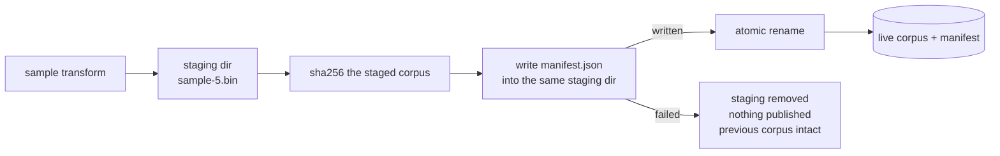

# Add reproducible seed and transformation manifest

## Summary

Every derived corpus is now published with a `manifest.json` beside it
recording how it was made: source identity, record geometry, transform name and
parameters, the seed actually used, source file/record counts, output record
count and bytes, tool version, timestamp, and a SHA-256 checksum of the
published corpus. Caller metadata arrives through a repeatable
`--metadata KEY=VALUE` and is stored verbatim, so no application-specific field
(a GRQ observation version, for instance) is invented by Refinery.

The manifest is written into the staging directory **before** the publishing
rename, so the atomic swap carries corpus and provenance across together. A
manifest that cannot be produced aborts the run — the staging directory is
reclaimed and the previously published corpus is left exactly as it was.

Closes #6.

## Evidence

Backend/CLI change — no web interface to screenshot. The evidence is the
published artefact and the tests below.

```bash
$ neat_ai_refinery --source /tmp/mtest/src --output /tmp/mtest/derived \
    --inputs 2 --outputs 1 \
    --metadata grq_observation_version=42 --metadata run.label=nightly \
    sample --rate 0.5 --seed 20260831
🏭 /tmp/mtest/derived/sample-50.bin — 40 of 80 records kept from 2 file(s), seed 20260831
📄 /tmp/mtest/derived/manifest.json — sha256 57d5a3b32d3b8157f809fa9a964b9994eb833eebc3cb3dbe5ec7bf973b48dc33

$ sha256sum /tmp/mtest/derived/sample-50.bin
57d5a3b32d3b8157f809fa9a964b9994eb833eebc3cb3dbe5ec7bf973b48dc33  …/sample-50.bin
```

Re-running with the same seed into a fresh directory produced the identical
digest, and `sha256sum` agrees with the value the manifest records.



Consumer compatibility: NEAT-AI scans a corpus directory for `.bin` files, so
the manifest sits beside them unread. `./parity/run.sh` passes — including
`evolve_dir_consumes_a_refinery_published_corpus`, which hands `Creature.evolveDir`
a manifest-carrying directory exactly as Refinery published it.

## Acceptance Criteria

- **met** — Same input + same seed + same transform config is reproducible —
  evidence: `refinery/tests/manifest_provenance.rs::reproduces_the_same_corpus_and_checksum_for_the_same_seed`
  (two seeded runs record the same output checksum, a third with a different
  seed does not), plus the `sha256sum` transcript above.
- **met** — Manifest is emitted beside the derived corpus — evidence:
  `refinery/tests/manifest_provenance.rs::publishes_a_manifest_beside_the_derived_corpus`
  and `::records_everything_needed_to_reproduce_and_audit_the_run`.
- **met** — Manifest failure cannot leave a supposedly complete published corpus
  without provenance — evidence:
  `refinery/tests/manifest_provenance.rs::publishes_nothing_when_the_manifest_cannot_be_written`;
  the manifest is written into staging before the publishing rename in
  `refinery/src/sample/run.rs`, and the test drives a real end-to-end failure (a
  source path that is not valid UTF-8 cannot be recorded faithfully) then
  asserts the previously published corpus survives untouched and no staging
  scratch is left behind.
- **met** — Source remains unchanged — evidence:
  `refinery/tests/manifest_provenance.rs::writes_no_manifest_into_the_source_corpus`
  and the pre-existing `sample_transform.rs::leaves_the_source_corpus_untouched`.
  Source files are only ever opened for reading and the manifest is written into
  the staging directory.
- **unrequested** — `--metadata KEY=VALUE` on the CLI — reason: the issue
  requires application-specific fields to arrive as opaque caller metadata, so
  a caller needs a way to supply it.
- **unrequested** — three new dependencies (`serde`, `serde_json`, `sha2`) —
  reason: JSON serialisation and the output checksum the issue asks for; all are
  MIT/Apache-2.0 and pass `cargo deny check`.

## Test Plan

New — `refinery/tests/manifest_provenance.rs` (8 tests):

- `publishes_a_manifest_beside_the_derived_corpus`
- `records_everything_needed_to_reproduce_and_audit_the_run` — every recorded
  field, with the checksum cross-checked against an independently computed
  SHA-256 of the published file
- `reproduces_the_same_corpus_and_checksum_for_the_same_seed`
- `carries_opaque_caller_metadata_without_interpreting_it`
- `rejects_caller_metadata_that_cannot_be_recorded_faithfully`
- `accepts_an_empty_metadata_value`
- `publishes_nothing_when_the_manifest_cannot_be_written`
- `writes_no_manifest_into_the_source_corpus`

New unit tests in `refinery/src/manifest/`:

- `checksum.rs` — the NIST `"abc"` SHA-256 vector through the streaming digest,
  hex rendering, and a missing artefact failing loud
- `metadata.rs` — key ordering, a value holding `=`, the length boundaries, and
  emptiness
- `model.rs` — geometry derivation, JSON round-trip, an unwritable manifest and
  a file that is not a manifest
- `time.rs` — six known instants including a leap day and the year 9999

New in `refinery/tests/cli_surface.rs`:

- `carries_repeated_caller_metadata_into_the_request`
- `rejects_caller_metadata_that_is_not_a_key_value_pair`

Modified (documented behaviour change — the published directory now holds a
manifest as well as the corpus; no test was removed or weakened):

- `refinery/tests/sample_transform.rs` — two assertions on the published
  directory's contents now compare the corpus files via a new `corpus_entries`
  helper; the manifest is asserted on in `manifest_provenance.rs`.
- `refinery/tests/parity_harness.rs` — `published_file` selects the single
  `.bin` corpus file, since the GRQ reference has no manifest equivalent.

Gates run: `./quality.sh` (cargo-deny, fmt, clippy, 118 tests, rustdoc) and
`./parity/run.sh` — both pass.
