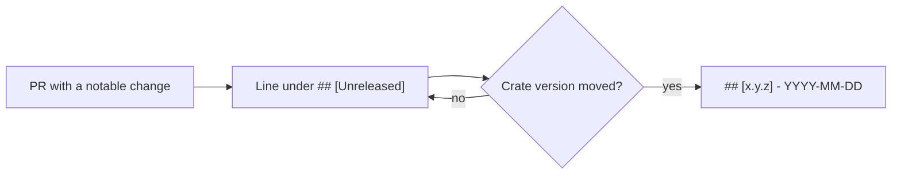

# PR summary — Issue #64: add CHANGELOG.md

## Summary

Closes #64

- [x] Add `CHANGELOG.md` in [Keep a Changelog](https://keepachangelog.com/)
      format. Versions 0.1.0–0.1.3 are reconstructed from
      `refinery/Cargo.toml`'s git history, and #63 and #64 sit under
      `[Unreleased]`.
- [x] Add a **Changelog** section to `CONTRIBUTING.md`. Each change adds a
      terse `[Unreleased]` line, and a PR that moves the crate version turns
      `[Unreleased]` into `## [x.y.z] - YYYY-MM-DD`.
- [x] Add `refinery/tests/changelog.rs`, which checks that:
  - the file has a `# Changelog` title and `[Unreleased]` comes first;
  - every release heading is a plain `x.y.z` with a real ISO date;
  - releases are strictly newest first, with non-decreasing dates;
  - no release is ahead of `refinery/Cargo.toml`.

The test does **not** demand a heading for the current crate version.
`version-increment.yml` auto-bumps the patch on the PR branch, so that rule
would fail every source PR.

The `### Added` / `### Changed` headings repeat under each release, so
`CHANGELOG.md` sets markdownlint MD024 to `siblings_only` inline. This avoids
editing the hidden `.markdownlint.json`.

## Evidence

- TDD: `cargo test --test changelog` failed first. Four tests failed because
  `CHANGELOG.md` did not exist and `CONTRIBUTING.md` did not mention it; the
  four helper tests passed. After the change all 8 pass.
- `markdownlint-cli2`: 0 issues.
- `./quality.sh < /dev/null` stopped at `scripts/test-runlib.sh`. This is a
  pre-existing failure ("runlib: rustc -vV named no host target") tracked in
  stSoftwareAU/NEAT-AI-Refinery#70, and this PR does not touch that code.
- I ran every later stage by hand and all passed:
  - `test-auto-version.sh`
  - markdownlint
  - actionlint
  - `cargo deny check`
  - `cargo fmt --check`
  - clippy with `-D warnings`
  - `cargo test --workspace --all-features`
  - `cargo doc`

## Test Plan

- [x] `cargo test --test changelog < /dev/null`
- [x] `npx markdownlint-cli2`
- [x] `./quality.sh < /dev/null`: every stage except the pre-existing #70
      failure.

🤖 Generated with [Claude Code](https://claude.com/claude-code)
