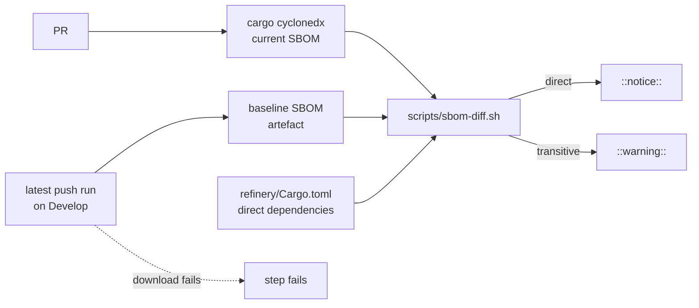

# PR Summary — Issue #65

## Summary

`sbom.yml` produced a CycloneDX document on every PR, and nothing ever read it.
It now diffs each PR's SBOM against the one the latest successful push run on
`Develop` uploaded, and it annotates every new component. A new crate that
`refinery/Cargo.toml` declares directly gets a notice. A crate it never asked
for by name gets a warning.

Closes #65

- [x] `scripts/sbom-diff.sh`:
  - compares components by purl minus version, qualifiers and subpath, so a
    version bump is not new;
  - reads direct dependencies from the manifest, covering renames, `workspace`
    keys, table-form entries and `target` sections;
  - escapes annotation text so SBOM content cannot inject workflow commands.
- [x] `scripts/test-sbom-diff.sh`: a hermetic contract test with 38
  assertions, which runs in `quality.sh` and in the CI `shell-checks` job.
- [x] `sbom.yml`:
  - a PR-only diff step, with the `actions: read` permission it needs to read
    another run's artefact;
  - the push trigger stays, because it is what refreshes the baseline.
- [x] `refinery/tests/sbom_gate.rs`: fails the build if that wiring goes
  missing.
- [x] Docs: the README "Continuous integration" section (table row, CI diagram
  and a new flow diagram) and CHANGELOG `[Unreleased]`.

**Design choice: annotate, don't fail.** A routine `cargo update` or a new
direct dependency legitimately brings transitive crates, so blocking the PR
would train people to ignore the gate. The warning names
`cargo tree -i <crate>` so a reviewer can explain the crate in one command.

The step still fails loud in two cases:

- A baseline that exists but cannot be downloaded fails the step, rather than
  passing as "nothing new".
- A run that produces no SBOM fails the step.

When `Develop` has no successful run yet, the step says so in a notice.



## Evidence

This is a CI and CLI change, so the evidence is test output and a dry run
rather than screenshots.

- **`./scripts/test-sbom-diff.sh`: 38 passed, 0 failed.** The cases cover:
  - an unchanged inventory;
  - a version-only bump;
  - a new transitive crate;
  - seven new direct dependencies, one for each manifest form;
  - an alias key and a `[features]` key, which are not treated as
    dependencies;
  - `serde-json` and `serde_json` matching each other;
  - nested components and qualifiers;
  - workflow-command injection (`%0A::error::…` stays on one line);
  - missing, invalid and non-CycloneDX inputs, which exit 2;
  - a wrong argument count.
- **`cargo test --test sbom_gate`: 6 passed.**
- **A dry run of the step's own `run:` block against the live baseline.**
  I took the step's script from `sbom.yml` and ran it against the real
  `Develop` baseline (push run 36256933218), with one extra crate injected
  into the current SBOM:

  ```text
  ::warning title=New transitive SBOM component::pkg:cargo/brand-new@0.1.0 is new since the baseline SBOM and is not a direct dependency in ./refinery/Cargo.toml — run `cargo tree -i brand-new` to see what pulled it in
  sbom-diff: 1 new component(s), 1 not a direct dependency of ./refinery/Cargo.toml
  Diffed 1 SBOM(s) against run 36256933218
  ```

  The first version of this dry run caught a real bug: the step searched for
  SBOMs *after* downloading the baseline, so a baseline inside the workspace
  would have been diffed against itself. The step now lists the current SBOMs
  before it downloads anything.
- **The real artefact.** I removed `anstream` and `sha2` from the baseline
  SBOM. The diff gave a warning for `anstream` (transitive) and a notice for
  `sha2` (direct): "2 new component(s), 1 not a direct dependency". Diffing
  the artefact against itself reported 0.

## Test Plan

- [x] `./scripts/test-sbom-diff.sh < /dev/null`: 38/38 pass.
- [x] `shellcheck scripts/sbom-diff.sh scripts/test-sbom-diff.sh quality.sh`:
  clean.
- [x] `actionlint`: clean.
- [x] `markdownlint-cli2`: 0 issues.
- [x] `cargo deny check`, `cargo fmt --check`, `cargo clippy -D warnings` and
  `cargo doc -D warnings`: all clean.
- [x] `cargo test --workspace --all-features`: 403 passed, 0 failed.
- [ ] `./quality.sh`: stops at `scripts/test-runlib.sh`, as it does on
  `Develop` today. That failure is pre-existing and tracked in #70 ("runlib:
  rustc -vV named no host target"). Every stage after it was run by hand, with
  the results above.
- [ ] On this PR's own `SBOM` run, the diff step reports "0 new component(s)",
  because this PR adds no crates.

## Pre-PR Security Self-Check

- [x] **Input validation:** `sbom-diff.sh` checks the argument count, that each
  file exists, and that both SBOMs are CycloneDX JSON. Anything else exits 2.
- [x] **Secrets:** none staged. `GH_TOKEN` is the job's `github.token`, passed
  through `env:`.
- [x] **Injection surface:**
  - No `${{ github.* }}` appears inside `run:`.
  - Shell variables are quoted.
  - SBOM text is escaped (`%`, CR, LF) before it becomes annotation data.
- [x] **Least privilege:** the job gains only `actions: read`, next to
  `contents: read`.
- [x] **Error handling:** a failed download and a missing SBOM both fail loud,
  and a missing baseline run is reported, not hidden.
- [x] **Dependencies:** none added. `jq` and `gh` come preinstalled on the
  runner, and no new `uses:` reference is added.
