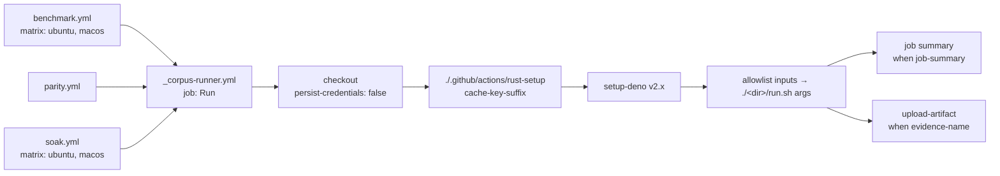

# PR Summary — Issue #68

## Summary

`benchmark.yml`, `parity.yml` and `soak.yml` each repeated the same steps:
checkout, rust-setup, setup-deno, running the corpus script, and (for two of
them) uploading the evidence. Those steps now live once, in the reusable
workflow `.github/workflows/_corpus-runner.yml`. Each caller passes only the
inputs that differ between them.

Closes #68

- [x] `_corpus-runner.yml` (`workflow_call` only):
  - takes the inputs `runs-on`, `timeout-minutes`, `cache-key-suffix`,
    `script`, `args`, `evidence-name` and `job-summary`;
  - checks out with `persist-credentials: false`;
  - checks `script`, `args` and `evidence-name` against allowlists before
    anything runs;
  - fails the upload with `if-no-files-found: error` when no evidence was
    written.
- [x] The three callers now contain only their triggers, concurrency, matrix
  and `with:` inputs. The cache suffixes (`bench`, `parity`, `soak`) and the
  artifact names (`bench-<os>`, `soak-<os>`) are unchanged.
- [x] `refinery/tests/corpus_runner.rs` (8 tests):
  - each caller calls the runner once, with its own inputs;
  - no caller inlines a shared step again;
  - the runner owns each shared step exactly once;
  - the runner forwards the cache suffix and does not persist the token.
- [x] `invocation_inputs` moved to `refinery/tests/support/workflow_yaml.rs`,
  so `rust_setup_action.rs` and `corpus_runner.rs` share one parser.
- [x] Docs updated: README (the CI text and the rust-setup Mermaid chart),
  `CONTRIBUTING.md`, `docs/parity-harness.md`, and CHANGELOG `[Unreleased]`.

**Things a reviewer will notice:**

- **Check names change** from `Benchmark on ubuntu-latest` to
  `Benchmark on ubuntu-latest / Run`, and the same happens for Parity and Soak.
  None of these is a required check: branch protection requires only
  "Markdown Lint" and "Dependency Review".
- **`REFINERY_PARITY_REQUIRED: "1"` was removed from `parity.yml`.**
  `parity/run.sh` exports it itself, so the harness still cannot pass by
  skipping.
- **`CARGO_TERM_COLOR` and `CARGO_BUILD_JOBS` moved into the runner.** A
  caller's `env:` does not reach a called workflow, so leaving them in the
  callers would have silently dropped them.

## Evidence

This change only affects CI, so the evidence is test output. The screenshots
the PR template asks for do not apply.

- `cargo test --test corpus_runner`: 8 passed.
- `cargo test --test rust_setup_action`: 15 passed. `RUST_WORKFLOWS` now lists
  `_corpus-runner.yml` in place of the three callers.
- Regression check: with `Develop`'s copy-pasted callers restored,
  `each_caller_invokes_the_runner_once_with_its_own_inputs` and
  `no_caller_inlines_the_shared_steps` fail (6 passed, 2 failed). With the
  refactor, all 8 pass.
- `actionlint`: clean. It type-checks the `workflow_call` inputs each caller
  passes.

## Test Plan

- [x] `cargo test --workspace --all-features`: 411 passed, 0 failed.
- [x] `cargo fmt --check`, `cargo clippy -D warnings` and
  `cargo doc -D warnings`: clean.
- [x] `cargo deny check`: advisories, bans, licences and sources all ok.
- [x] `actionlint`, `shellcheck` and `markdownlint-cli2`: clean.
- [x] `scripts/test-auto-version.sh` (26/0) and `scripts/test-sbom-diff.sh`
  (38/0).
- [ ] `./quality.sh` stops at `scripts/test-runlib.sh`, the same way it does
  on `Develop` today. That failure is older than this PR and is tracked in
  #70. I ran every stage after it by hand, with the results above.
- [ ] On this PR's own runs, the Benchmark, Parity and Soak checks go green
  under their `… / Run` names, and the `bench-<os>` and `soak-<os>` artifacts
  are uploaded.

## Pre-PR Security Self-Check

- [x] **Input validation:**
  - `script` must match `^\./[A-Za-z0-9_-]+/run\.sh$`;
  - `args` may hold only letters, digits, spaces, `.`, `_` and `-`;
  - `evidence-name` may hold only lower-case letters, digits and `-`.
- [x] **Injection surface:** each input reaches `run:` through `env:`, never
  through `${{ }}` interpolation, and shell variables are quoted.
- [x] **Least privilege:** the runner and every caller job are
  `contents: read`, and checkout does not persist `GITHUB_TOKEN`.
- [x] **Secrets:** none staged, and no secrets are passed to the runner.
- [x] **Error handling:** an input that fails validation stops the job with
  `::error::`, and a missing evidence directory fails the upload.
- [x] **Dependencies:** none added. The existing SHA-pinned actions moved into
  the runner unchanged.
