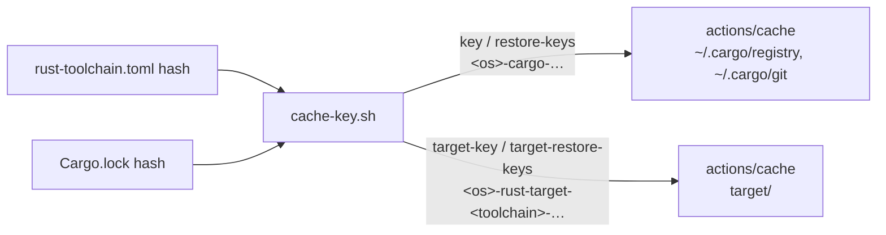

# Cache `target/` in the shared rust-setup action

## Summary

`.github/actions/rust-setup` cached only `~/.cargo/registry` and
`~/.cargo/git`. That meant every Rust workflow recompiled the whole workspace
from scratch. The action now adds a second `actions/cache` step over `target/`,
keyed on the Cargo.lock hash like the registry cache. The key also includes a
hash of the pinned toolchain, which the issue accepted as an improvement.
Closes #69.

- **Key:** `<os>-rust-target-<toolchain>-[<suffix>-]<lock>`.
- **Restore ladder:** first `<os>-rust-target-<toolchain>-<suffix>-`, then
  `<os>-rust-target-<toolchain>-`.
  - A `Cargo.lock` change still restores a warm `target/`.
  - A toolchain bump never restores artefacts built by another `rustc`.
- **No prefix overlap:** the `rust-target` prefix never collides with the
  registry's `<os>-cargo-` ladder. As a result, neither cache can restore the
  other's archive.
- **Fail loud:** `cache-key.sh` now takes a fourth argument, the toolchain hash
  (`hashFiles('rust-toolchain.toml', 'rust-toolchain')`). It still fails if any
  argument is empty or contains characters outside `[A-Za-z0-9._-]`.

Both steps reuse the existing `actions/cache@27d5ce7…  # v5` pin. `v5` now
resolves to `caa2961…` (v5.1.0). That bump is out of scope here and is left to
the normal dependency-bump flow.

The README, CONTRIBUTING and CHANGELOG are updated.

## Evidence

This is CI configuration only, so there is no UI to screenshot.

- `cargo test --test rust_setup_action`: 21 passed. These tests run the real
  `cache-key.sh` and parse the real `action.yml`.
- `./quality.sh < /dev/null` stops at the pre-existing
  `scripts/test-runlib.sh` failure tracked in #70, which is unrelated to this
  change. Bash syntax and shellcheck pass. I then ran every later stage by hand
  and all were green:
  - `test-auto-version.sh`
  - markdownlint
  - actionlint
  - `cargo deny`
  - `cargo fmt --check`
  - clippy with `-D warnings`
  - the full `cargo test --workspace`
  - `cargo doc` with `-D warnings`

## Test Plan

These tests are in `refinery/tests/rust_setup_action.rs`. They were written
first, and 8 of them failed against the unchanged action.

- **New tests:**
  - `a_toolchain_change_never_restores_a_stale_target_cache`
  - `a_lock_change_still_restores_the_target_cache`
  - `the_target_cache_never_shares_a_prefix_with_the_registry_cache`
  - `the_composite_action_caches_target_under_its_own_key`
  - `an_unsafe_or_empty_toolchain_hash_is_rejected`
  - `cache_step_paths_reads_each_block`
- **Changed tests:**
  - The exact-output tests now expect the target key and ladder.
  - `a_missing_argument_fails_loudly` covers the three-argument call.
  - The inline-cache gate also flags a workflow that caches `target` itself.

## Pre-PR Security Self-Check

- [x] Input validation: the toolchain hash is allowlisted and checked for
      emptiness, the same as the other three arguments.
- [x] Secrets: none staged, and no hidden files outside `.github/`.
- [x] Injection surface: values reach the script through `env`, not by
      interpolating `${{ }}` into `run:`.
- [x] Output encoding: multi-line outputs use fixed heredoc delimiters.
- [x] Auth: no permission changes.
- [x] Error handling: bad input exits non-zero with a usage message.
- [x] Dependencies: no new actions; the existing SHA pin is reused.
