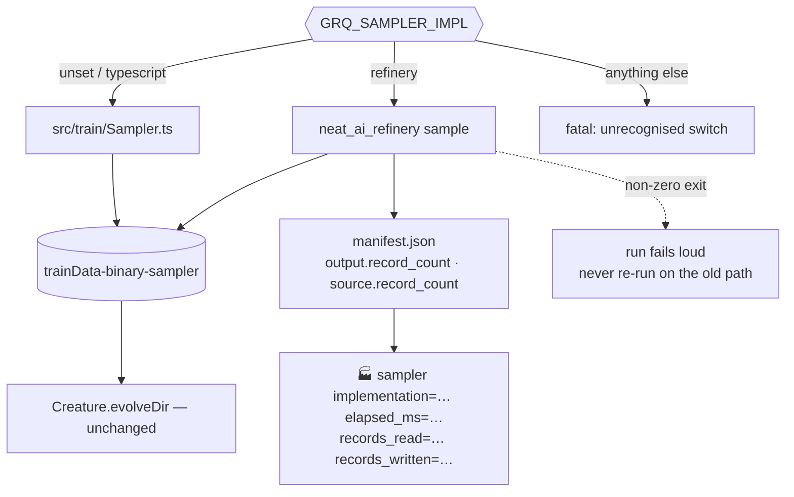

# Integrate Refinery sampling into GRQ behind a rollback switch

## Summary

The Rust sampler now runs in GRQ behind `GRQ_SAMPLER_IMPL` — unset (the
production default) keeps GRQ's TypeScript sampler, `refinery` hands the corpus
to `neat_ai_refinery sample`, and anything else is fatal. GRQ remains the
orchestration layer: it resolves the source corpus and the record shape,
invokes the chosen sampler, and passes the published directory to the same
`evolveDir` loop. NEAT-AI-scorer is untouched.

The integration itself lives in GRQ (the consuming repository) on branch
`refinery-sampler-rollback-switch`. This repository carries the caller-facing
half: the contract documentation and a Rust test that pins the manifest fields
GRQ reads the run's record counts out of. Closes #7.

## Evidence

Backend/CLI change — no web interface to screenshot. The evidence is the
end-to-end run below and the tests listed in the test plan.



GRQ's new seam driven against the **real** `neat_ai_refinery` binary over a
2000-record corpus (2 inputs, 1 output), rate 0.05:

```text
🏭 …/trainData-binary-sampler/sample-5.bin — 85 of 2000 records kept from 2 file(s), seed 1274541213517225767
📄 …/trainData-binary-sampler/manifest.json — sha256 cae2aff9447bfa2e1f7dea0a583c888c174e1e6997d4bffc751871d51392d23a
🏭 sampler implementation=refinery elapsed_ms=12 records_read=2000 records_written=85 output=…/trainData-binary-sampler/sample-5.bin
```

```json
{"output":{"file":"sample-5.bin","record_count":85,"bytes":1020,…},
 "source_records":2000,"metadata":{"grq_observation_version":"42"}}
```

That run also caught a real defect the unit stubs could not: a stale binary
without `--metadata` exited 2, and the seam refused the run
(`no corpus was published and GRQ does not fall back silently`) instead of
reporting an unmeasured success.

## Acceptance Criteria

- **met** — Feature/rollback switch exists — evidence: `GRQ_SAMPLER_IMPL` in
  GRQ `src/train/RefinerySampler.ts` (`resolveSamplerImplementation`) and
  `worker/shared/refinery_sampler.sh`; covered by
  `test/train/RefinerySampler_test.ts::resolveSamplerImplementation - …` and
  `test/worker/RefinerySamplerSwitch.ts::refinery_sampler.sh - …`.
- **met** — Existing production path remains available — evidence: the switch
  defaults to `typescript` and `loader()` in GRQ `src/train/Sampler.ts` is
  unchanged apart from counting records;
  `test/worker/RefinerySamplerSwitch.ts::sampler.sh - grants nothing extra on
  the default path` proves the default argv gains no permission.
- **met** — First fleet runs can compare old/new sampler timings and output
  counts — evidence: both paths report the same
  `implementation/elapsed_ms/records_read/records_written/output` line
  (`formatSamplerOutcome`), asserted by
  `test/train/RefinerySampler_test.ts::formatSamplerOutcome - one comparable
  line per implementation`; the Refinery counts come from `manifest.json`,
  whose key names are pinned here by
  `refinery/tests/consumer_contract.rs::the_manifest_names_the_counts_an_orchestrator_reads`.
- **met** — No scorer changes — evidence: the GRQ diff touches only
  `src/train/`, `worker/sampler.sh`, `worker/teams/run.sh` and their tests; no
  NEAT-AI-scorer file is opened, and `ensure_neat_ai_native_scorer` is
  untouched.

Safety requirements from the issue body, all met: the TypeScript sampler stays
the explicit fallback (unset one variable), every run logs which implementation
produced the corpus, and a Rust failure is fatal — no hidden fallback
(`test/train/RefinerySampler_test.ts::runRefinerySampler - a Refinery failure is
fatal, never a fallback`).

- **unrequested** — `refinery/tests/consumer_contract.rs` — reason: the counts
  the acceptance criteria ask GRQ to compare are read from `manifest.json`, so
  those JSON key names became an interface; without a raw-JSON test a serde
  rename here would silently blind the caller.

## Cross-repository change

The production integration is a GRQ change and was pushed to
`stSoftwareAU/GRQ` branch `refinery-sampler-rollback-switch` (base `Develop`):

| File | Role |
| --- | --- |
| `src/train/RefinerySampler.ts` (new) | switch, argument builder, subprocess call, manifest read |
| `src/train/Sampler.ts` | dispatches to the selected implementation; counts records so both paths report the same line |
| `worker/shared/refinery_sampler.sh` (new) | composes the scoped `--allow-run` for the binary, or fails loud |
| `worker/sampler.sh`, `worker/teams/run.sh` | source the helper and pass the flag through |
| `test/train/RefinerySampler_test.ts` (new), `test/worker/RefinerySamplerSwitch.ts` (new) | 19 tests over the switch, the argv and the fail-loud paths |
| `README.md` | the switch, its variables and the no-silent-fallback rule |

## Test Plan

This repository:

- Added `refinery/tests/consumer_contract.rs` — three tests over the published
  artefact as an orchestrator sees it: the manifest names `output.file`,
  `output.record_count`, `source.record_count` and the caller's metadata key in
  the **raw JSON**; the counts distinguish records read from records kept; the
  published directory holds exactly the corpus and its manifest.
- `./quality.sh` — cargo-deny, `cargo fmt`, clippy, the full test suite and
  `cargo doc`.

GRQ (`stSoftwareAU/GRQ`, branch `refinery-sampler-rollback-switch`):

- Added `test/train/RefinerySampler_test.ts` — 12 tests: the switch defaults,
  accepts `refinery`, and rejects an unknown value; the composed argv with and
  without a seed and metadata; a rejected record shape or rate; a run against a
  stub binary reporting the manifest's counts; a non-zero exit, a missing
  binary and an unreadable manifest each failing loud.
- Added `test/worker/RefinerySamplerSwitch.ts` — 7 tests running the real
  helper and the real anchored `deno run` block from `worker/sampler.sh` with a
  stub `deno`: the default grants no extra permission, the switch grants a
  scoped `--allow-run` (from the env var or `PATH`), a missing binary and an
  unknown value fail loud, and the flag reaches the composed argv.
- Re-ran the neighbouring sampler suites unchanged — `SamplerLifecycle_test.ts`,
  `SamplerScratchCleanup_test.ts`, `SamplerShPassthrough.ts`,
  `SamplerEnospcRetryGate.ts`, `SamplerLifecycleShell.ts` (64 passed) — plus
  `worker/shared/test_sampler_err_trap.sh` (27 passed), `deno fmt`, `deno lint`,
  `quality/bash_syntax.sh` and `quality/shellcheck.sh`.
