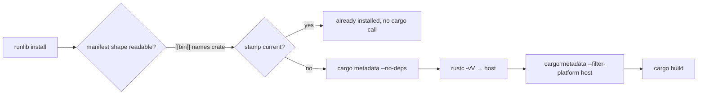

# PR Summary — Issue #70

## Summary

Closes #70

`scripts/runlib.sh`, synced byte-for-byte from NEAT-AI-core, changed its
contract, and `scripts/test-runlib.sh` had not caught up, so `./quality.sh`
was red on `Develop`. NEAT-AI-core has no canonical `test-runlib.sh` to
copy, so the local test was updated by hand. `runlib.sh` is untouched.

- [x] The rustc shim answers `-vV` with a `host:` line. Runlib now refuses to
      resolve the dependency graph without one, because it passes the host to
      `cargo metadata --filter-platform`.
- [x] The explicit `[[bin]]` assertion expects **zero** cargo calls. The
      canonical fast path treats a `[[bin]]` table that names the crate as
      unambiguous and skips without `cargo metadata`.
- [x] Added a check that the fresh-install graph call is filtered to the
      rustc host.
- [x] Updated the README paragraph that described the old one-metadata-call
      skip.



Follow-up note, out of scope: the README still says runlib "never installs a
toolchain", but the synced copy now bootstraps rustup when `rustc` is
missing (core #699).

## Evidence

Before, on `Develop` at c9967be:

```text
runlib: rustc -vV named no host target — the dependency graph cannot be filtered for this platform
=== summary: 7 passed, 17 failed ===
```

After:

```text
=== an explicit [[bin]] table naming the crate costs no cargo call ===
  PASS: the explicit [[bin]] shape skips without cargo metadata
  PASS: the explicit [[bin]] shape runs no cargo command at all
...
  PASS: a failed build exits non-zero
...
=== summary: 26 passed, 0 failed ===
All quality checks passed!
```

## Reproduction

- **Symptom:** `./quality.sh` on `Develop` fails in `scripts/test-runlib.sh`
  with 7 passed and 17 failed ("rustc -vV named no host target").
- **Status:** verified. The failure reproduced on the base commit and passes
  after the change.
- **Regression test:** `scripts/test-runlib.sh`, specifically
  "the dependency graph is filtered to the rustc host" and "the explicit
  [[bin]] shape skips without cargo metadata".

## Test Plan

- [x] `./scripts/test-runlib.sh < /dev/null`: 26 passed, 0 failed.
- [x] `./quality.sh < /dev/null`: all quality checks passed.
- [x] `scripts/runlib.sh` is unchanged, so the family-sync `cmp -s` check still holds.
