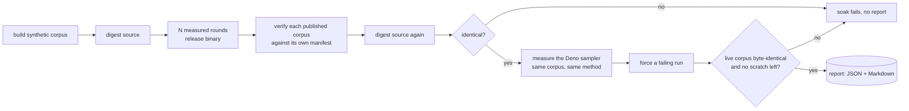

# 🏭 Production soak and cut over GRQ materialised sampling to Refinery

## Summary

Refinery is now the producer of GRQ's sampled corpus. The cut-over is carried
by measured evidence rather than confidence: a soak harness runs the release
binary repeatedly at the production record shape, measures it and the Deno
sampler the same way, and asserts every invariant the cut-over depends on. The
reports it produced on this host are committed under `docs/evidence/`, and a
soak workflow runs the same harness on macOS and Linux for every pull request.

The default flip itself lives in GRQ and is delivered as a declared cross-repo
PR on branch `issue-8-refinery-becomes-the-default-sampler`: unset
`GRQ_SAMPLER_IMPL` now runs `neat_ai_refinery`, and `GRQ_SAMPLER_IMPL=typescript`
is the rollback, kept until the TypeScript sampler is removed (issue #9).

Closes #8.

## Evidence

This is a backend/CLI change with no web interface to screenshot. The evidence
is the soak reports, the tests and the quality gate.

Production record shape, 8 shards × 20 000 records (1.5 GiB, 10 048 bytes a
record), rate 0.05, no seed — the production path
([`docs/evidence/soak-linux-aarch64.md`](../../evidence/soak-linux-aarch64.md)):

| Sampler | Elapsed | Records/s | Peak RSS | Read | Kept |
| --- | --- | --- | --- | --- | --- |
| Refinery round 1 | 438 ms | 365 297 | 12 612 KiB | 160 000 | 7 865 |
| Refinery round 2 | 214 ms | 747 664 | 13 020 KiB | 160 000 | 8 034 |
| Refinery round 3 | 220 ms | 727 273 | 12 976 KiB | 160 000 | 7 947 |
| Deno `Sampler.ts` | 642 ms | 249 221 | 168 476 KiB | 160 000 | 7 976 |

~2.9× the throughput at ~1/13th the peak resident memory, both reading the
whole corpus and keeping the same sampling band. Round 1 is slower because the
corpus has just been written and is not yet in the page cache.

The consumer report
([`docs/evidence/soak-linux-aarch64-consumer.md`](../../evidence/soak-linux-aarch64-consumer.md))
adds NEAT-AI's `evolveDir` opening a Refinery-published corpus unchanged:
`{"consumed":true,"error":132225.91…,"generations":1}`.

Every invariant is fatal — a breach ends the soak with a non-zero exit and no
report, rather than being recorded as a data field somebody skims past.

## Acceptance Criteria

- **partial** — Refinery becomes the GRQ default — evidence: GRQ branch
  `issue-8-refinery-becomes-the-default-sampler` (`src/train/RefinerySampler.ts`
  `resolveSamplerImplementation` returns `refinery` for an unset switch,
  `worker/shared/refinery_sampler.sh` grants the scoped `--allow-run` on the
  default path, 20 GRQ tests pass) — reason: the flip lives in GRQ, so it lands
  through the declared cross-repo PR rather than this diff.
- **partial** — rollback switch remains temporarily — evidence: same GRQ branch;
  `GRQ_SAMPLER_IMPL=typescript` still selects `Sampler.ts`, covered by
  `test/train/RefinerySampler_test.ts::resolveSamplerImplementation - typescript
  is the rollback` and `test/worker/RefinerySamplerSwitch.ts::refinery_sampler.sh
  - the typescript rollback grants nothing` — reason: same cross-repo PR.
- **met** — no source corpus mutation — evidence:
  `refinery/tests/soak_evidence.rs::digests_notice_a_source_corpus_that_changed`,
  the `source_unchanged` invariant in `refinery/src/soak/run.rs`, and both
  committed reports recording it as held.
- **met** — operational docs identify Refinery as the producer of the sampled
  corpus — evidence: `README.md` ("Running it in production"), the flipped
  switch table in `docs/grq-integration.md`, the new
  `docs/production-soak.md`, and the GRQ README section on the same branch.

Evidence the issue asked to capture:

- **partial** — successful runs across representative macOS/Linux hosts —
  evidence: `docs/evidence/soak-linux-aarch64.md` plus
  `.github/workflows/soak.yml`, which runs the same soak on `macos-latest` and
  `ubuntu-latest` for every PR — reason: no macOS report is committed; this
  change was made in a Linux-only container, and inventing one would be worse
  than naming the gap.
- **met** — no `evolveDir` consumer regressions — evidence:
  `docs/evidence/soak-linux-aarch64-consumer.md` and the existing
  `refinery/tests/parity_harness.rs` `evolve_dir` tests.
- **met** — output record counts / geometry valid — evidence:
  `refinery/src/soak/verify.rs` and the four rejection tests in
  `refinery/tests/soak_evidence.rs`.
- **partial** — no new disk-full / atomic-publication regressions — evidence:
  the `atomic_publication` invariant, held in both reports — reason: the failure
  is provoked by a corpus ending mid-record, not by a full volume; simulating
  ENOSPC portably needs privileges a soak should not ask for.
- **met** — throughput and peak RSS versus the Deno implementation — evidence:
  the table above, from `docs/evidence/soak-linux-aarch64.json`.

No unrequested changes: the diff is the soak harness, its tests, the evidence
it produced, the workflow that reruns it, and the docs the cut-over changes.

## Test Plan

Added `refinery/tests/soak_evidence.rs` — 12 tests calling the real API:

- `measures_the_wall_clock_and_peak_memory_of_a_live_process`
- `a_failed_command_fails_loud_with_what_it_wrote`
- `a_missing_program_fails_loud_rather_than_reporting_zero`
- `digests_notice_a_source_corpus_that_changed`
- `verifies_a_genuinely_published_corpus`
- `rejects_a_published_corpus_holding_a_partial_record`
- `rejects_a_published_corpus_whose_bytes_no_longer_match_the_manifest`
- `rejects_a_published_corpus_the_manifest_miscounts`
- `rejects_a_published_corpus_of_another_record_shape`
- `a_soak_run_captures_the_evidence_the_cut_over_needs`
- `a_soak_report_renders_as_committable_evidence`
- `a_soak_run_compares_refinery_against_the_deno_sampler` (skips without Deno)

Plus unit tests in `refinery/src/soak/{host,measure,report}.rs`.

`./quality.sh` passes: shellcheck, markdownlint, actionlint, cargo-deny, fmt,
clippy (`-D warnings`), 141 tests and the doc build.

In GRQ, `deno test test/train/RefinerySampler_test.ts
test/worker/RefinerySamplerSwitch.ts` passes (20 tests), as do
`quality/shellcheck.sh`, `quality/bash_syntax.sh`,
`quality/portability_guard.sh` and `quality/shell_source_chain.sh`.
