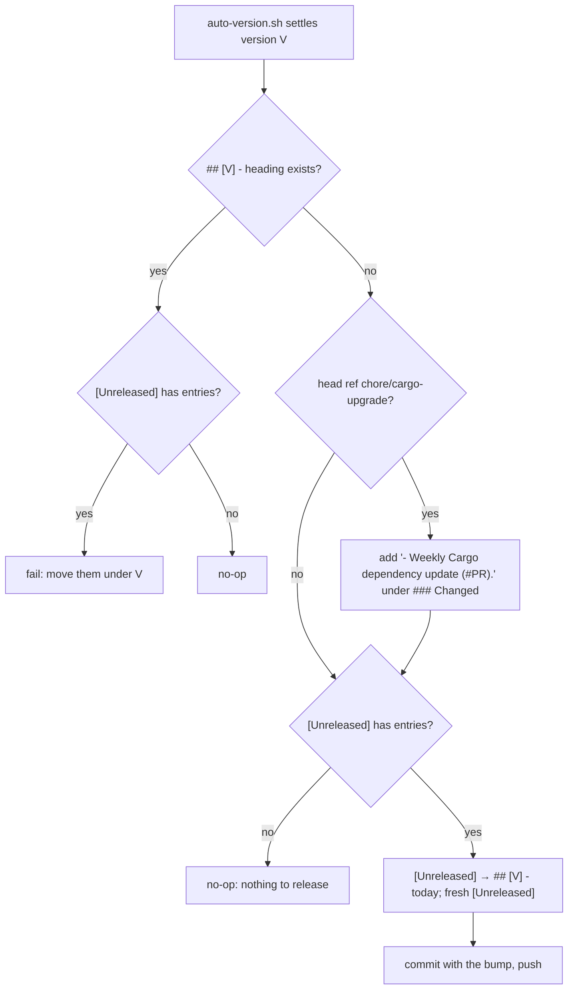

# PR summary — Issue #80: release CHANGELOG.md on the version bump

## Summary

`version-increment.yml` now releases `CHANGELOG.md` in the same job that
bumps the crate. Once the version is settled, a new script,
`scripts/changelog-release.sh`, turns `## [Unreleased]` into
`## [<version>] - <today UTC>` and opens a fresh, empty `[Unreleased]` above
it, but only when that version has no heading yet. On the weekly
`chore/cargo-upgrade` refresh, the job first adds
`- Weekly Cargo dependency update (#<PR>).` under `### Changed`. An empty
`[Unreleased]` is never released. The CHANGELOG release is committed and
pushed with the bump. Closes #80.

## Spec

### Intent and Rationale

- PR #78 moved the crate from 0.1.3 to 0.1.4 but left its entries under `[Unreleased]`. The next bump would then have labelled them with the wrong version. This PR takes option 1 from the issue (automate the release where the bump happens), which keeps the one-version-per-section rule that `refinery/tests/changelog.rs` and `CONTRIBUTING.md` describe.
- The script compares against what the changelog already contains, not against "did this run bump". A PR whose author bumped the version by hand is still released, and a re-run after the bot's own commit changes nothing.

### Essential Design Decisions

- The release triggers when no line anywhere in the file starts with `## [<version>] -`. If the version already has a heading and `[Unreleased]` still holds entries, the job fails rather than leaving those entries to be mislabelled by the next bump.
- An empty `[Unreleased]` is never released (the issue says "no release should be created with zero entries"). Such a version moves with no heading, which `refinery/tests/changelog.rs` already allows.
- The weekly entry is keyed on the head ref `chore/cargo-upgrade`, the `branch:` that `cargo-upgrade.yml` opens its PR from. A gate test pins both sides. The PR number reaches the script through `env:` and is never interpolated into `run:`.
- The entry text reaches awk through `ENVIRON`, not `awk -v`, so backslashes stay literal. The file is replaced only on a release, via a temporary file and `mv`. Every other outcome leaves it byte-identical.

### Undiscoverable Facts

- The base branch is already at 0.1.5 (#79 bumped it with an empty `[Unreleased]`, so 0.1.5 has no heading). This PR touches `scripts/changelog-release.sh` and `version-increment.yml`, both in the workflow's `paths:`, so the new job runs on this PR itself. It should bump to 0.1.6 and release this PR's `#80` entry under `## [0.1.6]`. That is why this PR adds no release heading by hand.

## Evidence

This is a CI/script change with no UI. The script's behaviour is covered by `scripts/test-changelog-release.sh`, and the workflow wiring by the validator in `refinery/tests/family_gates.rs`.

I ran the script on a copy of the real `CHANGELOG.md` with version `0.1.5` and the weekly entry. It printed `released [Unreleased] as [0.1.5] - 2026-10-08`. A second run printed `[0.1.5] is already released — nothing to do` and exited 0.

**Docs sweep** — grep: `Unreleased`, `version-increment`, `changelog-releas\w*`, `releas\w* .*CHANGELOG` over `README.md`, `CONTRIBUTING.md`, `SECURITY.md`, `docs/` (not archive), and the source doc comments; section: `CONTRIBUTING.md#changelog`, `README.md#continuous-integration`; updated: `CONTRIBUTING.md`, `README.md`, `CHANGELOG.md`, the module doc in `refinery/tests/changelog.rs`, and the header in `version-increment.yml`; `CONTRIBUTING.md:39` — still true because the patch-bump sentence and its path list are unchanged; `README.md:797` — still true because it now also names the CHANGELOG release.

## Test Plan

- `scripts/test-changelog-release.sh` (new; 13 cases, 46 assertions) runs the real script on throwaway changelogs. It checks the exact bytes on disk, the exit code and stderr. It runs in `quality.sh` and in CI's `shell-checks` job.
- `refinery/tests/family_gates.rs`:
  - `version_increment_releases_the_changelog` (positive) and `changelog_release_gaps_catches_every_missing_needle` (negative): each required line removed from the real job block, including just one of the two `git diff --quiet … CHANGELOG.md` guards, is reported.
  - `cargo_upgrade_branch_matches_the_weekly_changelog_entry_guard`.
  - `GATED_PATHS` gains `scripts/changelog-release.sh`.
  - `shell_checks_run_both_script_contracts` was renamed to `shell_checks_run_every_script_contract` and now also requires `./scripts/test-changelog-release.sh`. No assertion was removed.
  - `the_family_scripts_are_committed_executable` covers both new scripts.
- No existing test assertion was removed. The edits only extend lists, and only the doc comment in `refinery/tests/changelog.rs` was reworded. The removed-assertion check flags the three assertions below because the `for` list around each one changed. Each is byte-identical and still runs in the same test, now over a longer script list. No issue requirement makes any of them untrue:
  - Kept in `refinery/tests/family_gates.rs::shell_checks_run_every_script_contract` (renamed from `shell_checks_run_both_script_contracts`): `assert!( block.contains(script), "the shell-checks job must run {script} — a copied script with no contract test is \ linted but never exercised" );` — the loop now also covers `./scripts/test-changelog-release.sh`.
  - Kept in `refinery/tests/family_gates.rs::the_family_scripts_are_committed_executable`: `assert!( metadata.permissions().mode() & 0o111 != 0, "{script} is not executable — CI invokes it directly" );` — the loop now also covers `scripts/changelog-release.sh` and `scripts/test-changelog-release.sh`.
  - Kept in `refinery/tests/family_gates.rs::the_family_scripts_are_committed_executable` (the `#[cfg(not(unix))]` branch): `assert!(metadata.is_file(), "{script} is missing");` — same extended loop.
- The tests were written first. `test-changelog-release.sh` was run against the absent script and failed with exit 2 before the script existed.
- `./quality.sh < /dev/null` ran on the head: `All quality checks passed!` That covers shellcheck, the three script contracts (including `46 passed, 0 failed`), markdownlint, actionlint, cargo-deny, fmt, clippy `-D warnings`, `cargo test` and `cargo doc`.

**Branch outcomes:** each was flipped in a scratch copy of the script and the suite run with `scripts/test-changelog-release.sh`. Every flip went red.

- `scripts/changelog-release.sh:45` — missing changelog → die — case 12 — flipping went red (2 failed)
- `scripts/changelog-release.sh:47` — malformed version → die — case 12 — red (2 failed)
- `scripts/changelog-release.sh:50` — malformed date → die — case 12 — red (2 failed)
- `scripts/changelog-release.sh:54` — multi-line entry → die — case 12 — red (3 failed)
- `scripts/changelog-release.sh:100` — no `## [Unreleased]` → die — case 12 — red (3 failed)
- `scripts/changelog-release.sh:125-126` — already released with entries → die / without entries → no-op — cases 9, 8, 10 — red (2 failed)
- `scripts/changelog-release.sh:147` — entry given → inserted / not given → body as is — cases 3–6 vs 1–2 — red (5 failed)
- `scripts/changelog-release.sh:153` — entry already present → not duplicated — case 7 — red (1 failed)
- `scripts/changelog-release.sh:159` — `### Changed` exists → append — case 5 — red (1 failed)
- `scripts/changelog-release.sh:191` — later KaC subsection → insert before it / none → append at end — cases 6, 4 — red (1 failed)
- `scripts/changelog-release.sh:221` — empty `[Unreleased]` → no-op — case 2 — red (2 failed)
- `scripts/changelog-release.sh:242` — a following release section → kept / none → file ends after body — cases 1, 11 — red (5 failed)
- `scripts/changelog-release.sh:262` — release → `mv` over the changelog — cases 1, 3–6 — red (6 failed)
- `scripts/changelog-release.sh:266` — no outcome recorded → die: exempt (untestable): reachable only if awk exits 0 without writing the status file, which no input produces
- `.github/workflows/version-increment.yml:114` — `chore/cargo-upgrade` → weekly entry / any other ref → none — `refinery/tests/family_gates.rs::changelog_release_gaps_catches_every_missing_needle` (removing the guard or the entry line is reported) and `cargo_upgrade_branch_matches_the_weekly_changelog_entry_guard`

**Call sites checked:** `version-increment.yml` is the only caller of `changelog-release.sh`. Its call line, the weekly-entry guard, the `PR_NUMBER` env, the `git add … CHANGELOG.md`, and both `git diff --quiet … CHANGELOG.md` guards (commit step and fork report) are each pinned by `changelog_release_gaps`. Removing any one turns `changelog_release_gaps_catches_every_missing_needle` red.

🤖 Generated with [Claude Code](https://claude.com/claude-code)
