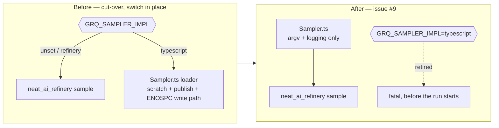

# Remove obsolete GRQ sampler code after the Refinery cut-over

## Summary

The rollback period closed, so the fallback the cut-over left behind was
deleted. The code lives in `stSoftwareAU/GRQ`, so the deletion rides a
cross-repo PR against that repository; this PR is the documentation half —
every page here that described the `GRQ_SAMPLER_IMPL` rollback switch, or named
a GRQ symbol the removal deleted, now describes what is actually there.
Closes #9.

**Why now.** The gate the previous run escalated on was operational, not
technical: `stSoftwareAU/GRQ#4599` (the default flip) merged 2026-08-31T12:31Z,
and a human removed `needs-human` and re-applied `work-on` at
2026-09-01T04:52Z — the signal that the rollback window closed with none of the
[conditions in `docs/production-soak.md`](../../production-soak.md) observed.

**What was removed in GRQ** (branch `issue-9-remove-typescript-sampler`,
−1361/+348 lines):

| Path | What went |
| --- | --- |
| `src/train/Sampler.ts` | `loader()`, `readAndProcess()`, both shuffles, `reclaimScratch()` and the `typescript` branch — **not** the file, which is the CLI entrypoint `worker/sampler.sh` and `worker/teams/run.sh` invoke |
| `src/train/SamplerScratchCleanup.ts` | whole file — its only production caller was `loader()`'s failure path |
| `src/train/SamplerDiskFailure.ts` | `writeRecordsOrThrow`, `SamplerDiskFullError` and the write-path helpers |
| `src/train/SamplerLifecycle.ts` | `publishSamplerDir`, `safeRemoveSamplerDir`, `isSamplerLockHeld` — Refinery publishes atomically itself and the bash cleaners own the lease check |
| `src/train/RefinerySampler.ts` | the switch: `SamplerImplementation`, `SAMPLER_IMPLEMENTATION_ENV`, `resolveSamplerImplementation`, `samplerImplementation` |
| `worker/shared/refinery_sampler.sh` | the `typescript` branch of the `--allow-run` grant |
| tests | `test/train/SamplerScratchCleanup_test.ts`, plus the cases that only covered the deleted functions |

**Preserved**, because the worker still calls them: the `.in-use.lock` lease
(`acquireDirLease` / `releaseDirLease`, held by `src/Learn.ts`), `isProcessAlive`
(`SegmentTmpPath.ts`), `isNoSpaceError` / `SAMPLER_ENOSPC_EXIT_CODE`, and every
timeout, health, stuck-detector and run-summary helper in `worker/shared/`.

**One thing was added rather than removed**: a host still exporting
`GRQ_SAMPLER_IMPL=typescript` now fails loud, in both
`worker/shared/refinery_sampler.sh` and `src/train/Sampler.ts`. Silently
honouring it as "run Refinery" would leave an operator believing a rollback took
effect while the corpus came from the implementation they were rolling away
from — the fail-loud rule, applied to a decommissioned switch.

## Evidence

Backend/CLI only — no web interface to screenshot. What was run instead:

- **This repository:** `./quality.sh < /dev/null` — green end to end
  (`All quality checks passed!`): shellcheck, markdownlint, `cargo deny`,
  `cargo fmt --check`, clippy with `-D warnings`, the full `cargo test`
  workspace and `cargo doc`.
- **GRQ (`/tmp/grq-9`, branch `issue-9-remove-typescript-sampler`):**
  `deno fmt`, `deno lint src test`, `deno check src test bench`,
  `quality/bash_syntax.sh`, `quality/shellcheck.sh`,
  `quality/shell_source_chain.sh`, `quality/portability_guard.sh`,
  `quality/no_legacy_creature_json.sh` — all pass; targeted suites
  `test/train/`, `test/unit/train/`, `test/unit/docs/` and the sampler
  `test/worker/` files: **224 passed, 0 failed**. GRQ's full `quality.sh` clones
  sibling repositories and rebuilds its Rust crate, so it is left to GRQ CI on
  the PR.
- **Call-site search, the first acceptance criterion:**
  `grep -rn` over `src/`, `test/`, `worker/` in GRQ for every removed symbol
  returns no live reference — only `CHANGELOG.md` and `docs/archive/`
  prose. `deno check src test bench` is the machine-checked half of the same
  claim.

## Acceptance Criteria

<!-- vibe-spec-review inputs="diff+issue-body" -->

- **met** — Call-site search proves deleted code is dead — evidence: reviewer
  re-ran `grep -rn` for `resolveSamplerImplementation`, `samplerImplementation`,
  `SAMPLER_IMPLEMENTATION_ENV`, `SamplerImplementation`, `writeRecordsOrThrow`,
  `SamplerDiskFullError`, `publishSamplerDir`, `safeRemoveSamplerDir`,
  `isSamplerLockHeld`, `reclaimSamplerScratch`, `grq_refinery_sampler_selected`
  — zero live `src/` / `test/` / `worker/` hits; `deno check` clean —
  reviewer: met
- **met** — GRQ tests/quality pass — evidence: `deno test` over the touched
  suites, `224 passed | 0 failed`; `deno lint` and `deno fmt --check` clean —
  reviewer: met
- **met** — Rollback period has completed before deleting the fallback —
  evidence: `stSoftwareAU/GRQ#4599` merged 2026-08-31T12:31Z; the issue's
  `needs-human` removed and `work-on` re-applied by `nleck` 2026-09-01T04:52Z
  (`gh api .../issues/9/timeline`) — reviewer: partial — reason: the reviewer
  saw only prose in the diff and could not verify the window from it; the
  timeline events above are the evidence it lacked, and the human's re-labelling
  is the operational sign-off the previous run asked for
- **partial** — No unrelated cleanup bundled into this issue —
  evidence: `worker/shared/refinery_sampler.sh:31-44`,
  `src/train/RefinerySampler.ts` `assertSamplerSwitchRetired` — reviewer:
  partial — reason: refusing the retired switch is added behaviour, not a
  deletion; it is kept because silently ignoring a rollback request is exactly
  the silent failure this fleet forbids, and it is named as `unrequested` below
- **unrequested** — fail-loud refusal of a leftover `GRQ_SAMPLER_IMPL`
  (shell + TypeScript, with tests) — reviewer: unrequested — reason: the
  alternative was a variable that silently does nothing on every host that
  still sets it
- **unrequested** — GRQ `README.md` "known gap" bullet and this repo's
  follow-up issue #38 — reviewer: unrequested — reason: the reviewer found the
  preserved `SAMPLER_ENOSPC_EXIT_CODE` unreachable because `neat_ai_refinery`
  exits 1 on a full volume; recording the gap beats leaving a retry gate that
  looks live and is not
- **unrequested** — replacing two weak tests in
  `test/unit/train/SamplerDiskFailure.ts` and adding the cross-language
  exit-code assertion in `test/worker/SamplerEnospcRetryGate.ts` — reviewer:
  unrequested — reason: the trimmed file was left asserting a fabricated
  message and mirroring a constant back at itself, which the standards review
  flagged; the replacement asserts real behaviour

## Standards Review

<!-- vibe-standards-review inputs="diff+CODING-STANDARDS.md" -->

Neither repository ships a `CODING-STANDARDS.md`; the reviewer was given
`AGENTS.md` and `CONTRIBUTING.md` from both repositories plus the fleet-wide
standing rules.

- **violation** — `docs/parity-harness.md` still told a maintainer to
  re-extract the reference "if GRQ's `Sampler.ts` moves", and named
  `publishSamplerDir` / `writeRecordsOrThrow` / `reclaimSamplerScratch` as live
  GRQ symbols — evidence: `docs/parity-harness.md:147` — reason: fixed here;
  the cut-over section now says the reference is frozen and why
- **violation** — `docs/sampling-semantics.md` claimed GRQ's
  `SamplerScratchCleanup.ts` "exists", present tense, after this change deleted
  it — evidence: `docs/sampling-semantics.md:103` — reason: fixed here; the
  Deno column is now explicitly "as ported" at the pinned commit
- **violation** — this repo's `README.md` still called `sample` "a port of
  GRQ's `src/train/Sampler.ts`" while GRQ's own README had been corrected —
  evidence: `README.md:222` — reason: fixed here
- **violation** — GRQ's `worker/shared/sampler_enospc.sh` header still
  described the deleted TypeScript write path — evidence:
  `worker/shared/sampler_enospc.sh:6` — reason: fixed in the GRQ branch, with
  the #38 gap recorded in the same header
- **violation** — GRQ's `CHANGELOG.md` claimed `SAMPLER_ENOSPC_EXIT_CODE` was
  "preserved because the worker still depends on it" while the README conceded
  the gate cannot fire — evidence: `CHANGELOG.md:198` — reason: fixed in the
  GRQ branch; the entry now states the gap and links #38
- **violation** — the trimmed ENOSPC test fabricated a wrapper message no
  production path emits, and mirrored a constant back at itself (forbidden by
  GRQ's `AGENTS.md`) — evidence:
  `test/unit/train/SamplerDiskFailure.ts:33,47` — reason: fixed in the GRQ
  branch; replaced by a real message-vs-cause assertion, and the constant is now
  asserted against the bash gate's own value across the language boundary
- **violation** — removing the in-process switch check left a hand-started
  `deno run src/train/Sampler.ts` silently ignoring a stale
  `GRQ_SAMPLER_IMPL=typescript`, contradicting the change's own docs —
  evidence: `src/train/RefinerySampler.ts:82` (deleted) — reason: fixed in the
  GRQ branch by `assertSamplerSwitchRetired`, called from `Sampler.ts` and
  covered by four tests
- **clean** — Australian English throughout both diffs; the bash 3.2
  empty-array guard `${arr[@]+"${arr[@]}"}` preserved at both `deno run` call
  sites; no GNU-only idioms; the shell tests still source the real helper and
  execute the real anchored argv block rather than asserting on script text;
  no dangling importers of any deleted symbol; Keep-a-Changelog `### Removed`
  entry naming what went, what stayed and the covering tests; no hidden files
  staged

## Test Plan

In `stSoftwareAU/GRQ` (branch `issue-9-remove-typescript-sampler`):

- Changed — `test/worker/RefinerySamplerSwitch.ts`: the "typescript rollback
  grants nothing" case became **`the removed typescript sampler fails loud`**
  (written first, watched fail against the unchanged helper, then made to pass);
  the missing-binary case no longer asserts on the retired rollback message.
- Added — `test/train/RefinerySampler_test.ts`: four
  `assertSamplerSwitchRetired` cases (unset/`refinery` pass; `typescript` fatal;
  an unknown value fatal; the environment read by default).
- Added — `test/worker/SamplerEnospcRetryGate.ts`:
  **`the shell gate and SAMPLER_ENOSPC_EXIT_CODE agree on the code`**, sourcing
  the real `sampler_enospc.sh` and comparing `GRQ_SAMPLER_ENOSPC_EXIT` with the
  TypeScript constant.
- Rewritten — `test/unit/train/SamplerDiskFailure.ts`: the write-path tests went
  with the write path; `isNoSpaceError` keeps message-based coverage, including
  that a wrapper which drops the ENOSPC text is *not* treated as ENOSPC.
- Rewritten — `test/train/SamplerLifecycle_test.ts`: the publish/remove tests
  went with those functions; the lease tests now assert the PID written and that
  releasing the lease leaves the leased directory intact.
- Removed — `test/train/SamplerScratchCleanup_test.ts`, whole file, with the
  module it tested.

In this repository: documentation only, covered by `./quality.sh` (markdownlint,
`cargo test --workspace`, `cargo doc` with `-D warnings`).
