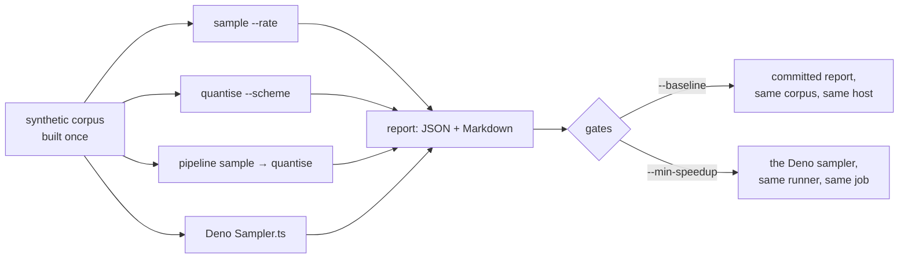

# Benchmarks — throughput, peak RSS and output size

Objective performance evidence for the Rust implementation (issue #14): what
each transform costs, what it publishes, and how the sampler compares with the
Deno `Sampler.ts` GRQ shipped.

Numbers only. "Faster" is not a claim this page makes — the tables carry the
corpus, the host and the method that produced them, and every figure is read
back off a corpus that was actually published.



## Running it

```bash
./bench/run.sh                            # production shape, 8 × 20 000 records, rate 0.05
./bench/run.sh --repeats 5                # any benchmark option passes through
./bench/run.sh --shards 2 --records 5000  # a smaller corpus, for a smaller host
./bench/run.sh --no-reference             # Refinery alone, without Deno
cargo run --release --example benchmark -- --help
```

The run builds a synthetic corpus at the requested record shape under the
system temporary directory, measures the **release** binary — the one a fleet
host would run, resolved from `NEAT_AI_REFINERY_BINARY_PATH` when it is set —
and removes the corpus afterwards.

A report is written to `docs/evidence/bench-<os>-<arch>.json` and `.md`. The
name carries the host, so a macOS and a Linux report sit side by side rather
than overwriting each other.

## What is measured

One case per transform, each run `--repeats` times over the *same* corpus:

| Case | What it runs |
| --- | --- |
| `sample` | `sample --rate R` — the transform GRQ calls |
| `quantise` | `quantise --scheme bfloat16` — the transform that changes output size most |
| `pipeline` | `pipeline sample → quantise` — the chain, which reads the corpus once rather than twice |
| `typescript` | `parity/grq_sampler.ts --rate R` — the Deno sampler, over the same corpus |

Every case reports:

| Figure | Where it comes from |
| --- | --- |
| wall-clock ms | the **fastest** of the repeats — the run least disturbed by whatever else the host was doing |
| input GiB/s | the source bytes the published manifest records as read, over that wall-clock |
| records/s | the records the manifest records as read, over that wall-clock |
| peak RSS KiB | the **worst** peak sampled across the repeats — a peak is a ceiling, so the highest one observed is the honest figure |
| output MiB, output/input | the bytes actually on disk, cross-checked against the manifest |

Peak memory is **sampled, not instrumented**, by the same code the soak uses:
on Linux the kernel's own high-water mark (`VmHWM`) is read every 5 ms, and
elsewhere `ps` is polled and the largest sample kept. The method is recorded in
the report beside the number, and a run too short to sample reports
`not sampled` rather than zero.

Correctness is not traded for a number. A case that did not read the whole
corpus, or whose published bytes disagree with its own `manifest.json`, ends
the run with an error instead of reporting a fast result — and the parity
harness and the production soak remain the gates on behaviour.

## Regression gates

Two, because two different things can rot, and both fail the run rather than
printing a warning:

```bash
# 1. against a committed report from the same corpus, on this host
./bench/run.sh --baseline docs/evidence/bench-linux-aarch64.json --tolerance 0.25

# 2. against the Deno sampler measured beside it, in this very run
./bench/run.sh --min-speedup 1.25
```

The **baseline** gate compares case by case on records/s, peak RSS and
published size, and refuses outright to compare two reports whose corpus or
record shape differ — a ratio between different workloads would hide the
regression it exists to find. A case present in the baseline but missing from
the run is itself reported as a regression, so coverage cannot quietly shrink.
It also fails a case that vanished, grew its peak memory, or grew its output.

The **speedup** gate is what `.github/workflows/benchmark.yml` enforces on
every pull request, on `ubuntu-latest` and `macos-latest`. A hosted runner's
absolute speed varies from job to job, so an absolute threshold would either
flake or be set so loose it caught nothing; both samplers run on the same
runner within seconds of each other, so their *ratio* is comparable between
runs. CI measures 4 × 10 000 production-shaped records (383 MiB) — large enough
that process start-up is noise — and holds Refinery to **1.25×** the Deno
sampler's records a second, well under the ~1.9× measured below. The report is
appended to the job summary and uploaded as an artefact whether the gate passes
or fails, so the numbers are visible either way.

At small corpora the gate would say nothing useful: over 1.5 MiB of 404-byte
records, process start-up dominates and Refinery measures *slower* than Deno
per record. That is a property of the measurement, not of the sampler, and it
is why the CI corpus is sized the way it is.

## The evidence

| Host | Report |
| --- | --- |
| `linux` / `aarch64`, 6 CPUs — production shape, 8 × 20 000 records (1.5 GiB) | [`bench-linux-aarch64.md`](evidence/bench-linux-aarch64.md) |

At the production record shape, 160 000 records of 10 048 bytes, rate 0.05:

| Case | Wall-clock | Input GiB/s | Records/s | Peak RSS | Output |
| --- | --- | --- | --- | --- | --- |
| `sample` | 304 ms | 4.93 | 526 316 | 13 292 KiB | 76.8 MiB (0.050×) |
| `quantise` | 1 581 ms | 0.95 | 101 202 | 2 980 KiB | 766.6 MiB (0.500×) |
| `pipeline` | 370 ms | 4.05 | 432 432 | 13 352 KiB | 38.7 MiB (0.025×) |
| Deno `Sampler.ts` | 576 ms | 2.60 | 277 778 | 170 876 KiB | 77.6 MiB (0.051×) |

Refinery samples 1.9× the records a second the Deno sampler does, at 0.08× its
peak RSS, and keeps the same share of the corpus — the sampling noise around
`rate × records_read` the parity harness already holds both to.

Quantisation is the slowest case and the only one that is **write**-bound: it
keeps every record, so it publishes 766 MiB where sampling publishes 77 MiB.
Reading is not what it costs.

**macOS**: `.github/workflows/benchmark.yml` runs the same benchmark on
`macos-latest` and `ubuntu-latest` for every pull request and publishes each
report as an artefact, so the macOS half of the evidence is produced by CI on
the change itself. No macOS report is committed under `docs/evidence/`: the
container this change was made in is Linux-only, and inventing one would be
worse than naming the gap.

## What these numbers are not

- **Not a fleet measurement.** The corpus is synthetic and local; a fleet host
  reads a real corpus off its own storage.
- **Not a claim about training.** Quantisation halves the corpus; whether a
  quantised corpus trains a better model is a downstream experimental question
  neither this page nor [`quantisation.md`](quantisation.md) answers.
- **Not a correctness gate.** [`parity-harness.md`](parity-harness.md) and
  [`production-soak.md`](production-soak.md) are the gates on behaviour. A
  benchmark that won by cutting a corner would still fail those.
