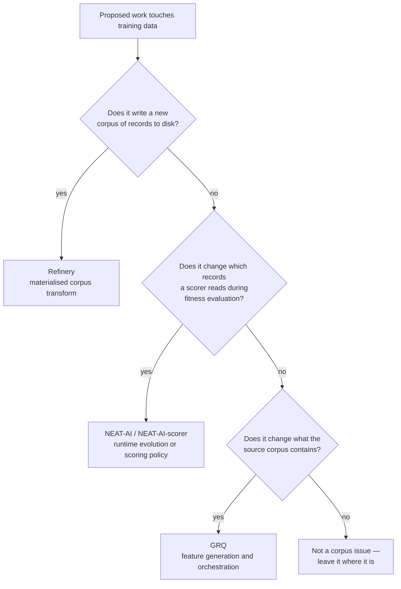

# Corpus-transform ownership

Sampling appears in two unrelated places in this fleet, and they are easy to
confuse. Refinery **materialises** a derived corpus on disk. The scorer
**sub-samples** records while it evaluates a creature and writes nothing. Both
are called "sampling", both take a rate, and a proposal that mixes them up gets
implemented twice — once here and once in NEAT-AI — with two seeds, two
definitions of a rate and no shared provenance.

This document is the rule that decides which project owns a proposed piece of
work, and the record of the audit that applied it (issue #10).

## The rule

Ownership follows the **artefact**, not the vocabulary.



The one-line test: **does a new file of records get written?**

| Owner | Owns | Examples |
| --- | --- | --- |
| Refinery | transforms that materialise a derived corpus | sampling a source corpus into another corpus, quantisation, fuzz/noise augmentation, shuffling/repartitioning, corpus validation and transcoding, transformation manifests |
| NEAT-AI / NEAT-AI-scorer | runtime evolution and scoring policy | the scorer's `--sample-rate` for multi-fidelity fitness, racing and early exit, generation policy, candidate selection, surrogates |
| GRQ | what the source corpus contains, and the orchestration that builds it | observation feeds, `TrainVNNN` modules, trainer stage budgets, score provenance tags |

A rate that selects records **while scoring** is runtime policy even though the
word "sample" is in it. A rate that produces `sample-5.bin` is a Refinery
transform even when GRQ invokes it.

## Audit — 2026-08-31

### How the sweep was run

Open issues in `stSoftwareAU/NEAT-AI`, `stSoftwareAU/NEAT-AI-scorer`,
`stSoftwareAU/GRQ` and `stSoftwareAU/GRQ-sampler` were listed in full, then
searched across the organisation for the terms that mark a data transform:

```bash
gh issue list --repo stSoftwareAU/NEAT-AI --state open --limit 400
gh issue list --repo stSoftwareAU/GRQ --state open --limit 400
gh issue list --repo stSoftwareAU/NEAT-AI-scorer --state open --limit 400
gh issue list --repo stSoftwareAU/GRQ-sampler --state open --limit 400

for kw in sampling quantisation quantization fuzz noise shuffle augment \
          corpus subsample "sample rate" downsample repartition transcode \
          sampler trainData "training data" binary validation; do
  gh search issues --owner stSoftwareAU --state open "$kw" --limit 40
done
```

`GRQ-sampler` has no open issues. The searches returned no candidate outside
the three repositories above.

### Verdicts

| Issue | Verdict | Reason |
| --- | --- | --- |
| NEAT-AI#3926 — multi-fidelity fitness, scorer `--sample-rate` unreachable | stays in NEAT-AI | Plumbs an existing scorer flag into fitness evaluation. Nothing is written to disk. |
| NEAT-AI#3927 — rank fidelity of a sub-sampled fitness score | stays in NEAT-AI | Measures whether the scorer's stride preserves creature ordering. A measurement of runtime policy, not a corpus. |
| NEAT-AI#3928 — racing / early exit | stays in NEAT-AI | Stops scoring losing candidates mid-sweep. Pure evaluation policy. |
| NEAT-AI#3929 — no evaluation archive | stays in NEAT-AI | Archives `(creature, fitness)` pairs. A record of evaluations, not a corpus of training records. |
| NEAT-AI#3930 — no fitness-approximation model | stays in NEAT-AI | Surrogate modelling of fitness. |
| NEAT-AI#3931 — model management / evolution control | stays in NEAT-AI | Decides when a creature earns an exact evaluation. |
| NEAT-AI#3932 — offspring pre-selection | stays in NEAT-AI | Screens bred creatures before evaluation. |
| NEAT-AI#3933 — uncertainty estimate and acquisition rule | stays in NEAT-AI | Surrogate acquisition policy. |
| NEAT-AI#3934 — memetic local-search budget | stays in NEAT-AI | Search-budget allocation. |
| NEAT-AI#3935 — cheap-problem benchmark harness | stays in NEAT-AI | Benchmarks surrogate techniques on toy problems. |
| NEAT-AI#3910 — island exchange ships whole creatures | stays in NEAT-AI | Transports creatures between islands. |
| NEAT-AI#3915 — distil a top-K ensemble | stays in NEAT-AI | Model distillation. |
| NEAT-AI#3916 — no Adam or momentum | stays in NEAT-AI | Gradient path. |
| NEAT-AI#3917 — no Huber loss | stays in NEAT-AI | Loss function. |
| NEAT-AI#3918 — weight averaging across checkpoints | stays in NEAT-AI | Weight-space averaging. |
| NEAT-AI-scorer#588 — perturbation-robustness mode | stays in NEAT-AI-scorer | Perturbs creature **weights**, not records. |
| NEAT-AI-scorer#589 — `--ensemble` mode | stays in NEAT-AI-scorer | Averages predictions across creatures. |
| GRQ#4536 — stamp the sample rate beside `dataSha` | stays in GRQ, cross-linked below | The tag lives on the creature, which is GRQ's. The rate it wants to stamp is already recorded authoritatively by Refinery. |
| GRQ#4535 — a disagreeing confirm heals silently | stays in GRQ | Failure-issue raising in the heal path. |
| GRQ#4459 — MSE reported without `Var(y)` | stays in GRQ, cross-linked below | Computes a statistic over the corpus; no derived corpus is produced. |
| GRQ#4457, #4460, #4461 — ensemble, EAR exchange rate, basis points | stays in GRQ | Score interpretation. |
| GRQ#4545 — trainer data task exhausts a 96h budget | stays in GRQ | Stage-budget orchestration. |
| GRQ feed and `TrainVNNN` issues | stays in GRQ | These change what the **source** corpus contains. Refinery never modifies a source. |

### Result

**No open issue in NEAT-AI, NEAT-AI-scorer or GRQ is Refinery-owned.** Nothing
moved, so nothing was recreated here and nothing was closed or superseded there.
Every sampling-adjacent issue in the sweep is runtime fitness policy or source
feature generation.

Refinery's own transform backlog is already tracked in this repository — #11
(quantisation), #12 (fuzz/noise augmentation) and #13 (pipeline composition) —
and none of them originated in the audited repositories.

## Duplicate mechanisms to avoid

Two ambiguous issues would build a mechanism Refinery already owns if
implemented without reading this.

### GRQ#4536 — the sample rate is already in the manifest

The issue asks for "the sample rate used for the published score" to be stamped
beside `dataSha` / `scorerSha`, because today the `*-100.json` filename is the
only place the basis is written down.

Refinery already writes that fact, authoritatively, for every derived corpus it
publishes. `manifest.json` carries `transform.name`, `transform.parameters`
(which holds `rate` — `refinery/src/sample/run.rs:117`), `transform.seed`, the
source identity and the output checksum. The correct implementation reads the
rate from the manifest of the corpus the score was measured against; it must not
re-derive it from a filename or introduce a second provenance record.

Ownership of the creature tag stays with GRQ. Ownership of the answer to "what
rate produced this corpus?" is Refinery's, and it is already answered.

### GRQ#4459 — the fixed-width reader already exists

Step 1 of the issue is a single pass over the `.bin` corpus to compute `Var(y)`
per output. That is a statistic, not a derived corpus, so ownership stays with
GRQ under the rule above.

It does, however, need to parse fixed-width records, and this fleet should not
gain a third implementation of `bytes_per_record = (inputs + outputs) * 4`.
Refinery's `neat_ai_refinery::corpus` module owns that contract — `RecordShape`,
`SourceCorpus` and a streaming, bounded-memory `RecordReader`. A Rust caller
should use it directly. If a statistics pass is wanted as a Refinery
subcommand instead, that is a new Refinery issue to raise here, not a transform
this audit moved.

## Ownership notes for the source issues

These are the notes the audit concluded belong on the ambiguous source issues,
so an agent picking one up does not implement a duplicate mechanism. They are
recorded here because a worker run is only permitted to write to the repository
it has claimed — posting them to NEAT-AI and GRQ is tracked by #31.

| Issue | Note to post |
| --- | --- |
| NEAT-AI#3926 | Ownership: stays in NEAT-AI. This is runtime multi-fidelity fitness — the scorer sub-samples while evaluating and writes nothing. It is **not** a Refinery migration. Refinery owns transforms that materialise a derived corpus. Do not add a corpus-writing step here. |
| NEAT-AI#3927 | Ownership: stays in NEAT-AI. Measuring rank fidelity of the scorer's stride is evaluation-policy evidence. If the experiment needs a materialised sub-corpus to compare against, produce it with Refinery rather than writing a sampler here. |
| NEAT-AI#3928 | Ownership: stays in NEAT-AI. Racing and early exit are candidate-selection policy and touch no corpus artefact. Not a Refinery migration. |
| GRQ#4536 | Ownership: stays in GRQ, but do not invent a second provenance record. Refinery's published `manifest.json` already carries `transform.parameters.rate`, `transform.seed`, the source identity and the output checksum. Read the rate from the manifest of the corpus the score was measured against. |
| GRQ#4459 | Ownership: stays in GRQ — `Var(y)` is a statistic, not a derived corpus. Do not write a third fixed-width record parser: `neat_ai_refinery::corpus` owns `RecordShape`, `SourceCorpus` and a streaming `RecordReader`. |

## Keeping this current

Re-run the sweep when a new transform-shaped issue appears in NEAT-AI or GRQ,
and add a row. A verdict that is not written down is re-litigated.
