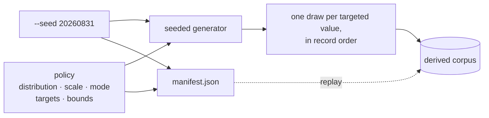
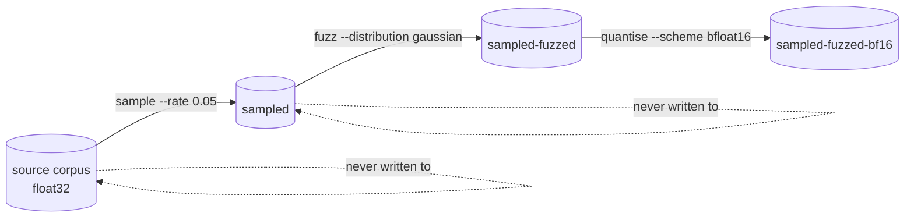

# Fuzzing

Fuzzing is Refinery's third transform: it perturbs the values of a corpus with
seeded noise and changes nothing else — how many records there are, what order
they are in, and how wide they are all survive untouched.

It is a **value** transform, which is the third of the three kinds Refinery
offers:

| | `sample` | `quantise` | `fuzz` |
| --- | --- | --- | --- |
| Records out | a random subset | every one | every one |
| Order | randomised | preserved | preserved |
| Values | untouched | re-encoded, lossily | perturbed |
| Seed | required for reproducibility | none — always deterministic | required for reproducibility |
| Bytes per record | unchanged | halved by `bfloat16` | unchanged |

> Refinery makes **no claim** that a fuzzed corpus trains a better model, or
> that noise augmentation improves fitness. It supplies a reproducible,
> recorded transform and nothing more; whether perturbing a corpus helps is a
> downstream experimental question, and the manifest is what makes answering it
> possible.

## Running it

```bash
neat_ai_refinery \
  --source trainData-binary \
  --output trainData-binary-fuzzed \
  --inputs 2511 --outputs 1 \
  [--metadata grq_observation_version=42] \
  fuzz --distribution gaussian --scale 0.01 --mode relative \
       [--targets inputs] [--clamp-min -1 --clamp-max 1] [--seed 20260831]
```

The corpus is published as `fuzz-<distribution>.bin` inside the output
directory, with a `manifest.json` beside it, in one atomic swap — the same
publication path `sample` and `quantise` use.

## The policy

Five flags describe the perturbation, and all five are recorded. Three of them
have no default at all, because a scale means nothing without a distribution and
a mode to read it against.

| Flag | Values | Default |
| --- | --- | --- |
| `--distribution` | `gaussian`, `uniform` | none — always stated |
| `--scale` | any finite number above zero | none — always stated |
| `--mode` | `absolute`, `relative` | none — always stated |
| `--targets` | `inputs`, `outputs`, `all` | `inputs` |
| `--clamp-min` / `--clamp-max` | any finite number | absent — unbounded |

### Distributions

A draw is **standardised** — zero mean, unit scale — and `--scale` supplies the
magnitude. The distribution therefore decides only the shape of the noise:

- **`gaussian`** — a standard normal draw, produced by the Box–Muller transform
  over the seeded generator. Unbounded: a draw beyond the scale is uncommon but
  possible, which is what makes it the choice when the tail is the point.
- **`uniform`** — a draw on `[-1, 1)`. Bounded by construction: no draw ever
  exceeds the scale, which is what makes it the choice when a hard perturbation
  limit matters more than a tail.

### Modes

`n` is the standardised draw and `s` the scale:

| Mode | Applied as | Scale means |
| --- | --- | --- |
| `absolute` | `x + s × n` | the same perturbation at every magnitude |
| `relative` | `x × (1 + s × n)` | a share of each value's own magnitude |

`relative` leaves an exact zero exactly zero, which is usually what a sparse
feature vector wants. `absolute` does not, which is usually what a
already-normalised feature vector wants. Neither is a default.

The arithmetic is done in `f64` and narrowed to `f32` once, so a large magnitude
and a small scale do not lose the perturbation to rounding before it is stored.

### Targets — outputs are not touched by default

A record stores its inputs first and its expected outputs after them, so
`--targets` is a split at the input count:

```text
record:  [ i₀ i₁ … i₂₅₁₀ | o₀ ]
          └── inputs ──┘  └ outputs
```

`--targets inputs` is the default, and it is the whole reason the flag exists.
Perturbing an expected output does not add noise to a corpus — it changes what
the corpus is *teaching*, quietly, and a run that did it by accident would be
indistinguishable from one that did it on purpose. Reaching an output is
therefore always an explicit `--targets outputs` or `--targets all`.

`refinery/tests/fuzz_transform.rs::leaves_expected_outputs_untouched_by_default`
asserts every published output value against its source, bit for bit.

### Bounds

`--clamp-min` and `--clamp-max` hold every perturbed value inside a range.
Either side may be given alone, and by default neither is: an unbounded run is
the honest one when the caller has no domain limit to state. Bounds are stored
at `f32` — the width the corpus stores — so a published value is compared
against exactly the number that was applied to it.

Clamping is applied after the noise, and only to a value that was perturbed: an
untargeted value never moves, so no bound is ever imposed on it.

### Values noise cannot be applied to

Two cases are defined explicitly rather than left to whatever the arithmetic
happens to do:

| Case | Behaviour | Why |
| --- | --- | --- |
| A **source** value that is not finite — a `NaN` or an infinity already in the corpus | written back exactly as it was, and counted as *preserved* | Noise is not defined on it. Inventing a number would be the quieter fault, so it is left alone and reported. |
| A perturbation whose **result** is not finite | the run **fails**, nothing is published | An overflow means the scale does not suit the corpus. A bound does not rescue it: clamping an infinity to the ceiling would publish a plausible number in place of a fault. |

Both are recorded in the manifest as `non_finite_source: "preserve"` and
`non_finite_result: "fail"`, so a reader never has to guess which a run applied.

The error names where it happened, so a corpus of billions of values does not
have to be searched by hand:

```text
neat_ai_refinery: record 41 value 7: 3.4028235e38 was perturbed to inf, which
the corpus cannot store — the scale does not suit this corpus
```

## Reproducibility

Noise is drawn from a generator seeded with `--seed`, one draw per **targeted**
value, in record order. A draw is taken whether or not the value can actually be
perturbed, so the sequence depends on the policy and the record shape alone —
never on the values a corpus happens to hold.



The same seed and the same policy therefore replay the same derived corpus, byte
for byte, and the output checksum in the manifest is how you prove it. Omit
`--seed` and the run takes one from the operating system — and **reports it**,
so an exploratory run can still be replayed afterwards.

Determinism is a property of a given build: the generator, the mapping and the
arithmetic are all fixed, and the manifest records the tool version that
produced the corpus alongside the seed.

## The manifest

The whole policy is recorded, so a derived corpus never leaves the perturbation
it carries to be inferred:

```json
{
  "transform": {
    "name": "fuzz",
    "parameters": {
      "distribution": "gaussian",
      "scale": 0.01,
      "mode": "relative",
      "targets": "inputs",
      "clamp_min": null,
      "clamp_max": null,
      "non_finite_source": "preserve",
      "non_finite_result": "fail"
    },
    "seed": 20260831
  },
  "record_shape": {
    "inputs": 2511, "outputs": 1, "record_values": 2512,
    "bytes_per_record": 10048, "encoding": "float32"
  }
}
```

- **Both bounds always appear**, `null` when absent. An unbounded policy is a
  decision, and a reader must be able to tell it from a field that was never
  written.
- **`seed` is never null.** Fuzzing without a seed is not reproducible, so the
  seed actually used — supplied or drawn from the operating system — is always
  recorded.
- **There is no `source_record_shape`.** Fuzzing edits values in place, so both
  corpora share one layout, and its absence says so.

## Composing with the other transforms

Fuzz reads a directory of `.bin` files and publishes a directory of `.bin` files
with a manifest beside them — which is precisely what `sample` and `quantise`
produce and consume. Composition is three ordinary runs, with nothing shared
between them but a directory:

```bash
neat_ai_refinery --source trainData-binary --output sampled \
  --inputs 2511 --outputs 1 sample --rate 0.05

neat_ai_refinery --source sampled --output sampled-fuzzed \
  --inputs 2511 --outputs 1 fuzz --distribution gaussian --scale 0.01 \
  --mode relative --seed 20260831

neat_ai_refinery --source sampled-fuzzed --output sampled-fuzzed-bf16 \
  --inputs 2511 --outputs 1 quantise --scheme bfloat16
```



Order matters experimentally but not mechanically: any of the three reads any
other's output. Fuzzing **before** quantising is the ordering to prefer, because
quantisation's rounding error would otherwise be applied to the noise rather
than the data.

Two details make the composition safe rather than merely possible, and they are
the ones `quantise` already relies on:

- **Discovery ignores the manifest.** A source directory is scanned for `.bin`
  files only, so `manifest.json` sitting beside a corpus is never mistaken for
  records.
- **The source manifest is checked, not trusted blindly.** When the source
  carries one, its declared encoding and record width must match what the run
  was told to read. Fuzzing an already quantised corpus as if it were `float32`
  fails with `SourceEncodingMismatch` rather than scattering noise across
  reinterpreted bytes; a mismatched `--inputs`/`--outputs` fails with
  `SourceWidthMismatch`. A manifest that is present but unreadable is fatal —
  reading past it would be guessing. A raw source corpus with no manifest is
  read as the caller described it.

## What it does not do

- It does not perturb expected outputs unless asked to.
- It does not choose a distribution, a scale or a mode for you, and it does not
  fall back to one.
- It does not drop, reorder, duplicate or re-encode records — a fuzzed corpus is
  the same shape as its source, and record *n* still stands for record *n*.
- It does not write to the source corpus. Sources are opened read-only and the
  destination is proved separate from them before a byte is read.
- It does not claim the result trains better.
