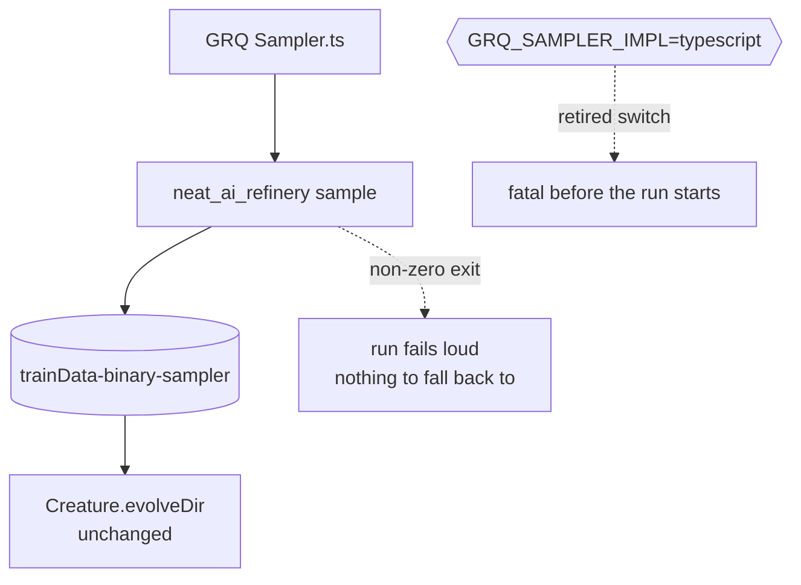

# Integrating Refinery into GRQ

Steps 3, 4 and 5 of the [migration principle](../README.md#migration-principle):
Refinery's sampler ran in production behind a rollback switch beside the
TypeScript sampler it was ported from, the [soak evidence](production-soak.md)
carried the cut-over, and — the rollback period having closed with none of the
[conditions that send it back](production-soak.md#what-sends-it-back) observed —
**the TypeScript sampler and the switch have been removed** (#9).

Refinery stays application-agnostic — it knows nothing about GRQ. This page is
the caller's half of the contract: what GRQ passes in, what it reads back, and
what a host still carrying the retired switch sees.

## Configuration

| Variable | Values | Meaning |
| --- | --- | --- |
| `NEAT_AI_REFINERY_BINARY_PATH` | path | the built binary; `neat_ai_refinery` is resolved from `PATH` when unset |

With no executable binary found, the run fails loud naming that variable rather
than sampling some other way — there is no other way left.

`GRQ_SAMPLER_IMPL` is retired. `refinery` — the only sampler there is — and an
unset variable pass untouched; **`typescript`, or any other value, is fatal**,
not ignored. Both `worker/shared/refinery_sampler.sh` (the fleet path) and
GRQ's `src/train/Sampler.ts` (a run started by hand) stop and say the
TypeScript sampler was removed. Honouring `typescript` as "run Refinery" would
leave an operator believing a rollback took effect while the corpus was
produced by the implementation they were trying to roll away from.



## What GRQ passes in

GRQ remains the orchestration layer. It resolves the source corpus and the
record shape and hands both to Refinery, which never parses GRQ version state:

```bash
neat_ai_refinery \
  --source  trainData-binary \
  --output  trainData-binary-sampler \
  --inputs  2511 \
  --outputs 1 \
  --metadata grq_observation_version=42 \
  sample --rate 0.05
```

- **`--inputs` / `--outputs`** come from the authoritative creature width
  (`NetworkUtil.getEffectiveInputCount()` and `NetworkUtil.OUTPUT_COUNT`) — the
  same numbers the TypeScript sampler read, so a corpus is interpreted with an
  unchanged record shape. A caller without that helper can take the same two
  numbers from a creature export with `jq '.input, .output'` — they are
  authoritative top-level integers, and a value below 1 is fatal.
- **`--metadata`** carries GRQ's observation version into the manifest verbatim.
  Refinery does not interpret it.
- **`--seed`** is omitted in production, so the run seeds from the operating
  system exactly as `Math.random()` does. The seed used is always reported, so
  any run can be replayed.
- The output directory is the same `-sampler` directory `evolveDir` already
  consumes, published atomically — nothing downstream changes.

## What GRQ reads back

The record counts come from the published
[`manifest.json`](../README.md#transformation-manifest), not from parsing
console output:

| Manifest field | Used for |
| --- | --- |
| `output.file` | the published corpus file name |
| `output.record_count` | records kept — the sample size |
| `source.record_count` | records read — the corpus the sample was drawn from |

Those three key names are a public interface. `refinery/tests/consumer_contract.rs`
asserts them over the raw JSON, so a rename that leaves the Rust struct intact
still fails the build rather than silently blinding the caller.

A published directory whose manifest cannot be read is treated as a failed run:
an unmeasurable corpus would defeat the comparison this integration exists for.

## Comparing the two samplers

The comparison this migration was measured on: both implementations reported one
line of the same shape, and the surviving one still logs it, so runs either side
of the cut-over compare directly without new instrumentation:

```text
🏭 sampler implementation=refinery elapsed_ms=412 records_read=1600000 records_written=80042 output=trainData-binary-sampler/sample-5.bin
🏭 sampler implementation=typescript elapsed_ms=9137 records_read=1600000 records_written=79988 output=trainData-binary-sampler/sample-5.bin
```

`records_read` must match between the two on the same corpus; `records_written`
differs by sampling noise around `rate × records_read`, which is the band the
[parity harness](parity-harness.md) already holds both samplers to.

What that comparison measured, on a corpus of 160 000 production-shaped records,
is in [`production-soak.md`](production-soak.md): 214 ms and 13 MiB peak RSS for
Refinery against 642 ms and 165 MiB for the Deno sampler, both reading the whole
corpus.

## No silent fallback

A failed Refinery run exits non-zero and publishes nothing; the previously
published corpus is left exactly as it was. Nothing re-runs another sampler to
rescue it — while both existed, a hidden fallback would have turned a Rust
failure into a green run whose timings and counts came from the other
implementation, which is precisely the evidence the soak depended on. Since #9
there is no other implementation to rescue it with.

The same rule applies before the run starts: with no executable binary found,
the worker fails loud naming `NEAT_AI_REFINERY_BINARY_PATH`. Every host needs
the binary installed.

## Where it lives in GRQ

| File | Role |
| --- | --- |
| `src/train/RefinerySampler.ts` | the argument builder, the subprocess call, the manifest read |
| `src/train/Sampler.ts` | the CLI entrypoint: resolves the corpus and record shape, calls Refinery, reports the comparable line |
| `worker/shared/refinery_sampler.sh` | grants Deno the scoped `--allow-run` for the binary, or fails loud — and refuses a retired `GRQ_SAMPLER_IMPL` |
| `worker/sampler.sh`, `worker/teams/run.sh` | source the helper and pass the flag through |
| `test/train/RefinerySampler_test.ts`, `test/worker/RefinerySamplerSwitch.ts` | cover the argv, the retired switch, and the fail-loud paths |

NEAT-AI-scorer is untouched: it already scores many creatures in one pass, and
this integration only changes how the corpus those generations reuse is
prepared.
