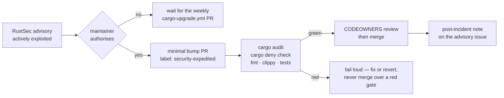

# Emergency dependency bump for an actively-exploited advisory

The ordinary dependency refresh is deliberately unhurried: `cargo-upgrade.yml`
raises one PR a week and the full gate judges it, exactly as
[the contribution rules](../CONTRIBUTING.md) describe. That cadence is the right
default — and it is the wrong one when an advisory against a crate already in
`Cargo.lock` is being exploited while you read this.

This page is the fast lane. It exists so the bypass is a procedure that was
decided calmly, rather than one improvised at 02:00 by whoever is on call.
Skipping the *cadence* is authorised here; skipping a *security gate* is not,
and the two are separated below on purpose.

## When the fast lane applies

All three must hold. If any one of them does not, the change is an ordinary PR
and waits for the normal cycle.

- A published advisory (RustSec, GHSA) or a confirmed supply-chain compromise
  names a crate that is **already in `Cargo.lock`** — not a crate someone
  proposes to add.
- The advisory is **being exploited**, or exploitation is imminent and public.
  A merely severe advisory with no exploitation is not a fast-lane case.
- The next scheduled `cargo-upgrade.yml` run is **too late** to matter.

Refinery processes local corpus files and needs no network access for normal
transformation, so a remote-code-execution advisory in a transitive
network-facing crate is often *not* reachable here. Say so in the PR when it
applies — an unreachable advisory is still worth patching promptly, but through
the normal cycle.

## Who authorises it

A maintainer in `@stSoftwareAU/developers` — the owner group in
[`.github/CODEOWNERS`](../.github/CODEOWNERS) — authorises the bypass, and the
authorisation is written on the tracking issue before the PR is raised, naming
the advisory ID. One maintainer is enough to start; the merge still needs a
CODEOWNERS review, which is a second pair of eyes by construction.

Nobody, maintainer included, may authorise skipping the gates in the next
section.

## Gates that still must pass

An expedited PR skips the *waiting*, never the *checking*. All of these must be
green before merge:

- `cargo audit` — RustSec advisories, run by `cargo-audit.yml` and by
  `security.yml` on PRs into `Develop`. This is the check that proves the bump
  actually clears the advisory that triggered the incident.
- `cargo deny check` — licences, bans and advisories, run by `ci.yml`.
- `cargo fmt`, `cargo clippy -D warnings` and `cargo test --workspace` — the
  rest of `./quality.sh`, which the `ci-required` job aggregates. A bump that
  breaks the corpus contract is a second incident, not a fix.

Two failure modes to name explicitly, because both have looked like shortcuts
under pressure:

- **Do not merge over a red or pending gate.** A gate that has not reported is
  not a gate that passed.
- **Do not disable a check to get green.** Silencing `cargo audit` with an
  ignore entry in `deny.toml` is a decision for a normal PR with a normal
  review, never part of an emergency bump.

## Raising the expedited PR

1. Open a tracking issue naming the advisory ID, the affected crate and version
   range, and whether Refinery's code path reaches the vulnerable API. Record
   the maintainer authorisation there.
2. Branch from `Develop` and make the **smallest** change that clears the
   advisory — `cargo update -p <crate>`, or a single `cargo upgrade -p <crate>`
   when the fix needs an incompatible version. Do not fold in unrelated bumps;
   `cargo-upgrade.yml` picks those up on Monday.
3. Run `./quality.sh` locally before pushing.
4. Raise the PR against `Develop` with `security-expedited` in the title, apply
   the `security-expedited` label (create it once if it does not exist), and
   `@`-mention `@stSoftwareAU/developers` in the body so the review request is
   a notification rather than a queue entry. State the advisory ID, the
   exploitation evidence, and the `cargo audit` output before and after.
5. Merge once the gates are green and a CODEOWNERS review is in. `gitleaks.yml`,
   `semgrep.yml` and `dependency-review.yml` run on the PR as usual; let them
   finish.

## After the fix lands

- Comment on the tracking issue with the merged PR, the version now in
  `Cargo.lock`, and the passing `cargo audit` output.
- Check that the next `cargo-upgrade.yml` PR does not revert the pin — an
  incompatible bump taken early can be re-proposed by the weekly refresh.
- If the fast lane was used and, in hindsight, need not have been, record that
  on the issue too. The bar in [When the fast lane applies](#when-the-fast-lane-applies)
  is only useful if a miss is written down.
