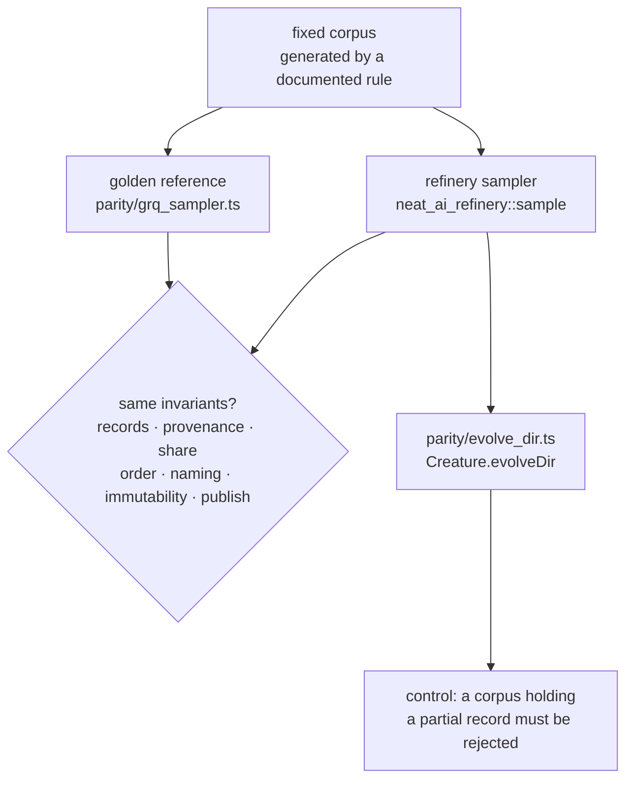

# Golden parity harness

The harness is the compatibility gate GRQ's cut-over depended on, and the guard
against Refinery drifting from it since: it runs Refinery's sampler and the
frozen reference extracted from GRQ's `src/train/Sampler.ts` over the same
fixture corpora, holds both to the invariants a caller depends on, and then hands a
Refinery-published corpus to NEAT-AI's `Creature.evolveDir` unchanged.

It runs as ordinary `cargo test` code —
[`refinery/tests/parity_harness.rs`](../refinery/tests/parity_harness.rs) — so
a divergence fails the build rather than a production run.

```bash
./parity/run.sh
```



## Why not byte-for-byte

GRQ's sampler draws from `Math.random()`, which Deno seeds from the operating
system and exposes no seam to override. Identical bytes are therefore
unobtainable without changing GRQ first, and a comparison that demanded them
would be testing a compatibility seam that does not exist rather than the
sampler.

What a caller actually depends on is the contract around those bytes, and that
is what the harness compares. Refinery's own determinism is not weakened by
this: a seeded run still reproduces its sample byte for byte, which
[`sample_transform.rs`](../refinery/tests/sample_transform.rs) asserts
separately.

## The invariants, and where each is checked

Every test runs **both** samplers over one fixture corpus and asserts the same
thing of each output.

| Invariant (issue #5) | How the harness proves it | Test |
| --- | --- | --- |
| Valid fixed-width records only | The published file's length is a whole multiple of `bytes_per_record` | `both_samplers_publish_whole_records_that_came_from_the_source` |
| Every output record comes from the source | Each published record is matched against the source multiset, and no record appears more often than the source holds it | `both_samplers_publish_whole_records_that_came_from_the_source` |
| The requested probability is statistically correct | 20 000 records at rate 0.05 must keep 846–1154 — five standard deviations of `Binomial(20 000, 0.05)`, a band a correct sampler clears essentially always and a wrong rate (0.04, 0.06) misses every time | `both_samplers_keep_close_to_the_requested_share` |
| Output ordering is randomised | At rate 1 the sample is a permutation of the source — every record present, not in source order | `both_samplers_randomise_the_output_order_without_losing_a_record` |
| Directory/file naming is compatible | Both implementations name the same file at rates 1, 0.5, 0.125, 0.05 and 0.004 — whole percent, half away from zero, `sample-0.bin` below half a percent | `both_samplers_name_the_published_file_the_same_way` |
| No source data changes | The source directory is byte-identical before and after each run | `neither_sampler_changes_the_source_corpus` |
| Atomic publication semantics are equivalent | A live corpus holding a stale `sample-99.bin` is replaced **whole**, and neither implementation leaves staging scratch or a renamed-aside `.deleting-*` directory behind | `both_samplers_replace_a_live_corpus_whole_and_leave_no_scratch` |
| `evolveDir` can consume the produced directory | The published directory is passed to `Creature.evolveDir` as-is; the run must report a finite error, meaning the records were read and scored | `evolve_dir_consumes_a_refinery_published_corpus` |

Refinery also publishes a `manifest.json` beside the corpus (issue #6), which
the GRQ reference has no equivalent of, so each invariant is asserted over the
one `.bin` file in the published directory. `evolveDir` consuming that
directory as published is the evidence the extra file changes nothing for a
consumer.

The last test has a control —
`evolve_dir_rejects_a_corpus_refinery_would_never_publish` — which feeds
`evolveDir` a file ending mid-record, the one thing Refinery's writer cannot
emit. NEAT-AI rejects it, so consuming a Refinery corpus is evidence about the
records inside it rather than about `evolveDir` accepting anything.

### The fixture corpora

Fixtures are generated by a documented rule rather than committed as blobs, so
they are identical on every machine and readable in the diff. Record `i` of
`total` holds `[i / total, ((i * 7) % 97) / 97, i / total × ((i * 7) % 97) /
97]` — values inside `[0, 1)`, distinct per record, and an output that is a
real function of the inputs so a consumer has something to learn. Corpora are
one to three shards of 128 to 10 000 records at the unit-test shape (2 inputs,
1 output — 12 bytes a record).

## The golden reference

`parity/grq_sampler.ts` is GRQ's sampling algorithm, extracted so it can run
against a fixture corpus. GRQ's own entry point cannot: it resolves the record
shape through `NetworkUtil`/`VersionManager` and the corpus path through GRQ
version state, so it needs a creature export and a GRQ checkout before it reads
a byte.

Provenance: stSoftwareAU/GRQ commit `3ae5a5987bd0c1bc115dd83c50854a574d806b51`,
`src/train/Sampler.ts` sha256
`e0b2670c70b6e3526a552d69a8908410ace80afd0571661a81f21756ea6c18db`.

The read loop, the `Math.random() < rate` selection, both Fisher-Yates
shuffles, the `sample-${Math.round(rate * 100)}.bin` naming, the short-write
loop and `publishSamplerDir`'s rename-aside → rename-in → remove-aside are
reproduced verbatim. Only the environment around them is replaced:

| GRQ | Reference |
| --- | --- |
| `NetworkUtil` / `VersionManager` supply the shape and corpus path | `--inputs`, `--outputs`, `--source`, `--output` |
| `getLogger()` diagnostics | a JSON summary on stdout |
| `writeRecordsOrThrow` ENOSPC diagnostics | the same short-write loop, without the free-space report |
| `reclaimSamplerScratch`, exit code 28 | the staging directory this run created is removed |
| staging under `.tmp/` relative to the working directory | staging under `.tmp/` beside the output, so a fixture run stays inside its own directory |

Keeping the reference in this repository means the harness pins the behaviour
being ported. GRQ's own implementation was removed after the cut-over
([#9](https://github.com/stSoftwareAU/NEAT-AI-Refinery/issues/9)) — with it went
`publishSamplerDir`, `writeRecordsOrThrow` and `reclaimSamplerScratch`, the GRQ
symbols named in the table above — so this frozen copy at the pinned commit is
now the sole executable record of the ported algorithm, and the only thing a
reviewer diffs against.

## Intentional differences

The differences between the two samplers are the ones already recorded in
[`sampling-semantics.md`](sampling-semantics.md) — the stricter corpus contract
(a partial record, an empty `.bin`, a source with no corpus files and an
overlapping source/output are all fatal in Rust), and the deliberate omissions
(ENOSPC exit 28 and cross-run scratch reclamation, the `.in-use.lock` lease,
`--next`/`VersionManager`). Nothing is hidden inside the port: no difference is
introduced by this harness, and the harness fails on any difference in the
invariants above.

Two differences are inherent to the comparison rather than to the port, and are
called out here so they are not mistaken for parity gaps:

- **Seeding.** Refinery's runs are seeded so a failure can be replayed; GRQ's
  cannot be. Both are compared statistically, never byte for byte.
- **Instrumentation.** The reference prints the records it read and kept.
  Counting does not change which records are selected.

## Running it

`./parity/run.sh` checks the harness scripts (`deno fmt --check`, `deno lint`,
`deno check`) and runs the parity tests with `REFINERY_PARITY_REQUIRED=1`, so a
missing Deno fails rather than skips.

Under a plain `cargo test`, the Deno-dependent tests skip with a notice when
`deno` is not on `PATH` — that keeps `./quality.sh` usable on a machine without
Deno. The enforcing gate is `.github/workflows/parity.yml`, which installs Deno
and sets `REFINERY_PARITY_REQUIRED=1`; the harness cannot pass there by not
running.

`parity/deno.json` pins NEAT-AI (`jsr:@stsoftware/neat-ai`) and
`parity/deno.lock` records the integrity hashes. The dependency-age policy is
Deno's own: 24 hours for external packages, with internal `@stsoftware/*`
packages excluded so a NEAT-AI release is consumable immediately.

## Cut-over

This harness is what gated the GRQ cut-over: it was defensible only while every
invariant above passed against the GRQ sampler version GRQ was actually running,
so a move of GRQ's `Sampler.ts` meant re-extracting the reference, updating the
pinned commit and sha256 above, and re-running the harness before the switch.

The cut-over is done and GRQ's sampler has been removed (#9), so the reference
can no longer be re-extracted — and no longer needs to be. It is frozen at the
pinned commit, and the harness now guards against Refinery drifting away from
the behaviour it was proven equal to.
