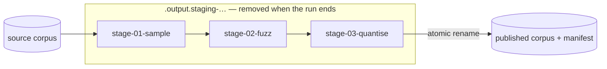

# Transform pipelines

A pipeline chains Refinery's standard transforms in a **stated order** and
publishes one derived corpus. It is not a new transform and not a fused fast
path: each stage is the ordinary standalone `sample`, `fuzz` or `quantise` run
over the previous stage's output, so nothing is baked into the orchestrator and
every transform stays independently testable.

```text
sample ──▶ fuzz ──▶ quantise
```

## Why the order is explicit

Transforms do not generally commute. Fuzzing and then quantising perturbs
`float32` values and rounds the result; quantising and then fuzzing rounds
first and perturbs the rounded values. The two produce different corpora from
the same source and the same seed, so a pipeline never reorders, merges or
deduplicates stages — it runs exactly the list it was given, and records that
list in the manifest.

## Running it

```bash
neat_ai_refinery \
  --source trainData-binary \
  --output trainData-binary-refined \
  --inputs 2511 --outputs 1 \
  [--metadata grq_observation_version=42] \
  pipeline --config pipeline.json
```

The published corpus is the last stage's — `quantise-bfloat16.bin` for the
pipeline above — with a `manifest.json` beside it, in one atomic swap.

## The configuration

The configuration is the stable, serialisable form of a pipeline: a schema
version, an optional seed, and the ordered stages.

```json
{
  "version": 1,
  "seed": 20260831,
  "stages": [
    { "transform": "sample", "rate": 0.05 },
    {
      "transform": "fuzz",
      "distribution": "gaussian",
      "scale": 0.01,
      "mode": "relative",
      "targets": "inputs"
    },
    { "transform": "quantise", "scheme": "bfloat16" }
  ]
}
```

- **`version`** is the schema version. A version this build does not know is
  refused rather than read on a guess at where its fields have moved.
- **`seed`** is the one seed the whole run replays from. Omit it and one is
  drawn from the operating system and reported, exactly as the standalone
  transforms do.
- **`stages`** is the order. Each stage names its transform under `transform`
  and carries that transform's own parameters beside it, so a stage reads as
  the command line it replaces.

Every stage parameter is the flag of the same name — `rate`, `distribution`,
`scale`, `mode`, `targets`, `clamp_min`, `clamp_max`, `scheme` — and is
validated by the transform that owns it. An unknown key is **refused**, not
ignored: a misspelt `raet` would otherwise silently sample at a rate nobody
asked for. Validation happens before a single corpus file is opened, so an
unusable pipeline fails immediately rather than part way through.

The form round-trips: `PipelineConfig::to_json` writes what
`PipelineConfig::load` reads.

## Seeds

A run has one seed. Each stage that draws randomness gets its own seed derived
from the pipeline seed and the stage's **position**, using the SplitMix64
finaliser — a fixed function, so the same pipeline seed yields the same stage
seeds on every machine. Two consequences follow, and both are wanted:

- no two stages of a run share a draw sequence, so a `sample` and a `fuzz` in
  one pipeline never move in lockstep;
- moving a stage changes what it draws, so reordering a pipeline is never
  silently equivalent to the original.

A stage may pin its own `seed` instead, which is how one stage is held fixed
while the rest of the pipeline is varied.

## What is published

Only the final corpus. Every stage but the last publishes into a scratch
directory inside the staging tree, and the whole tree is removed when the run
ends — published or failed.



A stage that fails aborts the run: nothing is published, no scratch is left
behind, and the previously published corpus is left exactly as it was. The
failure names the stage that produced it — `pipeline stage 2 (fuzz): …` —
carrying the transform's own explanation.

## What the manifest records

A pipeline manifest is an ordinary manifest with one addition: `pipeline`, the
ordered transform records, first to last. `transform` describes the run as a
whole. Each stage record is exactly the one that stage would have written
standalone, so the parameters below are abridged only for the sake of the
example:

```json
{
  "manifest_version": 1,
  "transform": {
    "name": "pipeline",
    "parameters": { "config_version": 1, "stage_count": 3 },
    "seed": 20260831
  },
  "pipeline": [
    { "name": "sample", "parameters": { "rate": 0.05 }, "seed": 10240930917795313 },
    {
      "name": "fuzz",
      "parameters": {
        "distribution": "gaussian", "mode": "relative",
        "scale": 0.01, "targets": "inputs"
      },
      "seed": 14454478897516155086
    },
    { "name": "quantise", "parameters": { "scheme": "bfloat16" }, "seed": null }
  ],
  "record_shape": { "encoding": "bfloat16", "bytes_per_record": 5024 },
  "source_record_shape": { "encoding": "float32", "bytes_per_record": 10048 }
}
```

- **`pipeline` is present only for a pipeline run.** Its absence is how a
  reader knows the corpus came from a single transform, described by
  `transform`.
- **Every stage records the seed it actually ran under**, so any one stage can
  be replayed on its own with the standalone command.
- **`record_shape` describes the published corpus** — the last stage's layout.
  `source_record_shape` appears when the pipeline as a whole changed the
  layout, on the same rule a single transform follows.
- **The source identity is the pipeline's source**, not the last stage's
  scratch directory: the intermediate corpora are gone, so recording them would
  name paths that no longer exist.

Reproducibility follows from all of it: the same source, the same
configuration and the same seed publish the same bytes, and the output checksum
is how you prove it.
