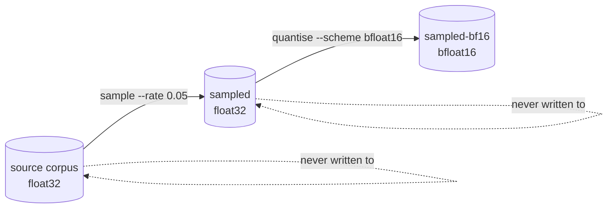

# Quantisation

Quantisation is Refinery's second transform: it re-encodes every value of a
corpus in a narrower format, leaving the records themselves — how many, and in
what order — exactly as it found them.

It is a **representation** transform, not a selection one. That distinction is
what the rest of this document rests on:

| | `sample` | `quantise` |
| --- | --- | --- |
| Records out | a random subset | every one |
| Order | randomised | preserved |
| Values | untouched | re-encoded, lossily |
| Seed | required for reproducibility | none — always deterministic |
| Bytes per record | unchanged | halved by `bfloat16` |

> Refinery makes **no claim** that a quantised corpus trains a better model.
> It reports what quantisation costs in precision and what it saves in storage
> and nothing more; whether that trade is worth taking is a downstream
> experimental question.

## Running it

```bash
neat_ai_refinery \
  --source trainData-binary \
  --output trainData-binary-bf16 \
  --inputs 2511 --outputs 1 \
  [--metadata grq_observation_version=42] \
  quantise --scheme bfloat16
```

`--inputs` and `--outputs` describe the **source**: the published width follows
from the scheme, so it is never a second flag that could disagree with the
first. There is no default scheme — the scheme decides the error the corpus
carries, so it is always stated and always recorded.

The corpus is published as `quantise-<scheme>.bin` inside the output directory,
with a `manifest.json` beside it, in one atomic swap — the same publication
path `sample` uses.

## The `bfloat16` scheme

`bfloat16` is the initial scheme, chosen because it is the conservative one: it
throws away precision and nothing else.

### The mapping

An IEEE-754 `binary32` keeps its sign bit and all eight exponent bits, and
loses sixteen of its twenty-three mantissa bits:

```text
f32       s eeeeeeee mmmmmmm mmmmmmmmmmmmmmmm
bfloat16  s eeeeeeee mmmmmmm
                             └── discarded, rounded to nearest, ties to even
```

The discarded bits are **rounded, not truncated**. Truncation would bias every
magnitude towards zero, and a systematic bias across a training corpus is a
different — and worse — defect than symmetric noise. A tie lands on the
neighbour whose mantissa is even, so the rounding itself carries no bias
either.

Decoding is the reverse and is **exact**: sixteen zero bits are appended, so
every `bfloat16` names exactly one `f32` and reading a quantised corpus adds no
error of its own. All error is introduced once, at write time.

Values are stored native-endian, as the `f32` corpus format already is.

### Error characteristics

Eight bits of significand survive — seven stored plus the implicit leading one
— so neighbouring values are `2⁻⁷` apart relative to their exponent:

| Property | Value |
| --- | --- |
| Bytes per value | 2 (from 4) |
| Significand bits | 8 (from 24) |
| Exponent bits | 8 (unchanged) |
| Spacing at `1.0` | `2⁻⁷` ≈ `7.8e-3` |
| **Max relative error** | **`2⁻⁸` ≈ `3.91e-3`** |
| Representable range | the `f32` range, unchanged |

The bound is a property of the mapping, not a measurement. For any finite `x`
in `[2ᵉ, 2ᵉ⁺¹)` the interval between neighbours is `2ᵉ⁻⁷`, round-to-nearest
puts `q(x)` within half of one, and so

```text
|q(x) - x| ≤ 2^(e-8)   and   |q(x) - x| / |x| ≤ 2^(e-8) / 2^e = 2^-8
```

The bound holds at every magnitude, which is exactly what keeping the whole
exponent buys: a value of `1e-30` and a value of `1e30` lose the same *share*
of themselves. **Absolute** error, by contrast, scales with magnitude — a value
of 4096 can move by up to 16.

Special values behave as they must:

| Input | Output |
| --- | --- |
| A value already representable in 8 significand bits | unchanged, bit for bit |
| `+0.0` / `-0.0` | preserved, sign included |
| `±∞` | preserved |
| `NaN` | stays `NaN` — a payload that lives only in the discarded bits would otherwise truncate to an infinity |
| An `f32` subnormal | rounds to a signed zero; far below the smallest normal |
| Within half an interval of `f32::MAX` | rounds up to `+∞`, the nearest representable value |

The last row is the only case where a finite input leaves as an infinite
output, and it needs `|x| > 3.3895e38`. A training corpus at that magnitude has
larger problems.

Every row above is asserted in `refinery/src/corpus/bfloat16.rs`, and the
relative bound is swept across every finite exponent there and asserted over a
whole published corpus in `refinery/tests/quantise_transform.rs`.

### What it does not do

- It does not renormalise, clamp, shift or scale. There is no per-block scale
  factor and no zero point, so nothing about one record's values can affect
  another's — which is what keeps a run streaming and order-independent.
- It does not choose a scheme for you, and it does not fall back to one.

## Composing with sampling

Quantise reads a directory of `.bin` files and publishes a directory of `.bin`
files with a manifest beside them — which is precisely what `sample` produces
and consumes. Composition is therefore two ordinary runs, with nothing shared
between them but a directory:

```bash
neat_ai_refinery --source trainData-binary --output sampled \
  --inputs 2511 --outputs 1 sample --rate 0.05

neat_ai_refinery --source sampled --output sampled-bf16 \
  --inputs 2511 --outputs 1 quantise --scheme bfloat16
```



Neither transform knows the other exists, and neither knows anything about GRQ:
the shared machinery — source discovery, destination separation, staging,
atomic publication — lives in `neat_ai_refinery::transform` and is all either
of them uses. The order can be reversed with the same two commands.

Two details make the composition safe rather than merely possible:

- **Discovery ignores the manifest.** A source directory is scanned for `.bin`
  files only, so `manifest.json` sitting beside a corpus is never mistaken for
  records.
- **The source manifest is checked, not trusted blindly.** When the source
  carries a manifest, its declared encoding and record width must match what
  the run was told to read. Quantising an already quantised corpus fails with
  `SourceEncodingMismatch` rather than reinterpreting `bfloat16` bytes as
  `f32`; a mismatched `--inputs`/`--outputs` fails with `SourceWidthMismatch`.
  A manifest that is present but unreadable is fatal — reading past it would be
  guessing. A raw source corpus with no manifest is read as the caller
  described it.

## The manifest

Quantisation parameters are explicit and recorded in full, so a derived corpus
never leaves its mapping to be inferred:

```json
{
  "transform": {
    "name": "quantise",
    "parameters": {
      "scheme": "bfloat16",
      "source_encoding": "float32",
      "target_encoding": "bfloat16",
      "rounding": "nearest-ties-to-even",
      "max_relative_error": 0.00390625
    },
    "seed": null
  },
  "record_shape": {
    "inputs": 2511, "outputs": 1, "record_values": 2512,
    "bytes_per_record": 5024, "encoding": "bfloat16"
  },
  "source_record_shape": {
    "inputs": 2511, "outputs": 1, "record_values": 2512,
    "bytes_per_record": 10048, "encoding": "float32"
  }
}
```

- **`record_shape` describes the corpus that was published** — what a reader of
  this directory must decode with.
- **`source_record_shape` appears only when a transform changed the layout.**
  A `sample` manifest omits it, byte for byte as before, because both corpora
  share one layout. Its absence is therefore meaningful: it says the two agree.
- **`seed` is `null`.** Quantisation takes no seed and needs none — the same
  source always produces the same bytes, and the output checksum proves it.

A consumer that decodes `float32` unconditionally will misread a `bfloat16`
corpus. The manifest states the encoding; a consumer that reads a quantised
corpus is expected to read it.

## Benchmarks

`cargo run --release --example quantise_throughput -- [shards] [records-per-shard]`
builds a synthetic corpus at the production shape and reports the three numbers
the transform is judged on. Values are drawn across many exponents with
mantissas that do not fit in eight bits — an exactly representable corpus would
report zero error and prove nothing.

Measured on Linux aarch64 (7 cores), 8 shards × 20 000 records at 2511 inputs
and 1 output — 1 533 MiB of source corpus:

| Measure | Result |
| --- | --- |
| Storage | 1 533.2 MiB → 766.6 MiB, **50.0% smaller** |
| Throughput | 86 236 records/s, **826 MiB/s read** |
| Max relative error | `3.891e-3` (bound `3.906e-3` — held) |
| Mean relative error | `1.408e-3` |
| Max absolute error | `1.600e1`, at values of order `10³` |

The measured maximum sits just under the proven bound, which is the point: the
fixture reaches the worst case rather than flattering the scheme. The mean is
roughly a third of the maximum, as uniform rounding across an exponent range
predicts.

Storage reduction is exactly 50% by construction — two bytes a value instead of
four, for the same record count — so it is reported rather than tuned for.
