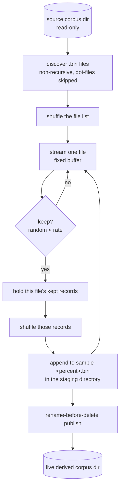

# Materialised sampling semantics

The sampler is a **port** of GRQ's `src/train/Sampler.ts`, not a redesign. This
document is the reference for what that means: the behaviour reproduced, the
behaviour deliberately left behind, and where the Rust implementation is
stricter than the Deno one.

## The pipeline

## Behaviour reproduced from the Deno sampler

| Behaviour | Deno (`src/train/Sampler.ts`) | Rust (`refinery/src/sample/`) |
| --- | --- | --- |
| Corpus discovery | `Deno.readDirSync`, files ending `.bin` | `discover_sources` filtered to the `.bin` extension |
| Input order | `shuffleStrings(files)` | `sources.shuffle(&mut rng)` |
| Record selection | `Math.random() < args.sampleRate` per record | `rng.random::<f64>() < rate` per record |
| Output order | `shuffleUint8Array` over the records kept **from that file** | `kept.shuffle(rng)` over the records kept from that file |
| Output name | `sample-${Math.round(rate * 100)}.bin` | `sample-<percent>.bin`, rounded half away from zero |
| Rate validation | `(rate > 0 && rate <= 1) == false` → exit 1 | `SampleRate::new` → `SampleError::InvalidRate` |
| Staging | `.tmp/sampler-<ts>-<pid>` | `.<output-name>.staging-<ts>-<pid>`, beside the output |
| Publish | `publishSamplerDir`: rename aside, rename in, remove aside | `StagedCorpus::publish`, same three steps and rollback |
| Failure | log, reclaim the scratch, non-zero exit | error returned, staging removed on drop, non-zero exit |

### The shuffle is per input file

The Deno sampler shuffles the records kept from **one input file** and appends
them before reading the next file. The published sample is therefore a
concatenation of per-file shuffled blocks, in a randomised file order — not a
global permutation of the whole sample. That is what the port reproduces.

A global shuffle would be a behavioural change and belongs in a follow-up
issue, not in the port.

### Memory

Working set is one file's kept records, plus a fixed 256 KiB read buffer and a
256 KiB write buffer — the same shape as the Deno sampler, which also
accumulates `sampledRecords` per file. A source corpus far larger than memory
is fine; a single source *file* whose sample does not fit is not, in either
implementation.

### Rounding

`percent` is `(rate * 100).round()`. Over the allowed range `0 < rate <= 1`,
Rust's round-half-away-from-zero and JavaScript's `Math.round`
(round-half-up) agree, so a given rate names the same file in both. A rate
below `0.005` rounds to `sample-0.bin` in both.

## Where the Rust port is stricter

These are inherited from the corpus contract established in issues #2 and #3,
which is stricter than the Deno reader by design — malformed input fails loud
rather than being processed approximately.

| Condition | Deno | Rust |
| --- | --- | --- |
| A source file that ends mid-record | throws `Invalid number of bytes read` | `CorpusError::PartialRecord`, naming the path, size, record width and trailing bytes |
| A zero-byte `.bin` file | read returns 0, the file is silently skipped | `CorpusError::EmptySource` — fatal |
| A source directory holding no `.bin` files | writes an empty sample | `SampleError::NoCorpusFiles` — fatal |
| A source and output directory that overlap | not checked | `SampleError::OverlappingCorpora` — fatal |

The last two matter because publishing renames the whole output directory
aside and deletes it. Either nesting — the output inside the source, or the
source inside the output — would put an immutable source corpus one rename
away from deletion, so both are refused before a file is opened.

## Added beyond the port: the manifest

The Deno sampler publishes a corpus file and nothing else. Refinery also writes
a `manifest.json` into the staging directory before the publishing rename, so
the published directory holds the corpus **and** the provenance record of how
it was made — issue #6. The addition is invisible to a consumer: NEAT-AI scans
a corpus directory for `.bin` files, so the manifest is never read as records,
and the parity harness proves `evolveDir` still consumes the directory
unchanged.

It is not a behavioural change to the sample itself. The same source, seed and
rate produce the same bytes as before; the manifest records the checksum of
those bytes so the claim can be checked rather than trusted. A manifest that
cannot be written aborts the run with nothing published — the derived corpus is
never separated from its provenance. See the README's
[transformation manifest](../README.md#transformation-manifest) section for the
recorded fields.

## Deliberately not ported

- **ENOSPC exit code 28 and scratch reclamation across earlier runs.** GRQ's
  `SamplerDiskFailure.ts` / `SamplerScratchCleanup.ts` exist to keep a full
  production volume recoverable, and its failure path also reclaims the *live*
  `-sampler` directory. The port removes only the scratch it created itself and
  leaves the previously published corpus intact.
- **The `.in-use.lock` lease.** GRQ's cleaners and NEAT-AI readers coordinate
  through it; nothing in Refinery cleans another process's directory, so there
  is nothing to lease yet.
- **`--next` / `VersionManager` / `NetworkUtil`.** Refinery never parses GRQ
  version state: the record shape arrives as `--inputs` and `--outputs`.
- **Quantisation, fuzzing, score sampling, and any optimisation that changes
  observable behaviour** — all out of scope for the port.

## Determinism

Production semantics are unchanged: with no `--seed`, the run draws its seed
from the operating system, so successive runs differ exactly as the Deno
sampler's `Math.random()` does. The seed used is always reported, so any run
can be replayed with `--seed`.

Given a seed, a run is reproducible: the same source produces the same sample,
byte for byte.

## Proving the parity

The differences on this page are asserted, not asserted-to. The golden parity
harness runs this sampler and the extracted GRQ reference over the same fixture
corpora and holds both to the same invariants, then proves NEAT-AI's
`evolveDir` consumes a Refinery-published corpus unchanged — see
[`parity-harness.md`](parity-harness.md). Any difference beyond the ones
recorded above fails `./parity/run.sh`.

## Measured performance

`cargo run --release --example sample_throughput` builds a synthetic corpus at
the production shape (2511 inputs, 1 output — 10 048 bytes a record) and
reports throughput. Parity comes before optimisation, so the example reports
numbers rather than asserting on them.

On a 7-core container, 8 shards × 20 000 records (1533 MiB) at rate 0.05:

| Run | Elapsed | Records/s | Read throughput |
| --- | --- | --- | --- |
| cold page cache | 0.425 s | 376 855 | 3611 MiB/s |
| warm page cache | 0.158 s | 1 012 105 | 9699 MiB/s |
| warm page cache | 0.160 s | 1 002 612 | 9608 MiB/s |

No side-by-side Deno figure is recorded: GRQ's `Sampler.ts` imports
`NetworkUtil` and `VersionManager`, so it cannot be run against a synthetic
corpus without GRQ's creature and version state. Beating Deno is not required
by this port.
